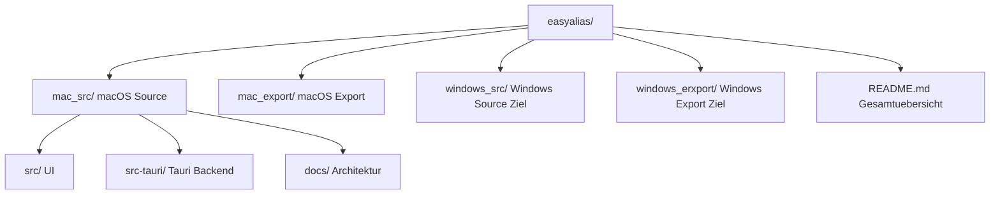
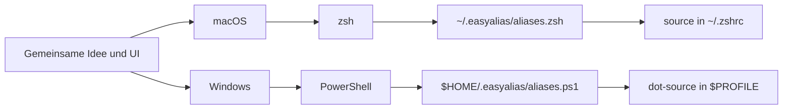
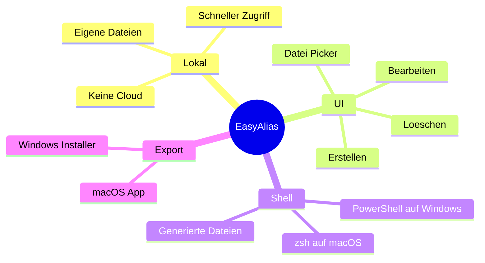

# EasyAlias

EasyAlias ist ein kleines Desktop-App-Projekt zum Erstellen, Anzeigen und Verwalten von Terminal-Aliasen ueber eine UI.

Die Idee: Statt Aliase per Hand in Shell-Dateien wie `~/.zshrc` oder PowerShell-Profilen zu pflegen, bietet EasyAlias eine einfache Oberflaeche. Man legt einen Command-Namen an, waehlt eine Datei oder einen Ordner aus, entscheidet per Dropdown was passieren soll, und die App erzeugt daraus den passenden Shell-Befehl.

## Was EasyAlias loest

Viele kleine Terminal-Kommandos entstehen nebenbei:

- Projektordner schnell oeffnen
- Datei oder Excel-Sheet starten
- Build-Kommandos merken
- SSH-Verbindungen abkuerzen
- wiederkehrende Shell-Befehle als kurze Namen speichern

Normalerweise landen solche Aliase direkt in `~/.zshrc`, werden dort schnell unuebersichtlich und sind leicht kaputt zu editieren. EasyAlias trennt das sauber:

- Die Shell-Konfiguration bleibt klein.
- Die Alias-Daten liegen strukturiert in einer eigenen Datei.
- Die generierte Shell-Datei wird automatisch eingebunden.
- Die Bearbeitung passiert ueber eine UI.


## Aktueller Stand

Die macOS-Version funktioniert bereits als Tauri-App.

Sie kann:

- Aliase erstellen
- bestehende Aliase bearbeiten
- Aliase loeschen
- Dateien und Ordner ueber den nativen macOS-Picker auswaehlen
- eine Vorschau des generierten Befehls anzeigen
- `createdAt` und `updatedAt` speichern
- automatisch `~/.easyalias/aliases.zsh` mit `~/.zshrc` verbinden
- ueber den Shortcut `easya` aus dem Terminal gestartet werden, wenn die App unter `/Applications/EasyAlias.app` liegt

## Ordnerstruktur

```text
easyalias/
  mac_src/          macOS-Quellcode der Tauri-App
  mac_export/       gebauter macOS-Export, z.B. EasyAlias.zip

  windows_src/      geplanter Windows-Quellcode
  windows_erxport/  geplanter Windows-Export

  README.md         diese Gesamtuebersicht
```



Hinweis: `windows_erxport` ist aktuell nur ein Ordnername und enthaelt noch keinen fertigen Export. Der Name kann spaeter zu `windows_export` korrigiert werden.

## macOS

Der macOS-Source liegt in:

```text
mac_src/
```

Typischer Workflow:

```zsh
cd mac_src
npm install
npm run tauri dev
```

Build:

```zsh
npm run tauri build
```

Export:

```zsh
cp -R src-tauri/target/release/bundle/macos/EasyAlias.app /Applications/
ditto -c -k --keepParent src-tauri/target/release/bundle/macos/EasyAlias.app ../mac_export/EasyAlias.zip
```

## Windows-Ziel

Die Windows-Version soll die gleiche UI und Idee nutzen, aber statt zsh mit PowerShell arbeiten.



macOS nutzt:

```zsh
~/.easyalias/aliases.zsh
source ~/.easyalias/aliases.zsh
```

Windows soll nutzen:

```powershell
$HOME\.easyalias\aliases.ps1
. "$HOME\.easyalias\aliases.ps1"
```

Statt zsh-`alias`-Zeilen sollen PowerShell-Funktionen erzeugt werden, z.B.:

```powershell
function beerv2 { Set-Location "$HOME\Desktop\projekte\beerv2_app" }
```

## Alias-Aktionen

| Aktion | macOS/zsh | Windows/PowerShell Ziel |
| --- | --- | --- |
| Navigiere zu Ordner | `cd "<pfad>"` | `Set-Location "<pfad>"` |
| Oeffnen | `open "<pfad>"` | `Start-Process "<pfad>"` |
| Ausfuehren | `"<pfad>"` | `& "<pfad>"` |
| Gradle Build | `cd "<pfad>" && ./gradlew build` | `Set-Location "<pfad>"; .\gradlew.bat build` |
| Maven Build | `cd "<pfad>" && mvn clean package` | `Set-Location "<pfad>"; mvn clean package` |
| Custom Command | frei | frei |

## Zielbild

EasyAlias soll langfristig ein kleines, praktisches Tool fuer wiederkehrende lokale Developer-Kommandos werden:

- simpel genug fuer schnelle Alias-Pflege
- robust genug, um Shell-Dateien nicht zu zerstoeren
- plattformnah fuer macOS und Windows
- exportierbar als normale Desktop-App

Der Fokus liegt nicht auf einem Cloud-Service oder Account-System, sondern auf einem lokalen, schnellen Helfer fuer den eigenen Rechner.


