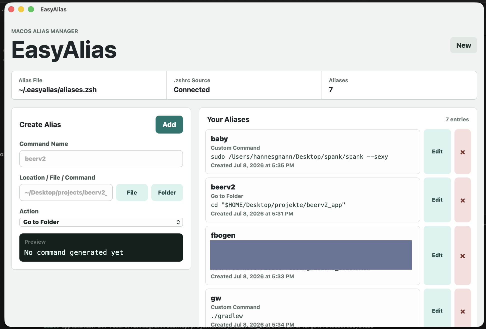
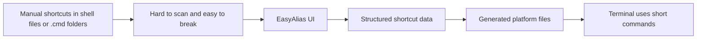
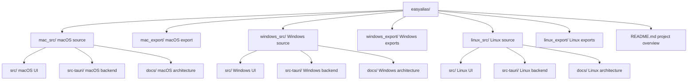
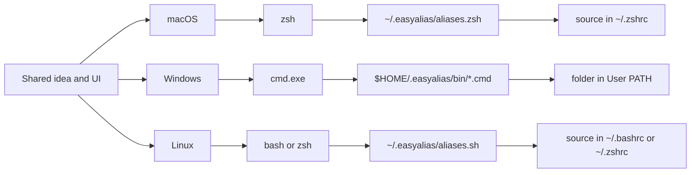
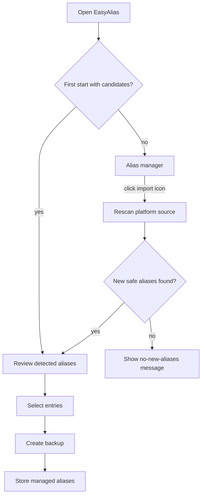
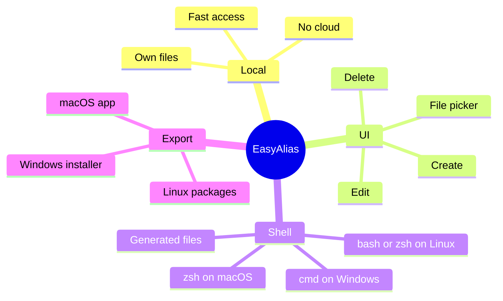

# EasyAlias

EasyAlias is a small desktop app project for creating, viewing, and managing local terminal shortcuts through a UI.

The idea: instead of manually editing shell files or hand-maintaining command scripts, EasyAlias gives you a simple interface. You enter a command name, choose a file or folder, select what should happen from a dropdown, and the app generates the matching platform-specific command.



## Install on macOS

EasyAlias is available as a Homebrew cask:

```zsh
brew tap hannesgnann-hub/tap
brew trust hannesgnann-hub/tap
brew install --cask easyalias
```

## What EasyAlias Solves

Small terminal shortcuts tend to pile up over time:

- quickly jumping into project folders
- opening files or spreadsheets
- remembering build commands
- shortening SSH connections
- saving recurring shell commands under short names

Normally, these shortcuts end up scattered across shell config files, random `.cmd` folders, notes, and terminal history. EasyAlias keeps this cleaner:

- Shell config and PATH setup stay small.
- Shortcut data is stored in a structured file.
- Generated command files are owned by the app.
- Editing happens through a UI.



## Current Status

EasyAlias now has separate Tauri source projects for macOS, Windows, and Linux. Each version keeps the same UI and data model while using the native terminal integration for its platform.

The macOS version can:

- create aliases
- edit existing aliases
- delete aliases
- choose files and folders through the native macOS picker
- show a preview of the generated command
- detect and safely import selected existing `.zshrc` aliases on first start or from the header import button
- add useful suggested macOS aliases with one click
- store `createdAt` and `updatedAt`
- automatically connect `~/.easyalias/aliases.zsh` to `~/.zshrc`
- start from the terminal through `easya` if the app is installed at `/Applications/EasyAlias.app`

The Windows version can:

- create, edit, and delete Windows command shortcuts
- detect and safely import selected simple `.cmd`/`.bat` aliases from user-owned `PATH` folders on first start or on demand
- add useful suggested Windows commands with one click
- choose files and folders through the native Windows picker
- generate `.cmd` files under `~/.easyalias/bin`
- connect the command folder to the user `PATH`, so aliases work in `cmd.exe`
- build as a Windows installer target through Tauri/NSIS

The Linux version can:

- create, edit, and delete bash/zsh aliases
- detect and safely import selected existing aliases from `.bashrc` or `.zshrc` on first start or on demand
- add useful suggested Linux aliases with one click
- choose files and folders through the native Linux picker
- detect bash or zsh from `$SHELL`
- generate `~/.easyalias/aliases.sh`
- connect the generated file to `~/.bashrc` or `~/.zshrc`
- build `.deb`, `.rpm`, and `.AppImage` packages

## Folder Structure

```text
easyalias/
  mac_src/          macOS source code for the Tauri app
  mac_export/       built macOS export, e.g. EasyAlias.zip

  windows_src/      Windows source code for the Tauri app
  windows_export/   built Windows installer exports

  linux_src/        Linux source code for the Tauri app
  linux_export/     built Linux packages

  README.md         this project overview
```

Documentation is split by scope:

| Document | Scope |
| --- | --- |
| `README.md` | shared project overview |
| `mac_src/README.md` | macOS app usage |
| `mac_src/docs/ARCHITECTURE.md` | macOS technical architecture |
| `windows_src/README.md` | Windows app usage |
| `windows_src/docs/ARCHITECTURE.md` | Windows technical architecture |
| `linux_src/README.md` | Linux app usage and build guide |
| `linux_src/docs/ARCHITECTURE.md` | Linux technical architecture |



## macOS

The macOS source lives in:

```text
mac_src/
```

Install the released app with Homebrew:

```zsh
brew tap hannesgnann-hub/tap
brew trust hannesgnann-hub/tap
brew install --cask easyalias
```

Typical workflow:

```zsh
cd mac_src
npm install
npm run tauri dev
```

Build:

```zsh
npm run tauri build
```

Export:

```zsh
cp -R src-tauri/target/release/bundle/macos/EasyAlias.app /Applications/
ditto -c -k --keepParent src-tauri/target/release/bundle/macos/EasyAlias.app ../mac_export/EasyAlias.zip
```

## Windows

The Windows source lives in:

```text
windows_src/
```

Typical workflow on Windows:

```powershell
cd windows_src
npm install
npm run tauri dev
```

Build:

```powershell
npm run tauri build
```

The Windows version uses the same UI and product idea, but integrates with `cmd.exe` instead of zsh.

## Linux

The Linux source lives in:

```text
linux_src/
```

Typical workflow on Linux:

```bash
cd linux_src
npm install
npm run tauri dev
```

Build `.deb`, `.rpm`, and `.AppImage` packages:

```bash
npm run tauri build
```

The Linux version detects bash or zsh, creates `~/.easyalias/aliases.sh`, and connects it to the matching shell startup file. Full prerequisites and export commands are documented in `linux_src/README.md`.

## Cross-Platform Builds

Development can be coordinated from a Mac, but release packages should be produced on the operating system they target:

| Source project | Recommended build host | Configured output |
| --- | --- | --- |
| `mac_src` | macOS | `.app` bundle |
| `windows_src` | Windows | NSIS `.exe` installer |
| `linux_src` | Linux | `.deb`, `.rpm`, and `.AppImage` packages |

A Windows or Linux VM works for occasional builds. For repeatable releases, use separate macOS, Windows, and Linux jobs in a CI matrix and upload their artifacts to one release. Tauri documents this pattern in its [GitHub Actions guide](https://v2.tauri.app/distribute/pipelines/github/). Windows MSI output requires Windows, while the configured NSIS target can also be cross-compiled with additional tooling; see the [Windows installer guide](https://v2.tauri.app/distribute/windows-installer/). Linux packages should be built on Linux because their native libraries and compatibility baseline matter.



macOS uses:

```zsh
~/.easyalias/aliases.zsh
source ~/.easyalias/aliases.zsh
```

Windows uses:

```cmd
%USERPROFILE%\.easyalias\bin
%USERPROFILE%\.easyalias\bin\beerv2.cmd
```

Instead of zsh `alias` lines, Windows generates `.cmd` files, for example:

```cmd
@echo off
cd /d "%USERPROFILE%\Desktop\projects\beerv2_app"
```

After the first Windows app start, open a new `cmd.exe` window so the updated user `PATH` is visible. You can verify command resolution with:

```cmd
where beerv2
```

Linux uses:

```bash
~/.easyalias/aliases.sh
source ~/.easyalias/aliases.sh
```

After the first Linux app start, open a new terminal or reload the detected shell startup file with `source ~/.bashrc` or `source ~/.zshrc`.

## Import Existing Aliases

Fresh installations automatically detect existing aliases and offer a one-time selection dialog. After that prompt has been handled, the import icon in the top-right corner can rescan the same platform-specific source at any time. EasyAlias never imports silently and creates a backup before confirmed source data is changed.

| Platform | Detection source | Backup |
| --- | --- | --- |
| macOS | safe, single-line aliases in `~/.zshrc` | `~/.zshrc.easyalias-backup-*` |
| Linux | safe, single-line aliases in the detected `~/.bashrc` or `~/.zshrc` | matching `.bashrc.easyalias-backup-*` or `.zshrc.easyalias-backup-*` |
| Windows | simple `.cmd`/`.bat` alias files in user-owned `PATH` folders | `~/.easyalias/import-backup-*` |

Complex, nested, repeated, multiline, malformed, or location-dependent definitions are skipped rather than guessed. Aliases already managed by EasyAlias are excluded from later rescans. Selecting **Skip Import** leaves existing aliases unchanged and closes only the automatic first-start prompt; the import icon remains available.



## Alias Actions

| Action | macOS/zsh | Windows/cmd | Linux/bash or zsh |
| --- | --- | --- | --- |
| Navigate to folder | `cd "<path>"` | `cd /d "<path>"` | `cd "<path>"` |
| Open | `open "<path>"` | `start "" "<path>"` | `xdg-open "<path>"` |
| Execute | `"<path>"` | `call "<path>" %*` | `"<path>"` |
| Gradle Build | `cd "<path>" && ./gradlew build` | `cd /d "<path>" && call gradlew.bat build` | `cd "<path>" && ./gradlew build` |
| Maven Build | `cd "<path>" && mvn clean package` | `cd /d "<path>" && call mvn clean package` | `cd "<path>" && mvn clean package` |
| Custom Command | free-form | free-form | free-form |

## Target Vision

EasyAlias should become a small, practical tool for recurring local developer commands:

- simple enough for quick alias maintenance
- robust enough to avoid breaking shell files
- platform-aware for macOS, Windows, and Linux
- exportable as a regular desktop app

The focus is not a cloud service or account system, but a local, fast helper for your own machine.



## License

EasyAlias is available under the [MIT License](LICENSE).
