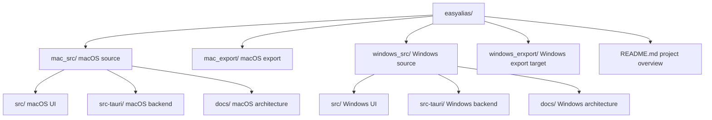
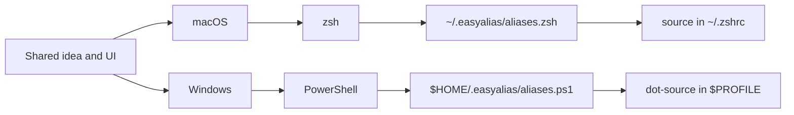
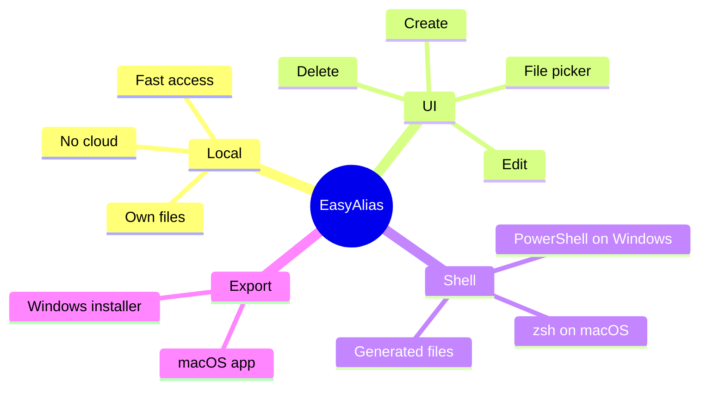

# EasyAlias

EasyAlias is a small desktop app project for creating, viewing, and managing terminal aliases through a UI.

The idea: instead of manually editing shell files like `~/.zshrc` or PowerShell profiles, EasyAlias gives you a simple interface. You enter a command name, choose a file or folder, select what should happen from a dropdown, and the app generates the matching shell command.


## What EasyAlias Solves

Small terminal shortcuts tend to pile up over time:

- quickly jumping into project folders
- opening files or spreadsheets
- remembering build commands
- shortening SSH connections
- saving recurring shell commands under short names

Normally, these aliases end up directly in `~/.zshrc`, where they quickly become hard to scan and easy to break. EasyAlias keeps this cleaner:

- The shell config stays small.
- Alias data is stored in a structured file.
- The generated shell file is sourced automatically.
- Editing happens through a UI.


## Current Status

The macOS version works as a Tauri app. The Windows source now exists as a PowerShell-based Tauri variant.

It can:

- create aliases
- edit existing aliases
- delete aliases
- choose files and folders through the native macOS picker
- show a preview of the generated command
- store `createdAt` and `updatedAt`
- automatically connect `~/.easyalias/aliases.zsh` to `~/.zshrc`
- start from the terminal through `easya` if the app is installed at `/Applications/EasyAlias.app`

The Windows version can:

- create, edit, and delete PowerShell shortcuts
- choose files and folders through the native Windows picker
- generate `~/.easyalias/aliases.ps1`
- connect the generated file to the common PowerShell profile locations
- build as a Windows installer target through Tauri/NSIS

## Folder Structure

```text
easyalias/
  mac_src/          macOS source code for the Tauri app
  mac_export/       built macOS export, e.g. EasyAlias.zip

  windows_src/      Windows source code for the Tauri app
  windows_erxport/  planned Windows export

  README.md         this project overview
```



Note: `windows_erxport` is currently only a folder name and does not contain a finished export yet. The name can be corrected to `windows_export` later.

## macOS

The macOS source lives in:

```text
mac_src/
```

Typical workflow:

```zsh
cd mac_src
npm install
npm run tauri dev
```

Build:

```zsh
npm run tauri build
```

Export:

```zsh
cp -R src-tauri/target/release/bundle/macos/EasyAlias.app /Applications/
ditto -c -k --keepParent src-tauri/target/release/bundle/macos/EasyAlias.app ../mac_export/EasyAlias.zip
```

## Windows

The Windows source lives in:

```text
windows_src/
```

Typical workflow on Windows:

```powershell
cd windows_src
npm install
npm run tauri dev
```

Build:

```powershell
npm run tauri build
```

The Windows version uses the same UI and product idea, but integrates with PowerShell instead of zsh.



macOS uses:

```zsh
~/.easyalias/aliases.zsh
source ~/.easyalias/aliases.zsh
```

Windows uses:

```powershell
$HOME\.easyalias\aliases.ps1
. "$HOME\.easyalias\aliases.ps1"
```

Instead of zsh `alias` lines, Windows generates PowerShell functions, for example:

```powershell
function beerv2 { Set-Location "$HOME\Desktop\projekte\beerv2_app" }
```

## Alias Actions

| Action | macOS/zsh | Windows/PowerShell target |
| --- | --- | --- |
| Navigate to folder | `cd "<path>"` | `Set-Location "<path>"` |
| Open | `open "<path>"` | `Start-Process "<path>"` |
| Execute | `"<path>"` | `& "<path>"` |
| Gradle Build | `cd "<path>" && ./gradlew build` | `Set-Location "<path>"; .\gradlew.bat build` |
| Maven Build | `cd "<path>" && mvn clean package` | `Set-Location "<path>"; mvn clean package` |
| Custom Command | free-form | free-form |

## Target Vision

EasyAlias should become a small, practical tool for recurring local developer commands:

- simple enough for quick alias maintenance
- robust enough to avoid breaking shell files
- platform-aware for macOS and Windows
- exportable as a regular desktop app

The focus is not a cloud service or account system, but a local, fast helper for your own machine.


