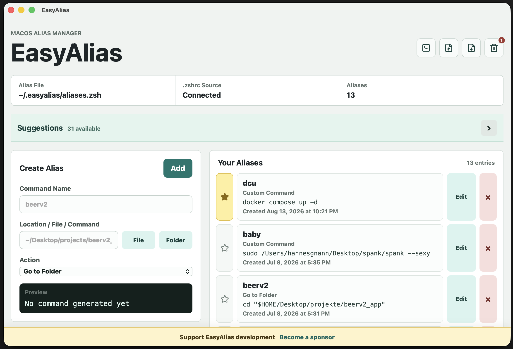
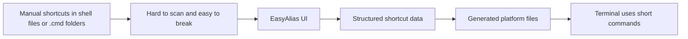
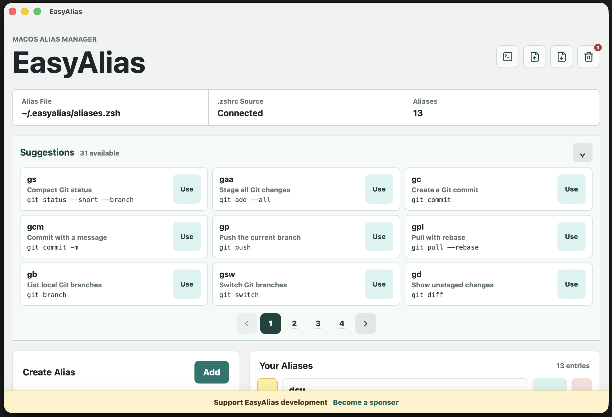
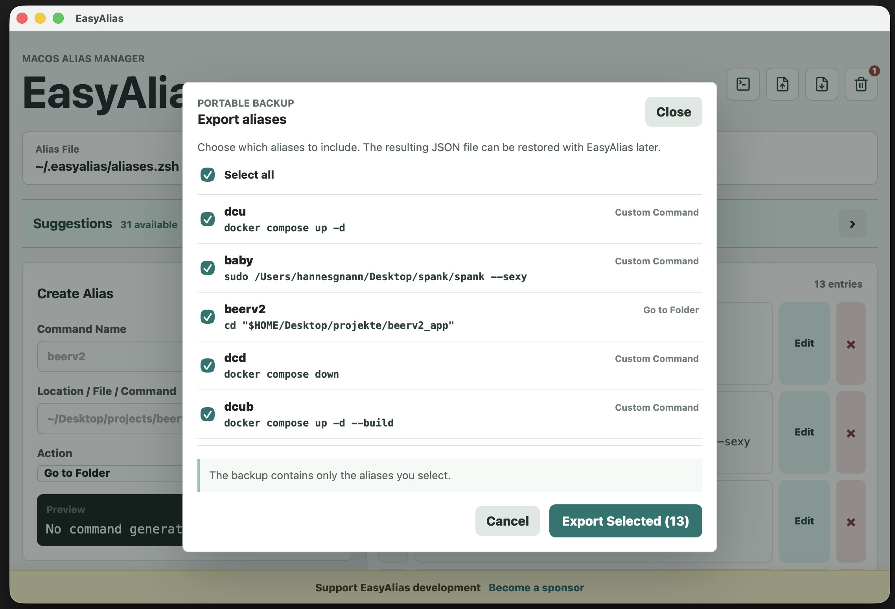
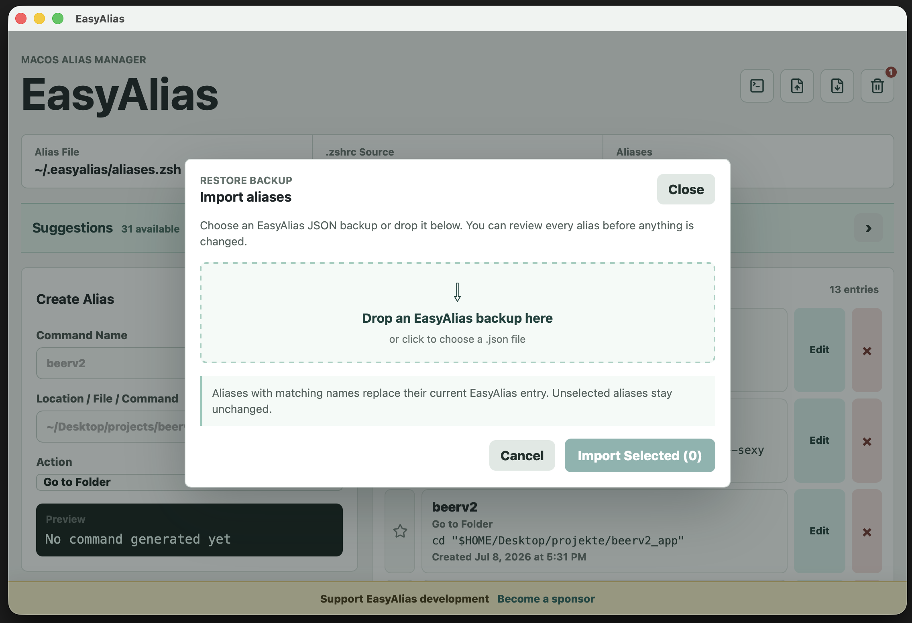
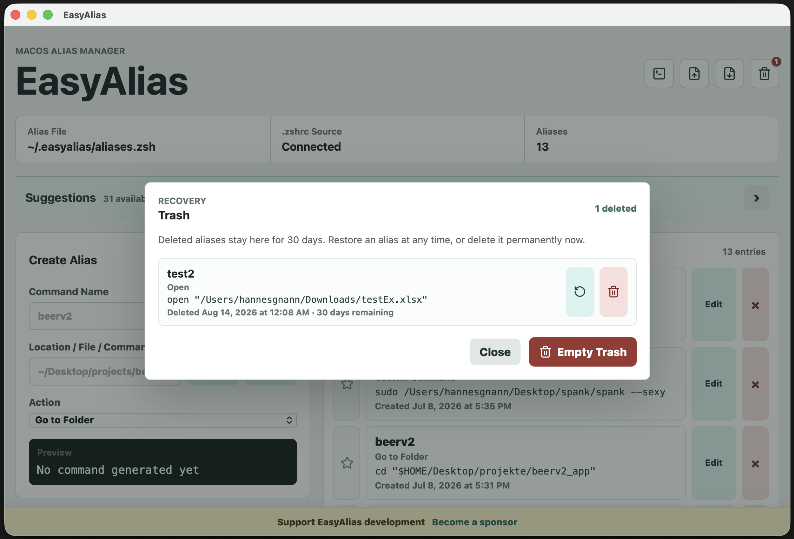
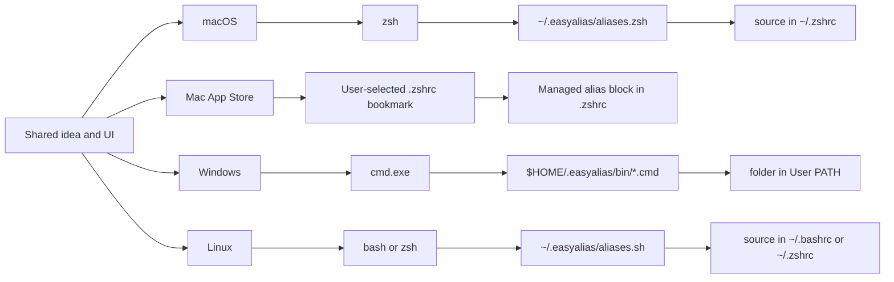
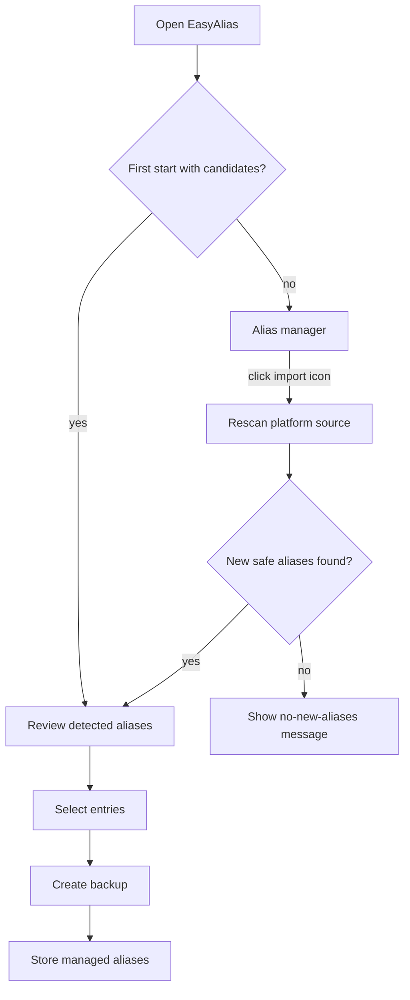
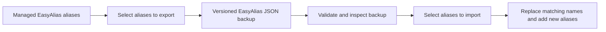
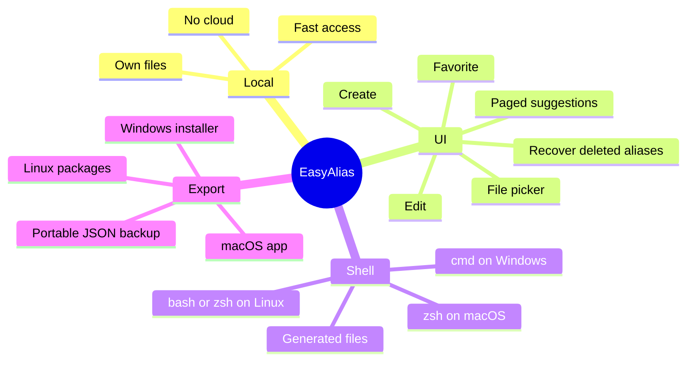

# EasyAlias

EasyAlias is a small desktop app project for creating, viewing, and managing local terminal shortcuts through a UI.

The idea: instead of manually editing shell files or hand-maintaining command scripts, EasyAlias gives you a simple interface. You enter a command name, choose a file or folder, select what should happen from a dropdown, and the app generates the matching platform-specific command.

[Website](https://easyalias.org) | [Mac App Store](https://apps.apple.com/de/app/easyalias/id6794944241?mt=12) | [GitHub](https://github.com/hannesgnann-hub/easyalias) | [Reddit](https://www.reddit.com/r/easyalias/)

## ❤️ Support EasyAlias

Hi, I'm Hannes, the creator of EasyAlias and a Software Engineering student.

If EasyAlias saves you time, consider supporting its development.

Your sponsorship helps me fix bugs, develop new features, and keep EasyAlias free and open source.

[Become a GitHub Sponsor](https://github.com/sponsors/hannesgnann-hub)



## Install on macOS

Install the sandboxed edition from the [Mac App Store](https://apps.apple.com/de/app/easyalias/id6794944241?mt=12), or install the direct desktop edition as a Homebrew cask:

```zsh
brew tap hannesgnann-hub/tap
brew trust hannesgnann-hub/tap
brew install --cask easyalias
```

## Install on Linux

The current Homebrew formula supports ARM64 Linux systems:

```bash
brew tap hannesgnann-hub/tap
brew trust hannesgnann-hub/tap
brew install easyalias
```

## What EasyAlias Solves

Small terminal shortcuts tend to pile up over time:

- quickly jumping into project folders
- opening files or spreadsheets
- remembering build commands
- shortening SSH connections
- saving recurring shell commands under short names

Normally, these shortcuts end up scattered across shell config files, random `.cmd` folders, notes, and terminal history. EasyAlias keeps this cleaner:

- Shell config and PATH setup stay small.
- Shortcut data is stored in a structured file.
- Generated command files are owned by the app.
- Editing happens through a UI.


```mermaid
flowchart LR
  A["Manual shortcuts in shell files or .cmd folders"] --> B["Hard to scan and easy to break"]
  B --> C["EasyAlias UI"]
  C --> D["Structured shortcut data"]
  D --> E["Generated platform files"]
  E --> F["Terminal uses short commands"]
```

## Current Status

EasyAlias has separate Tauri source projects for direct macOS distribution, the Mac App Store, direct Windows distribution, the Microsoft Store, and Linux. They share the same product direction while using the native terminal integration and security model for each platform; release variants can temporarily differ while features are being ported.

The direct macOS, direct Windows, Linux, and Mac App Store source trees share the current day-to-day management tools:

- pin favorites above the regular alias list
- browse 31 suggestions across paginated views and add one with a single click
- export all or selected aliases to a portable, versioned JSON backup
- validate and review all or selected entries before importing a backup
- restore deleted aliases from Trash for 30 days, or remove them permanently
- dismiss status messages manually or let them disappear after three seconds

The macOS version can:

- create aliases
- edit existing aliases
- move aliases to the 30-day Trash, then restore or permanently remove them
- choose files and folders through the native macOS picker
- show a preview of the generated command
- detect and safely import selected existing `.zshrc` aliases on first start or from the header import button
- add useful suggested macOS aliases with one click
- store `createdAt` and `updatedAt`
- automatically connect `~/.easyalias/aliases.zsh` to `~/.zshrc`
- start from the terminal through `easya` if the app is installed at `/Applications/EasyAlias.app`

The Mac App Store version can:

- run inside Apple's App Sandbox
- store structured data and backups in its app container
- connect only to a `.zshrc` explicitly selected through the native file picker
- persist that permission with a security-scoped bookmark
- manage one clearly marked alias block directly in the selected `.zshrc`
- import existing aliases only after the file has been connected
- build a universal signed `.app` and installer-signed `.pkg` for App Store Connect

The Windows version can:

- create, edit, and delete Windows command shortcuts
- detect and safely import selected simple `.cmd`/`.bat` aliases from user-owned `PATH` folders on first start or on demand
- add useful suggested Windows commands with one click
- choose files and folders through the native Windows picker
- generate `.cmd` files under `~/.easyalias/bin`
- connect the command folder to the user `PATH`, so aliases work in `cmd.exe`
- build as a Windows installer target through Tauri/NSIS

The Microsoft Store version keeps the same unrestricted Win32 behavior and:

- builds a separate offline NSIS installer for the Store's EXE/MSI workflow
- embeds the WebView2 offline installer required for Store certification
- supports unattended installation through the `/S` argument
- keeps Store signing and release instructions separate from direct Windows builds
- currently remains on the earlier Windows feature set while the newer favorites, portable backups, Trash, and expanded suggestions are prepared for its next Store build

The Linux version can:

- create, edit, and delete bash/zsh aliases
- detect and safely import selected existing aliases from `.bashrc` or `.zshrc` on first start or on demand
- add useful suggested Linux aliases with one click
- choose files and folders through the native Linux picker
- detect bash or zsh from `$SHELL`
- generate `~/.easyalias/aliases.sh`
- connect the generated file to `~/.bashrc` or `~/.zshrc`
- build `.deb`, `.rpm`, and `.AppImage` packages

## Feature Tour

The screenshots show the macOS edition. Direct Windows, Linux, and the Mac App Store edition use the same management workflow with platform-specific terminal commands and storage locations. The Microsoft Store source still uses the earlier Windows workflow.

### Favorites and Daily Management

Click the star beside an alias to pin it above regular entries. Favorites and non-favorites are each sorted alphabetically.


### Paged Suggestions

Suggestions start collapsed. Open the section to browse Git, Docker, build-tool, networking, and filesystem shortcuts. Nine suggestions are shown per page; **Use** saves one immediately.



### Selective Backup and Restore

The export dialog writes only the selected aliases to a portable `.json` file. The import dialog accepts that file through the picker or drag and drop, validates it before showing its contents, and lets you choose exactly what to restore.





### Recoverable Deletion

Deleting an alias moves it to Trash instead of removing it immediately. Deleted aliases remain recoverable for 30 days and can be restored, permanently deleted, or cleared together.



## Folder Structure

```text
easyalias/
  mac_src/          macOS source code for the Tauri app
  mac_export/       built macOS export, e.g. EasyAlias.zip
  mac_src_app_store/ sandboxed macOS source for Mac App Store distribution

  windows_src/      Windows source code for the Tauri app
  windows_src_store/ Microsoft Store Win32 source and release configuration
  windows_export/   built Windows installer exports

  linux_src/        Linux source code for the Tauri app
  linux_export/     built Linux packages

  README.md         this project overview
```

Documentation is split by scope:

| Document | Scope |
| --- | --- |
| `README.md` | shared project overview |
| `mac_src/README.md` | macOS app usage |
| `mac_src/docs/ARCHITECTURE.md` | macOS technical architecture |
| `mac_src_app_store/README.md` | Mac App Store setup, signing, and upload guide |
| `mac_src_app_store/docs/ARCHITECTURE.md` | App Sandbox and bookmark architecture |
| `windows_src/README.md` | Windows app usage |
| `windows_src/docs/ARCHITECTURE.md` | Windows technical architecture |
| `windows_src_store/README.md` | Microsoft Store Windows variant |
| `windows_src_store/docs/MICROSOFT_STORE.md` | Store build, signing, and submission guide |
| `linux_src/README.md` | Linux app usage and build guide |
| `linux_src/docs/ARCHITECTURE.md` | Linux technical architecture |


```mermaid
flowchart TD
  Root["easyalias/"]
  Root --> MacSrc["mac_src/ macOS source"]
  Root --> MacExport["mac_export/ macOS export"]
  Root --> MacStore["mac_src_app_store/ sandboxed macOS source"]
  Root --> WinSrc["windows_src/ Windows source"]
  Root --> WinStore["windows_src_store/ Microsoft Store source"]
  Root --> WinExport["windows_export/ Windows exports"]
  Root --> LinuxSrc["linux_src/ Linux source"]
  Root --> LinuxExport["linux_export/ Linux exports"]
  Root --> RootReadme["README.md project overview"]

  MacSrc --> MacFrontend["src/ macOS UI"]
  MacSrc --> MacBackend["src-tauri/ macOS backend"]
  MacSrc --> MacDocs["docs/ macOS architecture"]
  MacStore --> StoreFrontend["src/ Store UI"]
  MacStore --> StoreBackend["src-tauri/ sandbox backend"]
  MacStore --> StoreDocs["docs/ Store architecture"]
  WinSrc --> WinFrontend["src/ Windows UI"]
  WinSrc --> WinBackend["src-tauri/ Windows backend"]
  WinSrc --> WinDocs["docs/ Windows architecture"]
  WinStore --> WinStoreFrontend["src/ Store Windows UI"]
  WinStore --> WinStoreBackend["src-tauri/ Win32 backend"]
  WinStore --> WinStoreDocs["docs/ Store release guide"]
  LinuxSrc --> LinuxFrontend["src/ Linux UI"]
  LinuxSrc --> LinuxBackend["src-tauri/ Linux backend"]
  LinuxSrc --> LinuxDocs["docs/ Linux architecture"]
```

## macOS

The macOS source lives in:

```text
mac_src/
```

Install the released app with Homebrew:

```zsh
brew tap hannesgnann-hub/tap
brew trust hannesgnann-hub/tap
brew install --cask easyalias
```

Typical workflow:

```zsh
cd mac_src
npm install
npm run tauri dev
```

Build:

```zsh
npm run tauri build
```

Export:

```zsh
cp -R src-tauri/target/release/bundle/macos/EasyAlias.app /Applications/
ditto -c -k --keepParent src-tauri/target/release/bundle/macos/EasyAlias.app ../mac_export/EasyAlias.zip
```

### Mac App Store

The sandboxed edition is available on the [Mac App Store](https://apps.apple.com/de/app/easyalias/id6794944241?mt=12).

The sandboxed Store source lives in:

```text
mac_src_app_store/
```

It is intentionally separate from `mac_src/`. Before it can manage aliases, the user selects `.zshrc` once and macOS grants persistent access through a security-scoped bookmark.

Run the source checks:

```zsh
cd mac_src_app_store
npm install
npm run build
cargo test --manifest-path src-tauri/Cargo.toml
```

The final App Store build additionally requires Apple Distribution and Mac Installer Distribution certificates plus a Mac App Store Connect provisioning profile. See [`mac_src_app_store/README.md`](mac_src_app_store/README.md) for the exact registration, signing, `.pkg`, and upload steps.

## Windows

The Windows source lives in:

```text
windows_src/
```

Typical workflow on Windows:

```powershell
cd windows_src
npm install
npm run tauri dev
```

Build:

```powershell
npm run tauri build
```

The Windows version uses the same UI and product idea, but integrates with `cmd.exe` instead of zsh.

The Microsoft Store source lives in:

```text
windows_src_store/
```

Build its offline NSIS installer on Windows:

```powershell
cd windows_src_store
npm ci
npm run store:build
```

The installer is submitted through the Partner Center **EXE or MSI app**
workflow. See
[`windows_src_store/docs/MICROSOFT_STORE.md`](windows_src_store/docs/MICROSOFT_STORE.md)
for signing, silent installation, hosting, and submission details.

## Linux

The Linux source lives in:

```text
linux_src/
```

Typical workflow on Linux:

```bash
cd linux_src
npm install
npm run tauri dev
```

Build `.deb`, `.rpm`, and `.AppImage` packages:

```bash
npm run tauri build
```

The Linux version detects bash or zsh, creates `~/.easyalias/aliases.sh`, and connects it to the matching shell startup file. Full prerequisites and export commands are documented in `linux_src/README.md`.

## Cross-Platform Builds

Development can be coordinated from a Mac, but release packages should be produced on the operating system they target:

| Source project | Recommended build host | Configured output |
| --- | --- | --- |
| `mac_src` | macOS | `.app` bundle |
| `mac_src_app_store` | macOS with Apple signing assets | universal sandboxed `.app` and signed `.pkg` |
| `windows_src` | Windows | NSIS `.exe` installer |
| `windows_src_store` | Windows with signing assets | offline Microsoft Store NSIS `.exe` |
| `linux_src` | Linux | `.deb`, `.rpm`, and `.AppImage` packages |

A Windows or Linux VM works for occasional builds. For repeatable releases, use separate macOS, Windows, and Linux jobs in a CI matrix and upload their artifacts to one release. Tauri documents this pattern in its [GitHub Actions guide](https://v2.tauri.app/distribute/pipelines/github/). Windows MSI output requires Windows, while the configured NSIS target can also be cross-compiled with additional tooling; see the [Windows installer guide](https://v2.tauri.app/distribute/windows-installer/). Linux packages should be built on Linux because their native libraries and compatibility baseline matter.


```mermaid
flowchart LR
  Shared["Shared idea and UI"]
  Shared --> Mac["macOS"]
  Shared --> MacStore["Mac App Store"]
  Shared --> Win["Windows"]
  Shared --> Linux["Linux"]

  Mac --> Zsh["zsh"]
  Zsh --> ZshFile["~/.easyalias/aliases.zsh"]
  ZshFile --> Zshrc["source in ~/.zshrc"]

  MacStore --> Bookmark["User-selected .zshrc bookmark"]
  Bookmark --> ManagedBlock["Managed alias block in .zshrc"]

  Win --> Cmd["cmd.exe"]
  Cmd --> Bin["$HOME/.easyalias/bin/*.cmd"]
  Bin --> Path["folder in User PATH"]

  Linux --> Shell["bash or zsh"]
  Shell --> ShellFile["~/.easyalias/aliases.sh"]
  ShellFile --> ShellRc["source in ~/.bashrc or ~/.zshrc"]
```

macOS uses:

```zsh
~/.easyalias/aliases.zsh
source ~/.easyalias/aliases.zsh
```

Windows uses:

```cmd
%USERPROFILE%\.easyalias\bin
%USERPROFILE%\.easyalias\bin\beerv2.cmd
```

Instead of zsh `alias` lines, Windows generates `.cmd` files, for example:

```cmd
@echo off
cd /d "%USERPROFILE%\Desktop\projects\beerv2_app"
```

After the first Windows app start, open a new `cmd.exe` window so the updated user `PATH` is visible. You can verify command resolution with:

```cmd
where beerv2
```

Linux uses:

```bash
~/.easyalias/aliases.sh
source ~/.easyalias/aliases.sh
```

After the first Linux app start, open a new terminal or reload the detected shell startup file with `source ~/.bashrc` or `source ~/.zshrc`.

## Import Existing Aliases

Fresh direct-install editions automatically detect existing aliases and offer a one-time selection dialog. The Mac App Store edition performs that scan only after the user explicitly connects a `.zshrc`. After the prompt has been handled, the import icon in the top-right corner can rescan the same platform-specific source at any time. EasyAlias never imports silently and creates a backup before confirmed source data is changed.

| Platform | Detection source | Backup |
| --- | --- | --- |
| macOS | safe, single-line aliases in `~/.zshrc` | `~/.zshrc.easyalias-backup-*` |
| Mac App Store | safe, single-line aliases in the user-selected `.zshrc` | App Sandbox container `backups/` |
| Linux | safe, single-line aliases in the detected `~/.bashrc` or `~/.zshrc` | matching `.bashrc.easyalias-backup-*` or `.zshrc.easyalias-backup-*` |
| Windows | simple `.cmd`/`.bat` alias files in user-owned `PATH` folders | `~/.easyalias/import-backup-*` |

Complex, nested, repeated, multiline, malformed, or location-dependent definitions are skipped rather than guessed. Aliases already managed by EasyAlias are excluded from later rescans. Selecting **Skip Import** leaves existing aliases unchanged and closes only the automatic first-start prompt; the import icon remains available.


```mermaid
flowchart TD
  Start["Open EasyAlias"] --> Trigger{"First start with candidates?"}
  Trigger -- "yes" --> Review["Review detected aliases"]
  Trigger -- "no" --> Main["Alias manager"]
  Main -->|"click import icon"| Rescan["Rescan platform source"]
  Rescan --> Found{"New safe aliases found?"}
  Found -- "no" --> Message["Show no-new-aliases message"]
  Found -- "yes" --> Review
  Review --> Select["Select entries"]
  Select --> Backup["Create backup"]
  Backup --> Import["Store managed aliases"]
```

This legacy-import flow is separate from portable backup import. The legacy scanner migrates aliases already present in platform configuration files; the backup dialog restores EasyAlias JSON files created with the export button.

## Portable Backups

Portable backups use the same versioned JSON envelope in the direct macOS, direct Windows, Linux, and Mac App Store editions. This makes it possible to move selected aliases between those EasyAlias installations while reviewing every entry before it changes the destination configuration. The Microsoft Store source does not support this format yet.


```mermaid
flowchart LR
  Managed["Managed EasyAlias aliases"] --> SelectExport["Select aliases to export"]
  SelectExport --> Json["Versioned EasyAlias JSON backup"]
  Json --> Validate["Validate and inspect backup"]
  Validate --> SelectImport["Select aliases to import"]
  SelectImport --> Merge["Replace matching names and add new aliases"]
```

The importer rejects unsupported formats, malformed entries, duplicate ids or names, and files larger than 5 MB. Unselected aliases remain unchanged.

## Alias Actions

| Action | macOS/zsh | Windows/cmd | Linux/bash or zsh |
| --- | --- | --- | --- |
| Navigate to folder | `cd "<path>"` | `cd /d "<path>"` | `cd "<path>"` |
| Open | `open "<path>"` | `start "" "<path>"` | `xdg-open "<path>"` |
| Execute | `"<path>"` | `call "<path>" %*` | `"<path>"` |
| Gradle Build | `cd "<path>" && ./gradlew build` | `cd /d "<path>" && call gradlew.bat build` | `cd "<path>" && ./gradlew build` |
| Maven Build | `cd "<path>" && mvn clean package` | `cd /d "<path>" && call mvn clean package` | `cd "<path>" && mvn clean package` |
| Custom Command | free-form | free-form | free-form |

## Target Vision

EasyAlias should become a small, practical tool for recurring local developer commands:

- simple enough for quick alias maintenance
- robust enough to avoid breaking shell files
- platform-aware for macOS, Windows, and Linux
- exportable as a regular desktop app

The focus is not a cloud service or account system, but a local, fast helper for your own machine.


```mermaid
mindmap
  root((EasyAlias))
    Local
      No cloud
      Own files
      Fast access
    UI
      Create
      Edit
      Favorite
      Recover deleted aliases
      File picker
      Paged suggestions
    Shell
      zsh on macOS
      cmd on Windows
      bash or zsh on Linux
      Generated files
    Export
      Portable JSON backup
      macOS app
      Windows installer
      Linux packages
```

## License

EasyAlias is available under the [MIT License](LICENSE).
