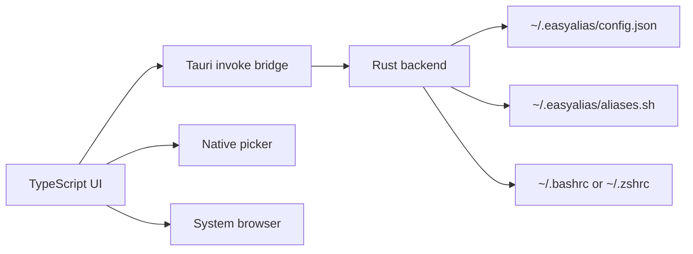
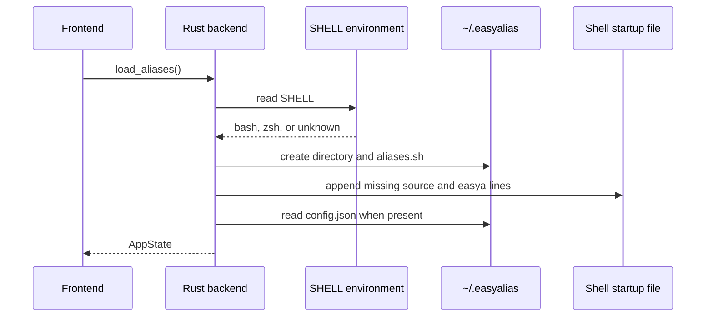
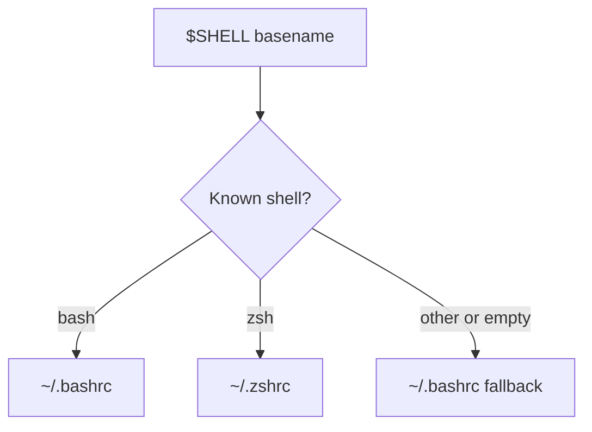
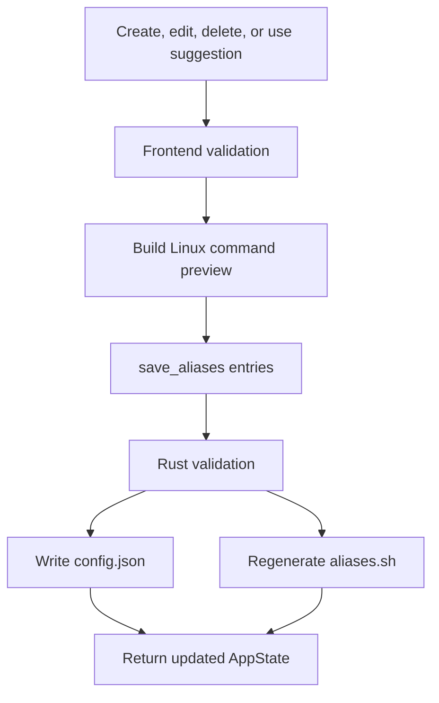
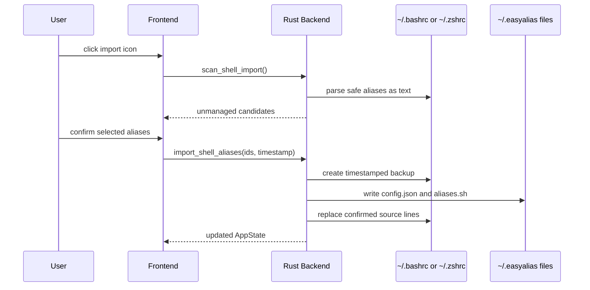

# Linux Architecture

EasyAlias Linux combines a TypeScript/Vite interface with a Tauri 2 Rust backend. The frontend owns interaction and command previews; the backend owns shell detection and filesystem changes.

## Components

| Layer | File | Responsibility |
| --- | --- | --- |
| Frontend | `src/main.ts` | forms, suggestions, first-start/manual import, validation, previews, Tauri calls |
| Styling | `src/styles.css` | responsive desktop interface |
| Backend | `src-tauri/src/main.rs` | shell detection, startup-file import, backup, and persistence |
| Bundle config | `src-tauri/tauri.conf.json` | Linux window, permissions, package targets |
| Dialog plugin | `@tauri-apps/plugin-dialog` | native file/folder picker |
| Opener plugin | `@tauri-apps/plugin-opener` | GitHub and Reddit links in the system browser |



## Startup Flow

The native app invokes `load_aliases()` when the frontend starts.



Shell selection is intentionally small and predictable:



## Data Model

Each alias is persisted as structured JSON:

```json
{
  "id": "a UUID",
  "name": "project",
  "path": "~/Desktop/projects/example",
  "action": "navigate",
  "commandPreview": "cd \"$HOME/Desktop/projects/example\"",
  "createdAt": "2026-07-17T10:00:00.000Z",
  "updatedAt": "2026-07-17T10:00:00.000Z"
}
```

`commandPreview` is stored because it is both visible in the UI and used as the source for generated shell aliases. The Rust backend validates names and non-empty commands again before writing.

## Save Flow

Create, edit, delete, and one-click suggestion operations all end in `save_aliases()`. First-start and manually requested migrations use `import_shell_aliases()` so backup, managed files, and selected startup-file changes stay coordinated.



The generated file looks like:

```bash
# Generated by EasyAlias.
# Edit aliases in the app, not by hand.

alias project='cd "$HOME/Desktop/projects/example"'
alias notes='xdg-open "$HOME/Documents/notes.txt"'
```

Suggestions use the same `AliasEntry` model and command-preview generator as manually entered aliases. Already-used names are filtered out in the frontend, and clicking `Use` persists a complete entry immediately.

## Import Flow

The backend exposes five commands to the frontend:

```rust
load_aliases()
save_aliases(aliases)
scan_shell_import()
dismiss_shell_import()
import_shell_aliases(selected_ids, timestamp)
```

`load_aliases` performs the automatic first-start detection. `scan_shell_import` ignores the handled marker when the header import button is clicked, rescans the startup file selected from `$SHELL`, and filters aliases already managed by EasyAlias. The scan only returns candidates; `import_shell_aliases` owns backup creation and source changes.



## Shell Safety Boundaries

- EasyAlias owns only `~/.easyalias/config.json` and `~/.easyalias/aliases.sh`.
- `~/.easyalias/.shell-import-v1` records that the automatic first-start migration prompt was handled; it does not disable manual rescans.
- A timestamped startup-file backup is created before confirmed alias lines are changed.
- The active startup file receives only a source line and the detached `easya` shortcut.
- Existing startup content is preserved.
- Alias names are limited to letters, numbers, `_`, and `-`, and must begin with a letter or `_`.
- Paths are double-quoted and shell-sensitive characters are escaped.
- Custom commands remain intentionally unrestricted because their purpose is to run user-provided shell code.
- Import detection parses text without sourcing the startup file and skips nested, repeated, multiline, or option-based aliases.
- The generated aliases file should be edited through the app, not manually.

## Browser Preview

When Tauri is absent, the same frontend runs in the browser and stores state in `localStorage`. Native pickers and real shell writes are disabled. This is useful for UI work but does not test Linux integration.

## Packaging

`tauri.conf.json` declares three Linux outputs:

```text
.deb       Debian and Ubuntu package
.rpm       Fedora/RHEL-family package
.AppImage  portable standalone application
```

These packages must be produced on a Linux build host. The frontend can be validated on another operating system, but WebKitGTK linking and final packaging are Linux-native build steps.
