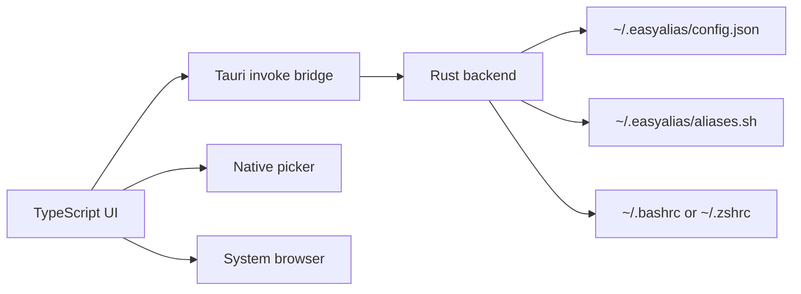
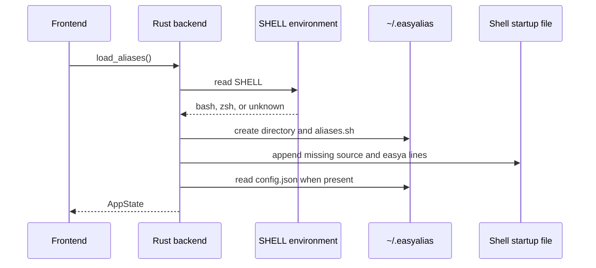
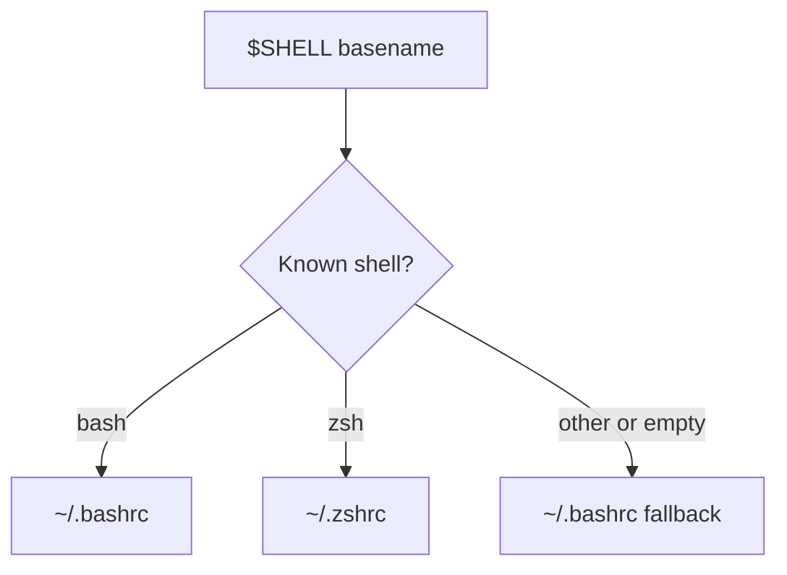
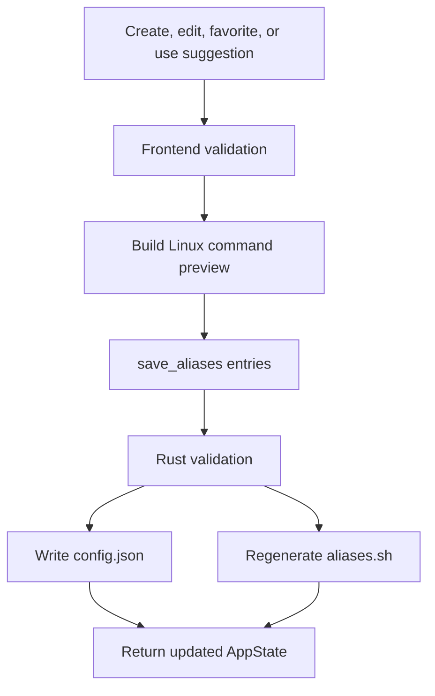
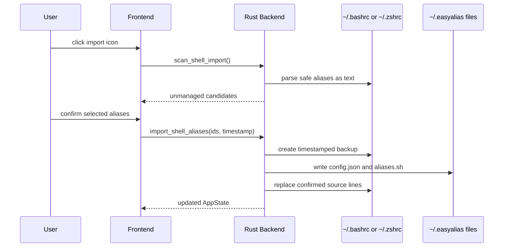

# Linux Architecture

EasyAlias Linux combines a TypeScript/Vite interface with a Tauri 2 Rust backend. The frontend owns interaction and command previews; the backend owns shell detection and filesystem changes.

## Components

| Layer | File | Responsibility |
| --- | --- | --- |
| Frontend | `src/main.ts` | forms, favorites, paged suggestions, imports, portable backups, Trash, automations, schedule modal, shortcut capture, Settings, previews, Tauri calls |
| Styling | `src/styles.css` | responsive desktop interface; CSS design tokens with light/dark values |
| Backend | `src-tauri/src/main.rs` | shell detection, startup-file import, backup, persistence, systemd `--user` scheduling, global shortcuts, tray, autostart |
| Bundle config | `src-tauri/tauri.conf.json` | Linux window, permissions, package targets |
| Dialog plugin | `@tauri-apps/plugin-dialog` | native file/folder picker |
| Opener plugin | `@tauri-apps/plugin-opener` | GitHub and Reddit links in the system browser |
| Global shortcut plugin | `tauri-plugin-global-shortcut` | per-automation system-wide accelerators |
| Autostart plugin | `tauri-plugin-autostart` | launch-at-login registration |
| `tray-icon` feature | built into `tauri` | system-tray item with Show / Quit |
| `systemctl --user` | `~/.config/systemd/user/easyalias-*` | fires timed automations when the app is closed |


```mermaid
flowchart LR
  UI["TypeScript UI"] --> Tauri["Tauri invoke bridge"]
  Tauri --> Rust["Rust backend"]
  UI --> Dialog["Native picker"]
  UI --> Opener["System browser"]
  Rust --> Config["~/.easyalias/config.json"]
  Rust --> Aliases["~/.easyalias/aliases.sh"]
  Rust --> Startup["~/.bashrc or ~/.zshrc"]
```

## Startup Flow

The native app invokes `load_aliases()` when the frontend starts.


```mermaid
sequenceDiagram
  participant UI as Frontend
  participant Rust as Rust backend
  participant Env as SHELL environment
  participant AppDir as ~/.easyalias
  participant RC as Shell startup file

  UI->>Rust: load_aliases()
  Rust->>Env: read SHELL
  Env-->>Rust: bash, zsh, or unknown
  Rust->>AppDir: create directory and aliases.sh
  Rust->>RC: append missing source and easya lines
  Rust->>AppDir: read config.json when present
  Rust-->>UI: AppState
```

Shell selection is intentionally small and predictable:


```mermaid
flowchart TD
  Shell["$SHELL basename"] --> Choice{"Known shell?"}
  Choice -- "bash" --> Bash["~/.bashrc"]
  Choice -- "zsh" --> Zsh["~/.zshrc"]
  Choice -- "other or empty" --> Fallback["~/.bashrc fallback"]
```

## Data Model

Each alias is persisted as structured JSON:

```json
{
  "id": "a UUID",
  "name": "project",
  "path": "~/Desktop/projects/example",
  "action": "navigate",
  "commandPreview": "cd \"$HOME/Desktop/projects/example\"",
  "favorite": true,
  "createdAt": "2026-07-17T10:00:00.000Z",
  "updatedAt": "2026-07-17T10:00:00.000Z"
}
```

`commandPreview` is stored because it is both visible in the UI and used as the source for generated shell aliases. The Rust backend validates names and non-empty commands again before writing.

## Save Flow

Create, edit, favorite, and one-click suggestion operations end in `save_aliases()`. Deletion uses `move_alias_to_trash()` so the entry remains recoverable. First-start and manually requested migrations use `import_shell_aliases()` so backup, managed files, and selected startup-file changes stay coordinated.


```mermaid
flowchart TD
  Change["Create, edit, favorite, or use suggestion"] --> Validate["Frontend validation"]
  Validate --> Preview["Build Linux command preview"]
  Preview --> Invoke["save_aliases entries"]
  Invoke --> BackendValidate["Rust validation"]
  BackendValidate --> Json["Write config.json"]
  BackendValidate --> Shell["Regenerate aliases.sh"]
  Json --> State["Return updated AppState"]
  Shell --> State
```

The generated file looks like:

```bash
# Generated by EasyAlias.
# Edit aliases in the app, not by hand.

alias project='cd "$HOME/Desktop/projects/example"'
alias notes='xdg-open "$HOME/Documents/notes.txt"'
```

Suggestions use the same `AliasEntry` model and command-preview generator as manually entered aliases. The 31 suggestions are shown nine per page, already-used names are filtered out, and clicking `Use` persists a complete entry immediately. Favorites are sorted before regular aliases while preserving stable name order inside each group.

## Backend Commands

The backend command groups are:

```rust
load_aliases()
save_aliases(aliases)
list_trash()
move_alias_to_trash(id)
restore_trash_alias(id)
permanently_delete_trash_alias(id)
empty_trash()
export_alias_backup(selected_ids)
inspect_alias_backup(path)
import_alias_backup(path, selected_ids)
scan_shell_import()
dismiss_shell_import()
import_shell_aliases(selected_ids, timestamp)

// Automations
load_automations()
save_automations(automations)                  // also re-syncs global hotkeys
set_automation_hotkey(id, accelerator)         // validate + OS-register, then persist
list_automation_trash()
move_automation_to_trash(id)
restore_trash_automation(id)
permanently_delete_trash_automation(id)
empty_automation_trash()
export_automation_backup(selected_ids)
inspect_automation_backup(path)
import_automation_backup(path, selected_ids)
start_automation_session(session_id, path)
run_session_command(session_id, command, background)
stop_automation_session(session_id)

// Timed automations (systemd --user)
list_timed_automations()
save_timed_automation(entry)
delete_timed_automation(id)
list_sun_regions()
load_sun_location_state() / save_sun_location(setting)

// Settings
load_settings() / save_settings(settings)

// CLI entry points (no window, invoked by systemd)
--run-timed-automation <id>
--check-sun-timed-automations
```

## Timed Automations and systemd

A `TimedAutomation` record in `timed-automations.json` links an automation id to a trigger (`clock`, `sunrise`, or `sunset`). `save_timed_automation` writes the JSON and reconciles the OS scheduler through `systemctl --user`; `delete_timed_automation` removes both.

- **Clock** entries get an `easyalias-timed-<id>.timer` + `.service` pair under `~/.config/systemd/user/`, with `OnCalendar` for the `HH:MM` and weekday list, running `easyalias --run-timed-automation <id>`.
- **Sunrise/sunset** entries share one `easyalias-sun-timed-automations.timer` (`OnUnitActiveSec` = 300 s, `OnBootSec` = 60 s, `Persistent=true`) running `easyalias --check-sun-timed-automations`. The checker computes today's event for the configured region and runs any enabled entry whose time has passed and whose `lastTriggeredDate` is not today. The shared timer exists only while at least one enabled sun entry does.

`--run-timed-automation` / `--check-sun-timed-automations` are handled at the top of `main()` before any GUI setup. Each run stamps `lastRunAt` / `lastRunStatus` / `lastRunOutput`; the checker's `lastTriggeredDate` keeps a sun entry to once per calendar day despite the 5-minute poll. Editing a unit file triggers `systemctl --user daemon-reload`.

## Global Shortcuts, Tray, and Autostart

`tauri-plugin-global-shortcut` registers one `with_handler` callback; `register_all_automation_hotkeys` runs in `.setup()` and after every command that can add/remove/free a binding, skipping bad or taken combos. `set_automation_hotkey` validates the accelerator, rejects an in-app duplicate, tries the OS registration **before** writing `automations.json`, and rolls back on failure. On a press the handler reads `hotkey_behavior` and either reveals the window + emits `automation-hotkey-fired`, or runs headless + emits `automation-hotkey-result`; `show_main_window` marshals window calls onto the main thread.

`.on_window_event` intercepts `CloseRequested` → `prevent_close()` + `hide()`, so the process and its shortcuts survive a window close. A `TrayIconBuilder` provides "Show EasyAlias" / "Quit EasyAlias"; on non-macOS platforms it uses the app icon. `tauri-plugin-autostart` registers a login entry with the `--autostarted` argument; `save_settings` applies it, `load_settings` reads the plugin's real state back into the `autostart` field, and `.setup()` keeps the window hidden when launched with the flag.

Commands that mutate automations take `app: tauri::AppHandle`; the pure logic lives in `*_inner` helpers so unit tests need no `AppHandle`. `AppSettings` (`theme`, `hotkeyBehavior`, `showSuggestions`, `autostart`) is stored in `settings.json` with `#[serde(default)]` on every field, validated by `validate_app_settings`, and mirrored to `localStorage` for a flash-free theme on start.

## Import Flow

`load_aliases` performs the automatic first-start detection. `scan_shell_import` ignores the handled marker when the header import button is clicked, rescans the startup file selected from `$SHELL`, and filters aliases already managed by EasyAlias. The scan only returns candidates; `import_shell_aliases` owns backup creation and source changes.


```mermaid
sequenceDiagram
  participant User
  participant UI as Frontend
  participant Rust as Rust Backend
  participant RC as ~/.bashrc or ~/.zshrc
  participant Managed as ~/.easyalias files

  User->>UI: click import icon
  UI->>Rust: scan_shell_import()
  Rust->>RC: parse safe aliases as text
  Rust-->>UI: unmanaged candidates
  User->>UI: confirm selected aliases
  UI->>Rust: import_shell_aliases(ids, timestamp)
  Rust->>RC: create timestamped backup
  Rust->>Managed: write config.json and aliases.sh
  Rust->>RC: replace confirmed source lines
  Rust-->>UI: updated AppState
```

## Portable Backups And Trash

EasyAlias can export selected aliases to a versioned JSON backup and inspect that file before importing selected entries. Matching names replace their current EasyAlias entry only when the user includes them. Backup files are size-limited, schema-validated, and treated strictly as data.

Deleted aliases move to `~/.easyalias/trash.json`. They can be restored, deleted permanently, or removed together with `Empty Trash`; entries are also purged automatically after 30 days. Restoring or deleting an entry regenerates `config.json` and `aliases.sh` so shell output stays synchronized.

## Shell Safety Boundaries

- EasyAlias owns `~/.easyalias/config.json`, `~/.easyalias/aliases.sh`, and `~/.easyalias/trash.json`.
- `~/.easyalias/.shell-import-v1` records that the automatic first-start migration prompt was handled; it does not disable manual rescans.
- A timestamped startup-file backup is created before confirmed alias lines are changed.
- The active startup file receives only a source line and the detached `easya` shortcut.
- Existing startup content is preserved.
- Alias names are limited to letters, numbers, `_`, and `-`, and must begin with a letter or `_`.
- Paths are double-quoted and shell-sensitive characters are escaped.
- Custom commands remain intentionally unrestricted because their purpose is to run user-provided shell code.
- Import detection parses text without sourcing the startup file and skips nested, repeated, multiline, or option-based aliases.
- The generated aliases file should be edited through the app, not manually.
- Portable backup files are parsed as JSON and never sourced or executed.

## Automations

Automations are a separate feature from aliases: user-defined, multi-step workflows (shell commands and timed waits) that the app itself runs in a chosen working directory, independent of the alias list and its `.bashrc`/`.zshrc` integration.

```ts
type AutomationStep = {
  id: string;
  kind: "command" | "wait";
  command: string;
  seconds: number;
  behavior: "wait" | "background";
};

type Automation = {
  id: string;
  name: string;
  path: string;             // a file path resolves to its parent folder
  steps: AutomationStep[];
  favorite: boolean;
  // Free-text label used to organize automations; empty means ungrouped.
  group: string;
  // Optional global keyboard shortcut (Tauri accelerator); null when unset.
  hotkey?: string | null;
  createdAt: string;
  updatedAt: string;
};

type TimedAutomation = {
  id: string;
  automationId: string;
  triggerKind: "clock" | "sunrise" | "sunset";
  time: string;             // "HH:MM" for "clock"
  days: string[];           // lowercase "mon".."sun"; empty = every day
  enabled: boolean;
  createdAt: string;
  updatedAt: string;
  lastRunAt: number | null;
  lastRunStatus: "success" | "error" | null;
  lastRunOutput: string | null;
  lastTriggeredDate: string | null;
};

type AppSettings = {
  theme: "system" | "light" | "dark";
  hotkeyBehavior: "window" | "background";
  showSuggestions: boolean;
  autostart: boolean;
};
```

Automations are stored independently of aliases in `~/.easyalias/automations.json` and validated on every load and save: up to 200 automations, each with 1-100 steps, unique automation and step ids, command steps under 16 KB, and wait steps between 1 second and 24 hours. Timed automations live in `timed-automations.json`, the shared sun region in `sun-location.json`, and preferences in `settings.json`.

Each run gets one persistent shell process (`AutomationSessionHandle`, keyed by a frontend-generated `session_id` in the `AutomationSessions` Tauri-managed state) instead of a fresh process per step. This is what lets `cd` and exported environment variables from one step carry over to the next, the same way they would in a real terminal. The shell binary is resolved by `automation_shell_binary()`, which reuses the same `$SHELL` detection as aliases (`/bin/zsh` when `shell_setup()` detects zsh, `/bin/bash` otherwise) — an automation runs in the user's own detected shell, not a hardcoded one.

- `start_automation_session` resolves the working directory (expanding a leading `~`, then `canonicalize`-ing and requiring it to exist), spawns the shell with piped stdin/stdout, and starts a background thread that streams output lines into an `mpsc` channel.
- `run_session_command` writes the step's command to the session's stdin followed by a unique echoed sentinel, then reads from the channel until that sentinel appears. Foreground commands are wrapped as `{ command ; } 2>&1` so stderr merges into the captured output, and the sentinel carries `$?`; background commands are wrapped as `{ command ; } >/dev/null 2>&1 &` and the sentinel carries `$!`, so the step returns as soon as the job has started rather than waiting for it to finish. Captured output is truncated to 20,000 characters.
- `stop_automation_session` kills the session's shell process specifically (not its process group), so it can interrupt a stuck foreground command without touching background jobs that process already started with `&` — those keep running detached. It is called both when the user clicks Stop and automatically once a run finishes.

Automations additionally get their own favorites, groups, 30-day Trash (`~/.easyalias/automations-trash.json`), and portable JSON backup (its own `easyalias-automation-backup` envelope, so it is never confused with an alias backup) — all mirroring the equivalent alias features one-for-one, including the same validation, retention, and conflict-on-restore rules.

Safety boundaries specific to automations:

- Automation commands run only when the user explicitly clicks Run or a schedule/shortcut fires, execute in the automation's own shell session, and are rejected outright in browser preview mode (no `start_automation_session`/`run_session_command` backend to call).
- Portable automation backup files are parsed as data and never executed.
- Automation Trash provides the same 30-day recovery window as alias Trash.
- Timed automations run the app binary headlessly through systemd; the CLI entry points touch no GUI.
- A global shortcut is registered with the OS before it is written to `automations.json`, so a rejected combo never leaves a stored-but-inactive binding.
- Global shortcuts only work while the app process is alive; closing the window keeps it in the tray, `Quit` fully unregisters them.

## Browser Preview

When Tauri is absent, the same frontend runs in the browser and stores state in `localStorage`. Native pickers and real shell writes are disabled. This is useful for UI work but does not test Linux integration.

## Packaging

`tauri.conf.json` declares three Linux outputs:

```text
.deb       Debian and Ubuntu package
.rpm       Fedora/RHEL-family package
.AppImage  portable standalone application
```

These packages must be produced on a Linux build host. The frontend can be validated on another operating system, but WebKitGTK linking and final packaging are Linux-native build steps.
