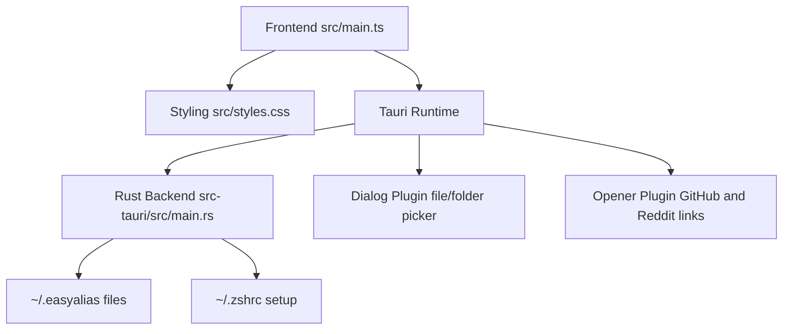
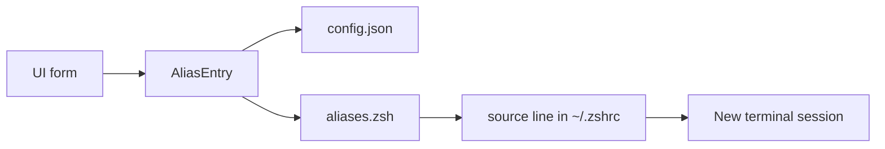
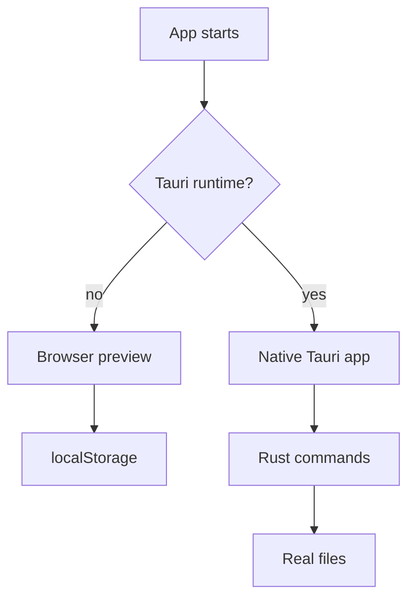
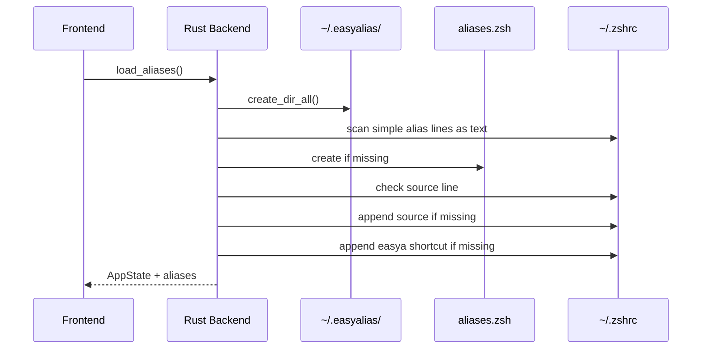
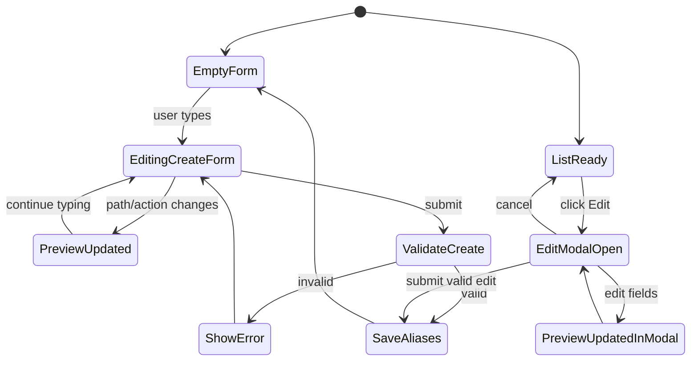
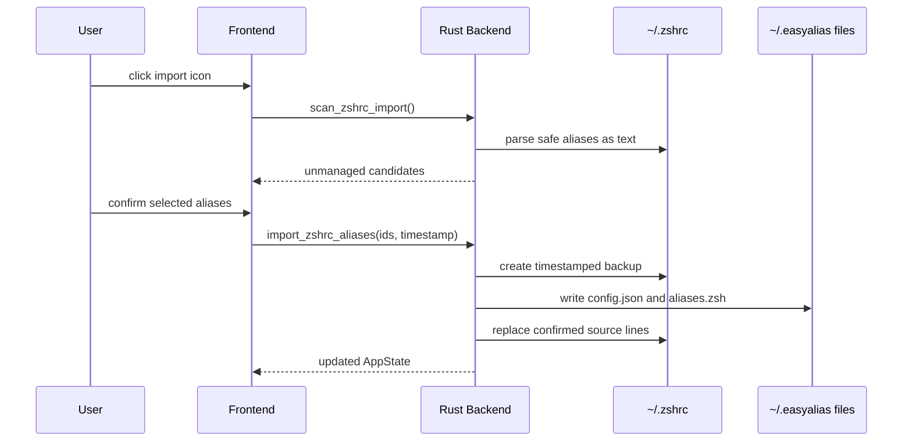
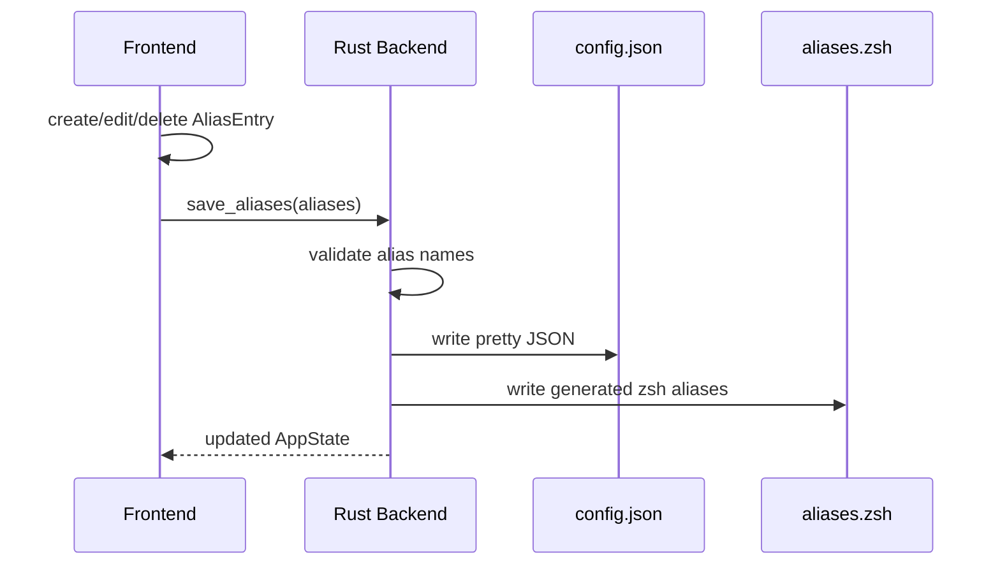
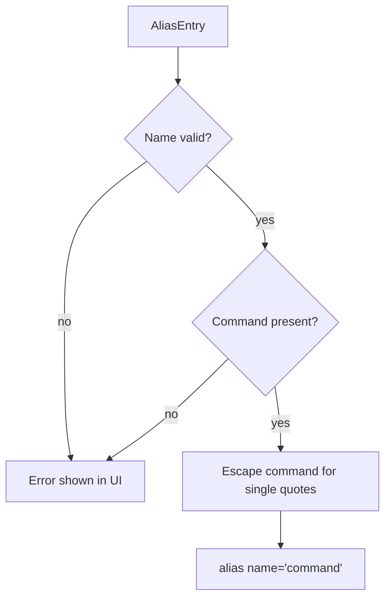

# Architecture

This document describes the technical structure of EasyAlias.

## Overview

EasyAlias consists of a small frontend and a Tauri/Rust backend:

| Layer | File | Responsibility |
| --- | --- | --- |
| Frontend | `src/main.ts` | UI, form state, suggestions, first-start/manual import dialog, command preview |
| Styling | `src/styles.css` | layout and visual design |
| Backend | `src-tauri/src/main.rs` | `.zshrc` detection, backup, migration, and local file writes |
| Tauri Config | `src-tauri/tauri.conf.json` | app window, build, bundle |
| Tauri Dialog Plugin | `@tauri-apps/plugin-dialog` | native file/folder picker |
| Tauri Opener Plugin | `@tauri-apps/plugin-opener` | open GitHub and Reddit in the system browser |

The core idea: EasyAlias does not manage the entire `~/.zshrc`. It creates a dedicated alias file and connects it to zsh once.



## Data Flow

```text
UI form
  -> AliasEntry
  -> ~/.easyalias/config.json
  -> ~/.easyalias/aliases.zsh
  -> source line in ~/.zshrc
  -> new terminal sessions
```



In browser preview mode without Tauri, state is stored only in `localStorage`. This makes the UI easy to test without changing real shell files.

In Tauri mode, the backend writes real files on the Mac.



## Local Files

| File | Content | Owner |
| --- | --- | --- |
| `~/.easyalias/config.json` | structured alias data for the UI | EasyAlias |
| `~/.easyalias/aliases.zsh` | generated zsh aliases | EasyAlias |
| `~/.easyalias/.zshrc-import-v1` | records that the automatic first-start import prompt was handled | EasyAlias |
| `~/.zshrc.easyalias-backup-*` | timestamped copy created before an import | user backup |
| `~/.zshrc` | user configuration plus EasyAlias source/shortcut lines and confirmed import markers | user + EasyAlias setup |

On first Tauri startup, the backend ensures:

1. `~/.easyalias/` exists.
2. Existing safe one-line aliases are detected before EasyAlias appends its own lines.
3. `~/.easyalias/aliases.zsh` exists.
4. `~/.zshrc` contains `source ~/.easyalias/aliases.zsh`.
5. `~/.zshrc` contains `alias easya='open /Applications/EasyAlias.app'` if `easya` does not already exist.



## Frontend

The frontend is intentionally lightweight:

- no UI framework
- TypeScript
- Vite
- direct DOM updates

Main responsibilities:

- manage form values
- validate alias names
- update the command preview live
- persist safe macOS suggestions directly with one click
- open the import scanner from the header and review `.zshrc` candidates
- display, edit, and delete aliases
- call Tauri commands when the app runs natively

The most important types:

```ts
type AliasAction =
  | "navigate"
  | "open"
  | "execute"
  | "compile_gradle"
  | "compile_maven"
  | "custom";

type AliasEntry = {
  id: string;
  name: string;
  path: string;
  action: AliasAction;
  customCommand?: string;
  commandPreview: string;
  createdAt: string;
  updatedAt: string;
};
```



## Backend

The Tauri backend exposes five commands:

```rust
load_aliases()
save_aliases(aliases)
scan_zshrc_import()
dismiss_zshrc_import()
import_zshrc_aliases(selected_ids, timestamp)
```

`load_aliases` handles startup setup:

- create the app directory
- create an empty `aliases.zsh` if missing
- ensure the `source` line in `~/.zshrc`
- ensure the `easya` shortcut in `~/.zshrc`
- load `config.json` if it exists

`save_aliases` writes:

- `config.json` as the data source for the UI
- `aliases.zsh` as the generated shell file

`scan_zshrc_import` ignores the first-start marker, scans `~/.zshrc` again, filters names already managed by EasyAlias, and returns the remaining candidates for the header import dialog. It does not modify alias lines.

`import_zshrc_aliases` rescans the file, verifies the selected line ids, creates a timestamped backup, writes imported Custom Commands, and replaces only confirmed source lines with zsh no-op markers. The scanner never sources or executes `~/.zshrc`.





## Shell Generation

An alias entry becomes a zsh line:

```zsh
# Generated by EasyAlias.
# Edit aliases in the app, not by hand.

alias beerv2='cd "$HOME/Desktop/projects/beerv2_app"'
```

Before writing, the backend validates:

- alias name is not empty
- alias name starts with a letter or `_`
- alias name contains only letters, numbers, `_`, or `-`
- command preview is not empty



## Safety

EasyAlias changes `~/.zshrc` only minimally:

```zsh
# EasyAlias aliases
source ~/.easyalias/aliases.zsh

# EasyAlias app shortcut
alias easya='open /Applications/EasyAlias.app'
```

Existing content is preserved.

Important boundaries:

- Custom commands are real shell commands.
- The generated `aliases.zsh` is app output and should not be edited manually.
- Standard paths are wrapped in double quotes.
- Import scanning handles only unindented, one-line aliases with one assignment.
- Alias options, nested declarations, repeated names, malformed lines, and multiple assignments are skipped.
- A backup is written before any selected source line is changed.

## Roadmap

Short term:

- tests for command generation

Later:

- settings window
- optional export/backup mechanism
- signed and notarized release automation
