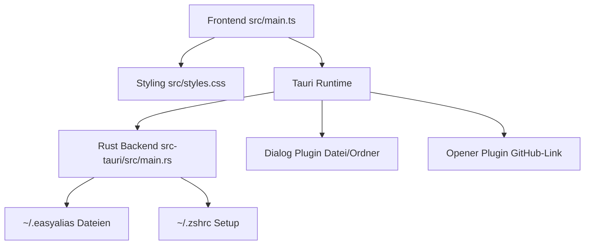
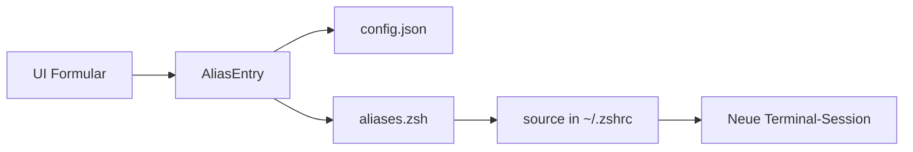
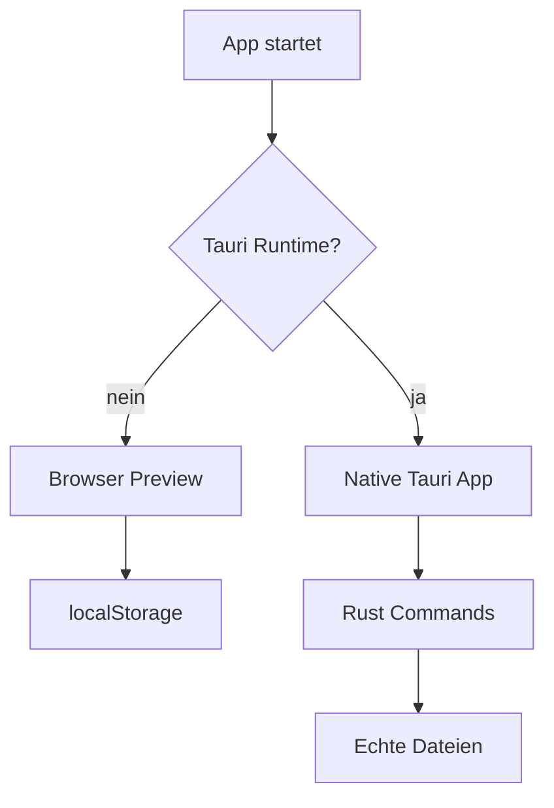
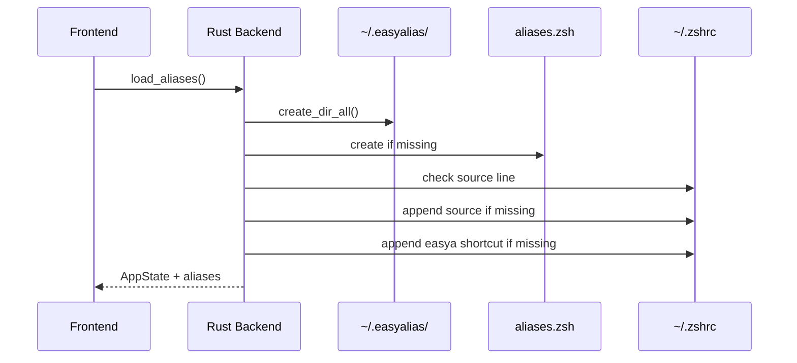
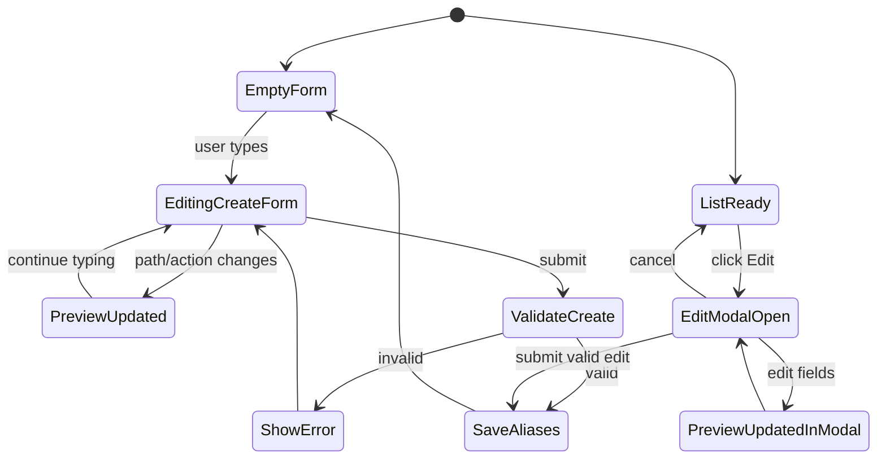
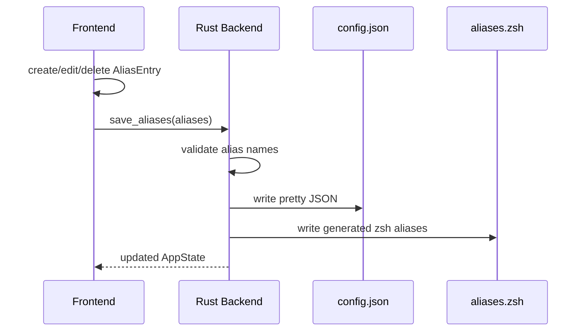
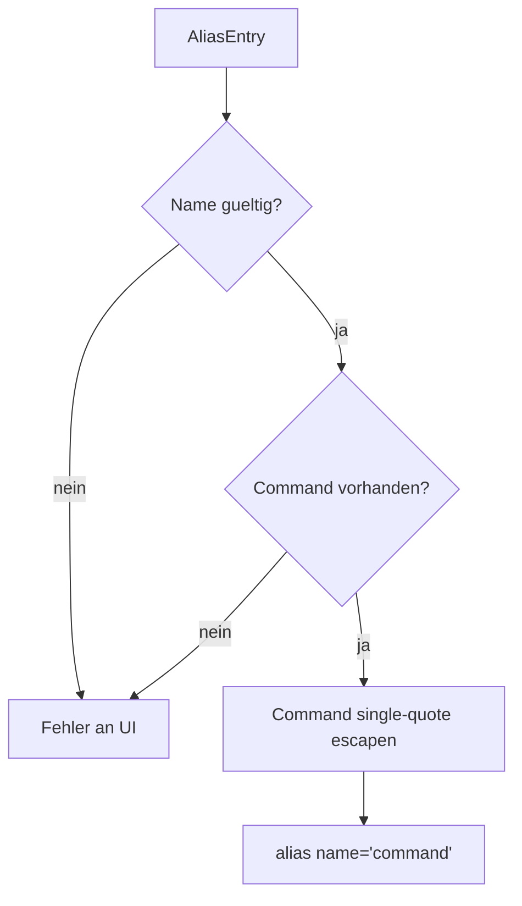

# Architektur

Dieses Dokument beschreibt den technischen Aufbau von EasyAlias.

## Ueberblick

EasyAlias besteht aus zwei Schichten:

| Schicht | Datei | Aufgabe |
| --- | --- | --- |
| Frontend | `src/main.ts` | UI, Formular-State, Command-Preview |
| Styling | `src/styles.css` | Layout und visuelle Oberflaeche |
| Backend | `src-tauri/src/main.rs` | lokale Dateien lesen/schreiben |
| Tauri Config | `src-tauri/tauri.conf.json` | App-Fenster, Build, Bundle |
| Tauri Dialog Plugin | `@tauri-apps/plugin-dialog` | nativer Datei-/Ordner-Picker |

Die Grundidee: EasyAlias verwaltet nicht die gesamte `~/.zshrc`, sondern erzeugt eine separate Alias-Datei und verbindet diese einmalig mit zsh.



## Datenfluss

```text
UI Formular
  -> AliasEntry
  -> ~/.easyalias/config.json
  -> ~/.easyalias/aliases.zsh
  -> source in ~/.zshrc
  -> neue Terminal-Sessions
```



Im Browser-Dev-Modus ohne Tauri wird der Zustand nur in `localStorage` gespeichert. So kann die UI schnell getestet werden, ohne echte Shell-Dateien zu veraendern.

Im Tauri-Modus schreibt das Backend echte Dateien auf dem Mac.



## Lokale Dateien

| Datei | Inhalt | Besitzer |
| --- | --- | --- |
| `~/.easyalias/config.json` | strukturierte Alias-Daten fuer die UI | EasyAlias |
| `~/.easyalias/aliases.zsh` | generierte zsh-Aliase | EasyAlias |
| `~/.zshrc` | enthaelt nur die `source`-Zeile | Nutzer + EasyAlias Setup |

Beim ersten Tauri-Start stellt das Backend sicher:

1. `~/.easyalias/` existiert.
2. `~/.easyalias/aliases.zsh` existiert.
3. `~/.zshrc` enthaelt `source ~/.easyalias/aliases.zsh`.
4. `~/.zshrc` enthaelt `alias easya='open /Applications/EasyAlias.app'`, falls `easya` noch nicht existiert.



## Frontend

Das Frontend ist bewusst leichtgewichtig:

- kein UI-Framework
- TypeScript
- Vite
- direkte DOM-Updates

Wichtige Aufgaben:

- Formularwerte verwalten
- Alias-Namen validieren
- Command-Preview live aktualisieren
- Aliase anzeigen, auswaehlen und loeschen
- Tauri Commands aufrufen, wenn die App nativ laeuft

Die wichtigsten Typen:

```ts
type AliasAction =
  | "navigate"
  | "open"
  | "execute"
  | "compile_gradle"
  | "compile_maven"
  | "custom";

type AliasEntry = {
  id: string;
  name: string;
  path: string;
  action: AliasAction;
  customCommand?: string;
  commandPreview: string;
  createdAt: string;
  updatedAt: string;
};
```



## Backend

Das Tauri-Backend stellt aktuell zwei Commands bereit:

```rust
load_aliases()
save_aliases(aliases)
```

`load_aliases` erledigt den Start-Setup:

- App-Ordner erstellen
- leere `aliases.zsh` anlegen, falls sie fehlt
- `source`-Zeile in `~/.zshrc` sicherstellen
- `easya`-Shortcut in `~/.zshrc` sicherstellen
- `config.json` laden, falls vorhanden

`save_aliases` schreibt:

- `config.json` als Datenbasis fuer die UI
- `aliases.zsh` als generierte Shell-Datei



## Shell-Generierung

Aus einem Alias-Eintrag wird eine zsh-Zeile:

```zsh
# Generated by EasyAlias.
# Edit aliases in the app, not by hand.

alias beerv2='cd "$HOME/Desktop/projekte/beerv2_app"'
```

Das Backend validiert vor dem Schreiben:

- Alias-Name ist nicht leer
- Alias-Name beginnt mit Buchstabe oder `_`
- Alias-Name enthaelt nur Buchstaben, Zahlen, `_` oder `-`
- Command-Preview ist nicht leer



## Sicherheit

EasyAlias veraendert `~/.zshrc` nur minimal:

```zsh
# EasyAlias aliases
source ~/.easyalias/aliases.zsh

# EasyAlias app shortcut
alias easya='open /Applications/EasyAlias.app'
```

Bestehende Inhalte bleiben erhalten.

Wichtige Grenzen:

- Custom Commands sind echte Shell-Befehle.
- Die generierte `aliases.zsh` ist Output der App und sollte nicht manuell editiert werden.
- Standardpfade werden in doppelte Anfuehrungszeichen gesetzt.
- Bestehende Aliase aus `~/.zshrc` werden aktuell noch nicht importiert.

## Roadmap

Kurzfristig:

- Import bestehender Aliase
- Tests fuer Command-Generierung

Spaeter:

- Settings-Fenster
- echtes App-Icon
- macOS `.app` Bundle
- optionaler Export/Backup-Mechanismus
