# Architecture

This document describes the technical structure of EasyAlias.

## Overview

EasyAlias consists of a small frontend and a Tauri/Rust backend:

| Layer | File | Responsibility |
| --- | --- | --- |
| Frontend | `src/main.ts` | UI, form state, favorites, paged suggestions, imports, portable backups, Trash, automations, schedule modal, shortcut capture, Settings, command preview |
| Styling | `src/styles.css` | layout and visual design; CSS design tokens with light/dark values |
| Backend | `src-tauri/src/main.rs` | `.zshrc` detection, backup, migration, local file writes, `launchd` scheduling, global-shortcut registration, tray, autostart |
| Tauri Config | `src-tauri/tauri.conf.json` | app window, build, bundle |
| Tauri Dialog Plugin | `@tauri-apps/plugin-dialog` | native file/folder picker |
| Tauri Opener Plugin | `@tauri-apps/plugin-opener` | open GitHub and Reddit in the system browser |
| Tauri Global Shortcut Plugin | `tauri-plugin-global-shortcut` | register per-automation system-wide accelerators |
| Tauri Autostart Plugin | `tauri-plugin-autostart` | launch-at-login registration (`MacosLauncher::LaunchAgent`) |
| Tauri `tray-icon` feature | built into `tauri` | menu-bar item with Show / Quit menu |
| `launchd` | `~/Library/LaunchAgents/dev.hannesgnann.easyalias.*` | fires timed automations when the app is closed |

The core idea: EasyAlias does not manage the entire `~/.zshrc`. It creates a dedicated alias file and connects it to zsh once.

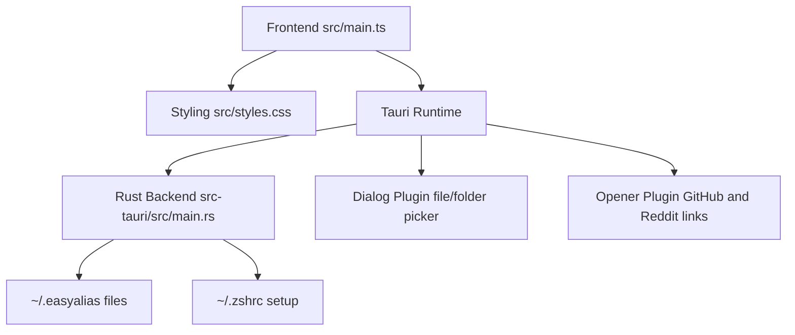
```mermaid
flowchart TB
  UI["Frontend src/main.ts"]
  CSS["Styling src/styles.css"]
  Tauri["Tauri Runtime"]
  Rust["Rust Backend src-tauri/src/main.rs"]
  Dialog["Dialog Plugin file/folder picker"]
  Opener["Opener Plugin GitHub and Reddit links"]
  Files["~/.easyalias files"]
  Zshrc["~/.zshrc setup"]

  UI --> CSS
  UI --> Tauri
  Tauri --> Rust
  Tauri --> Dialog
  Tauri --> Opener
  Rust --> Files
  Rust --> Zshrc
```

## Data Flow

```text
UI form
  -> AliasEntry
  -> ~/.easyalias/config.json
  -> ~/.easyalias/aliases.zsh
  -> source line in ~/.zshrc
  -> new terminal sessions
```

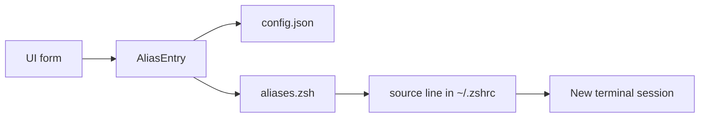
```mermaid
flowchart LR
  Form["UI form"]
  Entry["AliasEntry"]
  Config["config.json"]
  Generated["aliases.zsh"]
  Source["source line in ~/.zshrc"]
  Terminal["New terminal session"]

  Form --> Entry
  Entry --> Config
  Entry --> Generated
  Generated --> Source
  Source --> Terminal
```

In browser preview mode without Tauri, state is stored only in `localStorage`. This makes the UI easy to test without changing real shell files.

In Tauri mode, the backend writes real files on the Mac.

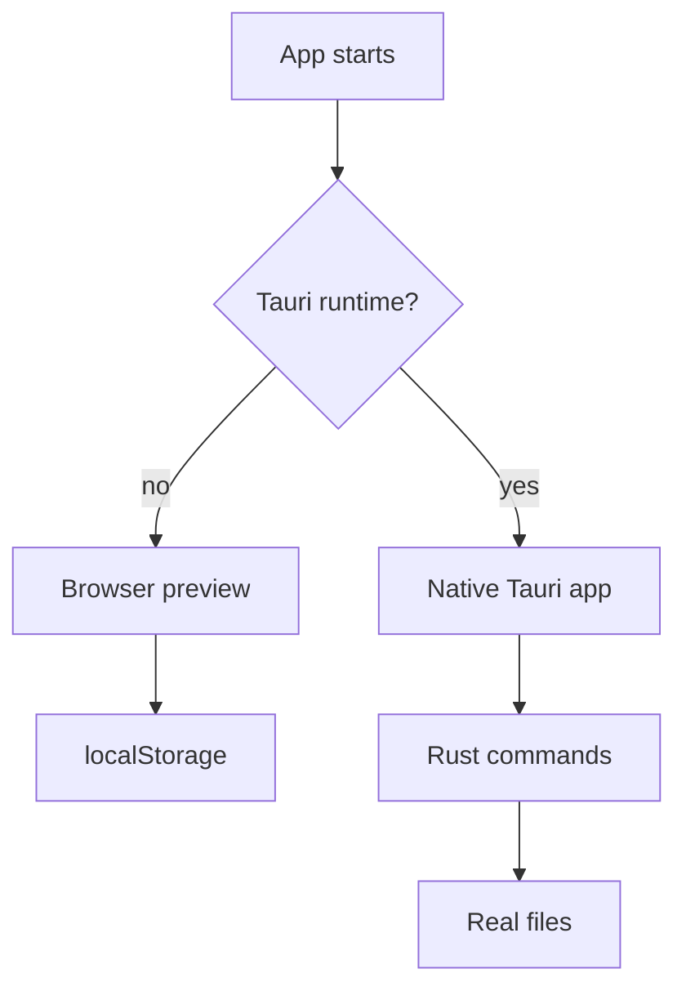
```mermaid
flowchart TD
  Start["App starts"]
  Runtime{"Tauri runtime?"}
  Browser["Browser preview"]
  Native["Native Tauri app"]
  LocalStorage["localStorage"]
  Backend["Rust commands"]
  RealFiles["Real files"]

  Start --> Runtime
  Runtime -- "no" --> Browser
  Browser --> LocalStorage
  Runtime -- "yes" --> Native
  Native --> Backend
  Backend --> RealFiles
```

## Local Files

| File | Content | Owner |
| --- | --- | --- |
| `~/.easyalias/config.json` | structured alias data for the UI | EasyAlias |
| `~/.easyalias/trash.json` | deleted aliases retained for up to 30 days | EasyAlias |
| `~/.easyalias/automations.json` | saved multi-step automations (incl. `hotkey`) | EasyAlias |
| `~/.easyalias/automations-trash.json` | deleted automations retained for up to 30 days | EasyAlias |
| `~/.easyalias/timed-automations.json` | schedules linking an automation id to a trigger | EasyAlias |
| `~/.easyalias/timed-automation-logs/` | per-run stdout/stderr for scheduled runs | EasyAlias |
| `~/.easyalias/sun-location.json` | shared region for sunrise/sunset calculation | EasyAlias |
| `~/.easyalias/settings.json` | theme, shortcut behavior, suggestions toggle, autostart | EasyAlias |
| `~/.easyalias/aliases.zsh` | generated zsh aliases | EasyAlias |
| `~/.easyalias/.zshrc-import-v1` | records that the automatic first-start import prompt was handled | EasyAlias |
| `~/Library/LaunchAgents/dev.hannesgnann.easyalias.timed.*` | one exact-fire agent per clock-time schedule | EasyAlias |
| `~/Library/LaunchAgents/dev.hannesgnann.easyalias.sun-timed-automations.plist` | shared 5-minute checker for sunrise/sunset schedules | EasyAlias |
| `~/Library/LaunchAgents/<autostart agent>` | present only while "Start at login" is on | EasyAlias / autostart plugin |
| `~/.zshrc.easyalias-backup-*` | timestamped copy created before an import | user backup |
| `~/.zshrc` | user configuration plus EasyAlias source/shortcut lines and confirmed import markers | user + EasyAlias setup |

On first Tauri startup, the backend ensures:

1. `~/.easyalias/` exists.
2. Existing safe one-line aliases are detected before EasyAlias appends its own lines.
3. `~/.easyalias/aliases.zsh` exists.
4. `~/.zshrc` contains `source ~/.easyalias/aliases.zsh`.
5. `~/.zshrc` contains `alias easya='open /Applications/EasyAlias.app'` if `easya` does not already exist.

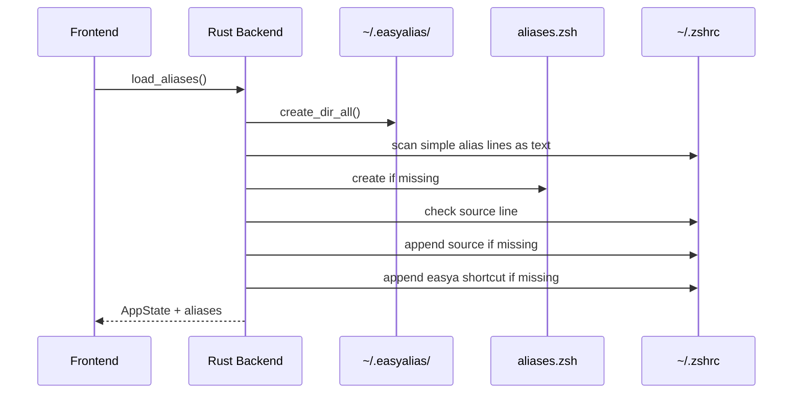
```mermaid
sequenceDiagram
  participant UI as Frontend
  participant Rust as Rust Backend
  participant Dir as ~/.easyalias/
  participant AliasFile as aliases.zsh
  participant Zshrc as ~/.zshrc

  UI->>Rust: load_aliases()
  Rust->>Dir: create_dir_all()
  Rust->>Zshrc: scan simple alias lines as text
  Rust->>AliasFile: create if missing
  Rust->>Zshrc: check source line
  Rust->>Zshrc: append source if missing
  Rust->>Zshrc: append easya shortcut if missing
  Rust-->>UI: AppState + aliases
```

## Frontend

The frontend is intentionally lightweight:

- no UI framework
- TypeScript
- Vite
- direct DOM updates

Main responsibilities:

- manage form values
- validate alias names
- update the command preview live
- persist safe macOS suggestions directly with one click
- paginate the 31 built-in Git, Docker, build, and utility suggestions
- open the import scanner from the header and review `.zshrc` candidates
- sort favorites before regular aliases
- search aliases by name/command and filter by favorites, Git, Docker, navigation, or build
- selectively export and restore portable JSON backups
- restore or permanently remove aliases from the 30-day Trash
- display, edit, and move aliases to Trash
- build, save, and run multi-step Automations in a separate view
- open a schedule modal per automation, capture a global shortcut, and show last-run status
- apply theme, shortcut behavior, suggestions, and autostart from the Settings view; stamp `data-theme` on `<html>`
- listen for `automation-hotkey-fired` / `automation-hotkey-result` events from the backend
- call Tauri commands when the app runs natively

The most important types:

```ts
type AliasAction =
  | "navigate"
  | "open"
  | "execute"
  | "compile_gradle"
  | "compile_maven"
  | "custom";

type AliasEntry = {
  id: string;
  name: string;
  path: string;
  action: AliasAction;
  customCommand?: string;
  commandPreview: string;
  favorite: boolean;
  createdAt: string;
  updatedAt: string;
};

type AutomationStep = {
  id: string;
  kind: "command" | "wait";
  command: string;
  seconds: number;
  behavior: "wait" | "background";
};

type Automation = {
  id: string;
  name: string;
  path: string;
  steps: AutomationStep[];
  favorite: boolean;
  // Free-text label used to organize automations; empty means ungrouped.
  group: string;
  // Optional global keyboard shortcut (Tauri accelerator); null when unset.
  hotkey?: string | null;
  createdAt: string;
  updatedAt: string;
};

type TimedAutomation = {
  id: string;
  automationId: string;
  triggerKind: "clock" | "sunrise" | "sunset";
  time: string;          // "HH:MM", used for triggerKind "clock"
  days: string[];        // lowercase "mon".."sun"; empty = every day
  enabled: boolean;
  createdAt: string;
  updatedAt: string;
  lastRunAt: number | null;
  lastRunStatus: "success" | "error" | null;
  lastRunOutput: string | null;
  lastTriggeredDate: string | null;  // guards the shared sun checker
};

type AppSettings = {
  theme: "system" | "light" | "dark";
  hotkeyBehavior: "window" | "background";
  showSuggestions: boolean;
  autostart: boolean;
};
```

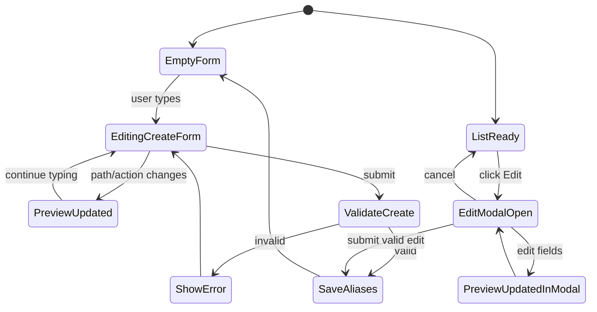
```mermaid
stateDiagram-v2
  [*] --> EmptyForm
  EmptyForm --> EditingCreateForm: user types
  EditingCreateForm --> PreviewUpdated: path/action changes
  PreviewUpdated --> EditingCreateForm: continue typing
  EditingCreateForm --> ValidateCreate: submit
  ValidateCreate --> SaveAliases: valid
  ValidateCreate --> ShowError: invalid
  ShowError --> EditingCreateForm
  SaveAliases --> EmptyForm

  [*] --> ListReady
  ListReady --> EditModalOpen: click Edit
  EditModalOpen --> PreviewUpdatedInModal: edit fields
  PreviewUpdatedInModal --> EditModalOpen
  EditModalOpen --> SaveAliases: submit valid edit
  EditModalOpen --> ListReady: cancel
```

## Backend

The Tauri backend exposes commands in four groups:

```rust
// Core persistence
load_aliases()
save_aliases(aliases)

// Recoverable deletion
list_trash()
move_alias_to_trash(id)
restore_trash_alias(id)
permanently_delete_trash_alias(id)
empty_trash()

// Portable JSON backups
export_alias_backup(selected_ids)
inspect_alias_backup(path)
import_alias_backup(path, selected_ids)

// Legacy .zshrc migration
scan_zshrc_import()
dismiss_zshrc_import()
import_zshrc_aliases(selected_ids, timestamp)

// Automations
load_automations()
save_automations(automations)                 // also re-syncs global hotkeys
set_automation_hotkey(id, accelerator)        // validate + OS-register, then persist
start_automation_session(session_id, path)
run_session_command(session_id, command, background)
stop_automation_session(session_id)
list_automation_trash() / move_automation_to_trash(id) / restore_trash_automation(id)
permanently_delete_trash_automation(id) / empty_automation_trash()
export_automation_backup(...) / inspect_automation_backup(path) / import_automation_backup(...)

// Timed automations (launchd)
list_timed_automations()
save_timed_automation(entry)                   // writes JSON + registers/updates the agent
delete_timed_automation(id)                    // unregisters the agent
list_sun_regions()
load_sun_location_state() / save_sun_location(setting)

// Settings
load_settings()                               // reads settings.json, overrides autostart from the plugin
save_settings(settings)                        // validate + write + apply autostart

// CLI entry points (no window, invoked by launchd)
--run-timed-automation <id>
--check-sun-timed-automations
```

Commands that mutate automations take `app: tauri::AppHandle` and call `register_all_automation_hotkeys` after writing, so OS shortcut registration always matches `automations.json`. The pure logic lives in `*_inner` helpers so unit tests can call it without an `AppHandle`.

`load_aliases` handles startup setup:

- create the app directory
- create an empty `aliases.zsh` if missing
- ensure the `source` line in `~/.zshrc`
- ensure the `easya` shortcut in `~/.zshrc`
- load `config.json` if it exists

`save_aliases` writes:

- `config.json` as the data source for the UI
- `aliases.zsh` as the generated shell file

Deleting an alias calls `move_alias_to_trash`. The backend removes it from the active config and generated shell file, records its deletion time in `trash.json`, and purges entries older than 30 days whenever Trash is loaded. Restore regenerates the active files; permanent deletion and `empty_trash` cannot be undone.

Portable backup commands use a versioned EasyAlias JSON format. Export includes only selected aliases. Import first validates the file, rejects unsupported or oversized input, then lets the user choose which entries to merge. Matching alias names are replaced only when selected.

`scan_zshrc_import` ignores the first-start marker, scans `~/.zshrc` again, filters names already managed by EasyAlias, and returns the remaining candidates for the header import dialog. It does not modify alias lines.

`import_zshrc_aliases` rescans the file, verifies the selected line ids, creates a timestamped backup, writes imported Custom Commands, and replaces only confirmed source lines with zsh no-op markers. The scanner never sources or executes `~/.zshrc`.

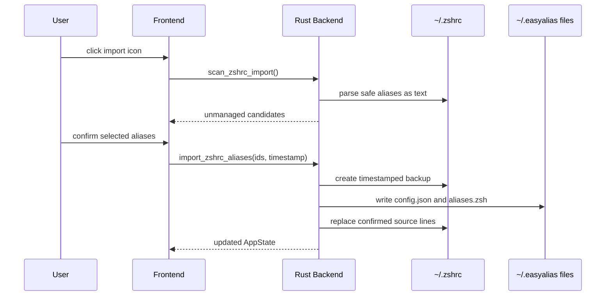
```mermaid
sequenceDiagram
  participant User
  participant UI as Frontend
  participant Rust as Rust Backend
  participant Zshrc as ~/.zshrc
  participant Managed as ~/.easyalias files

  User->>UI: click import icon
  UI->>Rust: scan_zshrc_import()
  Rust->>Zshrc: parse safe aliases as text
  Rust-->>UI: unmanaged candidates
  User->>UI: confirm selected aliases
  UI->>Rust: import_zshrc_aliases(ids, timestamp)
  Rust->>Zshrc: create timestamped backup
  Rust->>Managed: write config.json and aliases.zsh
  Rust->>Zshrc: replace confirmed source lines
  Rust-->>UI: updated AppState
```

Automations are stored independently of aliases in `~/.easyalias/automations.json` and validated on every load and save: up to `MAX_AUTOMATIONS` (200) automations, each with 1-`MAX_AUTOMATION_STEPS` (100) steps, unique automation and step ids, command steps under `MAX_AUTOMATION_COMMAND_BYTES` (16 KB), and wait steps between 1 second and `MAX_WAIT_SECONDS` (24 hours).

Each run gets one persistent `/bin/zsh -l` process (an `AutomationSessionHandle`, keyed by a frontend-generated `session_id` in the `AutomationSessions` Tauri-managed state) instead of a fresh process per step. This is what lets `cd` and exported environment variables from one step carry over to the next, the same way they would in a real terminal.

- `start_automation_session` resolves the working directory (expanding a leading `~`, then `canonicalize`-ing and requiring it to exist), spawns the shell with piped stdin/stdout, and starts a background thread that streams output lines into an `mpsc` channel.
- `run_session_command` writes the step's command to the session's stdin followed by a unique echoed sentinel, then reads from the channel until that sentinel appears. Foreground commands are wrapped as `{ command ; } 2>&1` so stderr merges into the captured output, and the sentinel carries `$?`; background commands are wrapped as `{ command ; } >/dev/null 2>&1 &` and the sentinel carries `$!`, so the step returns as soon as the job has started rather than waiting for it to finish. Captured output is truncated to `MAX_AUTOMATION_OUTPUT_CHARS` (20,000 characters).
- `stop_automation_session` kills the session's shell process specifically (not its process group), so it can interrupt a stuck foreground command without touching background jobs that process already started with `&` — those keep running detached, reparented once the shell exits. It is called both when the user clicks Stop and automatically once a run finishes.

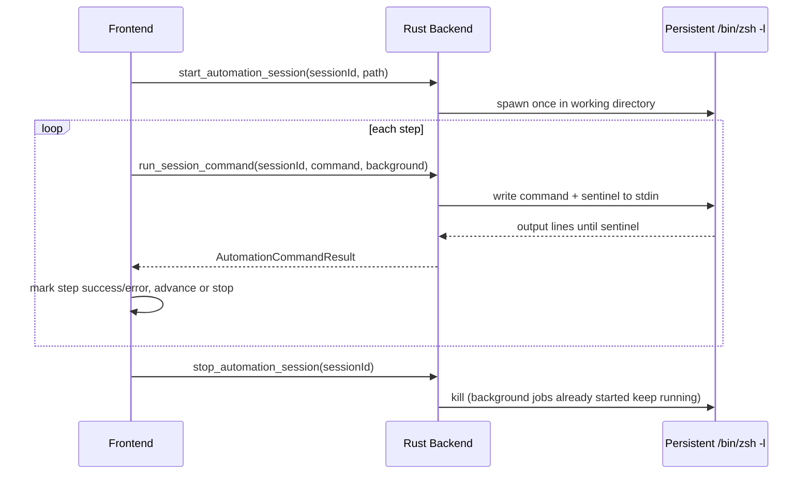
```mermaid
sequenceDiagram
  participant UI as Frontend
  participant Rust as Rust Backend
  participant Shell as Persistent /bin/zsh -l

  UI->>Rust: start_automation_session(sessionId, path)
  Rust->>Shell: spawn once in working directory
  loop each step
    UI->>Rust: run_session_command(sessionId, command, background)
    Rust->>Shell: write command + sentinel to stdin
    Shell-->>Rust: output lines until sentinel
    Rust-->>UI: AutomationCommandResult
    UI->>UI: mark step success/error, advance or stop
  end
  UI->>Rust: stop_automation_session(sessionId)
  Rust->>Shell: kill (background jobs already started keep running)
```

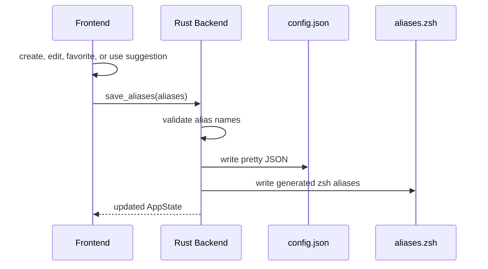
```mermaid
sequenceDiagram
  participant UI as Frontend
  participant Rust as Rust Backend
  participant Config as config.json
  participant Zsh as aliases.zsh

  UI->>UI: create, edit, favorite, or use suggestion
  UI->>Rust: save_aliases(aliases)
  Rust->>Rust: validate alias names
  Rust->>Config: write pretty JSON
  Rust->>Zsh: write generated zsh aliases
  Rust-->>UI: updated AppState
```

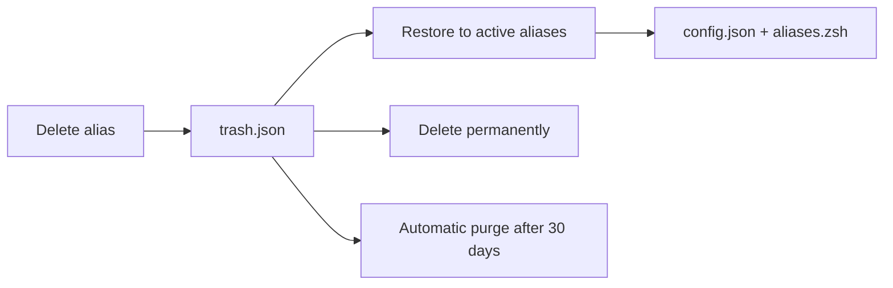
```mermaid
flowchart LR
  Delete["Delete alias"] --> Trash["trash.json"]
  Trash --> Restore["Restore to active aliases"]
  Trash --> Permanent["Delete permanently"]
  Trash --> Expire["Automatic purge after 30 days"]
  Restore --> Config["config.json + aliases.zsh"]
```

## Timed Automations and launchd

A `TimedAutomation` record in `timed-automations.json` links an automation id to a trigger. `save_timed_automation` writes the JSON and reconciles the OS scheduler; `delete_timed_automation` removes both.

- **Clock** entries each get a `~/Library/LaunchAgents/dev.hannesgnann.easyalias.timed.<id>.plist` with a `StartCalendarInterval` for the `HH:MM` (and weekday filter), running `easyalias --run-timed-automation <id>`.
- **Sunrise/sunset** entries cannot use a fixed calendar trigger because the time drifts by roughly a minute a day. They instead share one `dev.hannesgnann.easyalias.sun-timed-automations.plist` agent with `StartInterval 300` running `easyalias --check-sun-timed-automations`. The checker computes today's event time for the configured region (a NOAA-style solar position calc; polar day/night yields "no event"), and for each enabled entry whose time has passed and whose `lastTriggeredDate` is not today, runs the automation and stamps the date. The shared agent is created only while at least one enabled sun entry exists.

`--run-timed-automation` and `--check-sun-timed-automations` are handled at the very top of `main()` before any Tauri/GUI setup, so `launchd` runs them as short headless processes. Each records `lastRunAt` / `lastRunStatus` / `lastRunOutput`; the checker also uses `lastTriggeredDate` so a sun entry fires at most once per calendar day even though the agent polls every 5 minutes.

`launchd` user agents only run while the user is logged in and the Mac is awake. A `StartInterval` occurrence missed while asleep runs soon after wake; there is no "catch-up storm".

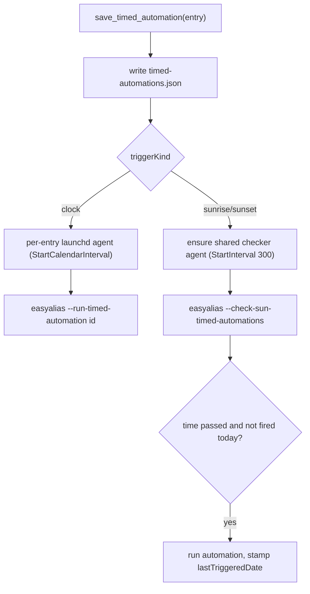
```mermaid
flowchart TD
  Save["save_timed_automation(entry)"] --> Write["write timed-automations.json"]
  Write --> Kind{"triggerKind"}
  Kind -- "clock" --> Plist["per-entry launchd agent (StartCalendarInterval)"]
  Kind -- "sunrise/sunset" --> Shared["ensure shared checker agent (StartInterval 300)"]
  Plist --> Fire["easyalias --run-timed-automation id"]
  Shared --> Check["easyalias --check-sun-timed-automations"]
  Check --> Due{"time passed and not fired today?"}
  Due -- "yes" --> Fire2["run automation, stamp lastTriggeredDate"]
```

## Global Keyboard Shortcuts

`tauri-plugin-global-shortcut` is registered with a single `with_handler` callback. `register_all_automation_hotkeys(app)` runs in `.setup()` and after every command that can add, remove, or free a binding (`save_automations`, `set_automation_hotkey`, trash move/restore, backup import). It unregisters everything, then registers each automation's `hotkey`; a bad or already-taken combo is logged and skipped so one entry never blocks the rest.

`set_automation_hotkey(id, accelerator)`:

1. rejects an unparseable accelerator;
2. rejects a combo already assigned to another automation;
3. releases this automation's previous binding, then tries to `register` the new one — on failure it re-registers the old binding and returns an error **without writing** `automations.json`;
4. otherwise persists the change.

On a press, `handle_global_shortcut` matches the `Shortcut` back to an automation, reads `hotkey_behavior` from settings, and spawns a worker thread: `"background"` runs `run_automation_steps_headless` and emits `automation-hotkey-result` (surfacing the window only on failure); `"window"` reveals the window and emits `automation-hotkey-fired` for the frontend to run through the normal session flow. All window calls go through `show_main_window`, which marshals onto the main thread with `run_on_main_thread`.

## Menu Bar, Tray, and Autostart

`.setup()` builds a `TrayIconBuilder` with a "Show EasyAlias" / "Quit EasyAlias" menu; left click reveals the window, right click opens the menu. On macOS the icon is `icons/tray-icon.png` set `icon_as_template(true)` so the system tints it to the menu bar.

`.on_window_event` intercepts `CloseRequested`, calls `api.prevent_close()`, and hides the window — the process (and its shortcuts) keep running until "Quit" / `Cmd+Q`.

`tauri-plugin-autostart` (`MacosLauncher::LaunchAgent`) is initialised with the extra argument `--autostarted`. `save_settings` calls `apply_autostart` to enable/disable the login item; `load_settings` overrides the stored `autostart` value with the plugin's real `is_enabled()`. When `main()` sees `--autostarted`, `.setup()` keeps the window hidden so a login launch stays in the tray.

## Settings

`AppSettings` persists in `settings.json` with `#[serde(default)]` on every field, so an older or partial file still loads. `save_settings` validates `theme` and `hotkey_behavior` against fixed value lists (`validate_app_settings`), writes the file, and applies autostart. The frontend also mirrors settings to `localStorage["easyalias-settings"]` and calls `applyTheme` before the backend responds, so there is no light flash on start. `styles.css` defines every colour as a `var(--token)` with light values on `:root`, a `:root[data-theme="dark"]` block, and a `prefers-color-scheme` fallback; the frontend stamps `data-theme` on `<html>`.

## Shell Generation

An alias entry becomes a zsh line:

```zsh
# Generated by EasyAlias.
# Edit aliases in the app, not by hand.

alias beerv2='cd "$HOME/Desktop/projects/beerv2_app"'
```

Before writing, the backend validates:

- alias name is not empty
- alias name starts with a letter or `_`
- alias name contains only letters, numbers, `_`, or `-`
- command preview is not empty

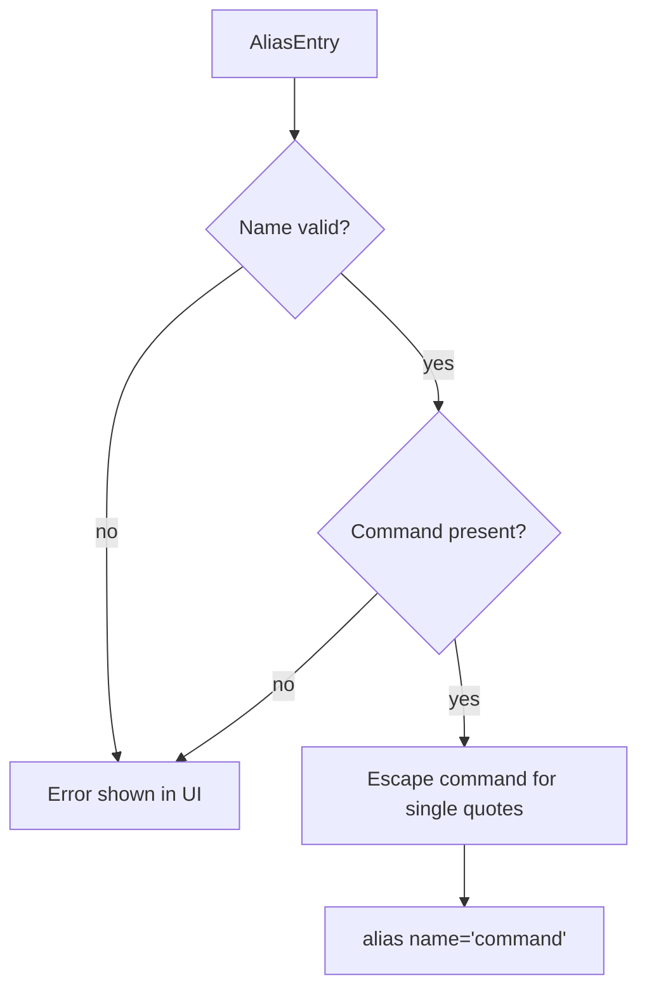
```mermaid
flowchart TD
  AliasEntry["AliasEntry"]
  ValidateName{"Name valid?"}
  ValidateCommand{"Command present?"}
  Quote["Escape command for single quotes"]
  Line["alias name='command'"]
  Error["Error shown in UI"]

  AliasEntry --> ValidateName
  ValidateName -- "no" --> Error
  ValidateName -- "yes" --> ValidateCommand
  ValidateCommand -- "no" --> Error
  ValidateCommand -- "yes" --> Quote
  Quote --> Line
```

## Safety

EasyAlias changes `~/.zshrc` only minimally:

```zsh
# EasyAlias aliases
source ~/.easyalias/aliases.zsh

# EasyAlias app shortcut
alias easya='open /Applications/EasyAlias.app'
```

Existing content is preserved.

Important boundaries:

- Custom commands are real shell commands.
- The generated `aliases.zsh` is app output and should not be edited manually.
- Standard paths are wrapped in double quotes.
- Import scanning handles only unindented, one-line aliases with one assignment.
- Alias options, nested declarations, repeated names, malformed lines, and multiple assignments are skipped.
- A backup is written before any selected source line is changed.
- Portable backup files are parsed as data and never executed.
- Trash provides a 30-day recovery window unless the user explicitly deletes an entry permanently or empties it.
- Automation commands run only when the user explicitly clicks Run or a schedule/shortcut fires, execute in the automation's own shell session, and are rejected outright in browser preview mode (no `start_automation_session`/`run_session_command` backend to call).
- Timed automations run the app binary headlessly through `launchd`; the CLI entry points touch no GUI and exit immediately.
- Global shortcuts only work while the app process is alive; closing the window keeps it in the tray but `Quit` fully unregisters them.
- A global shortcut is registered with the OS before it is written to `automations.json`, so a rejected combo never leaves a stored-but-inactive binding.

## Roadmap

Short term:

- tests for command generation

Later:

- signed and notarized release automation
- a monochrome/branded tray icon set per platform
- Automations, timed schedules, global shortcuts, and the tray now ship on macOS, Windows, and Linux; the sandboxed Mac App Store edition remains intentionally excluded (see its architecture doc)
