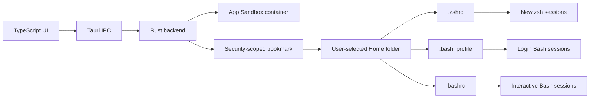
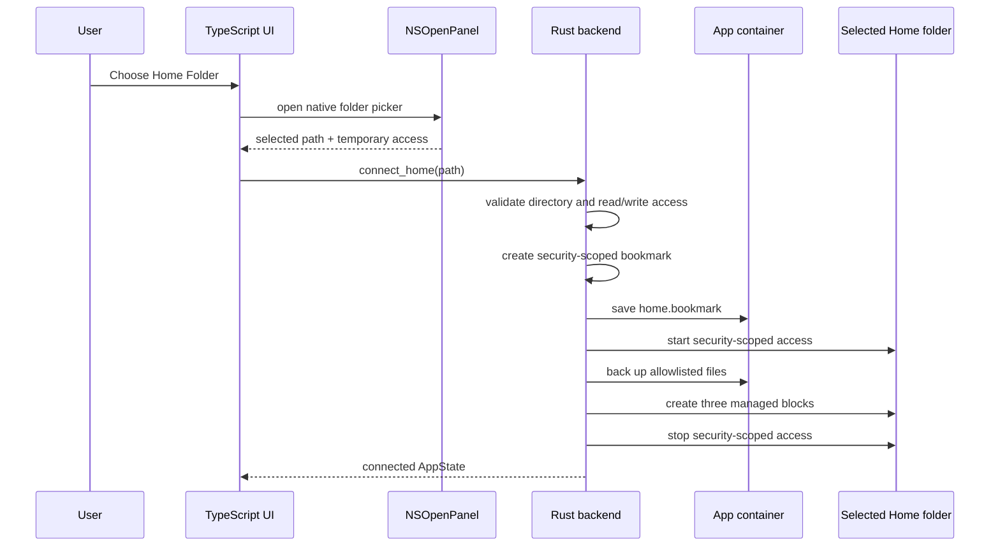
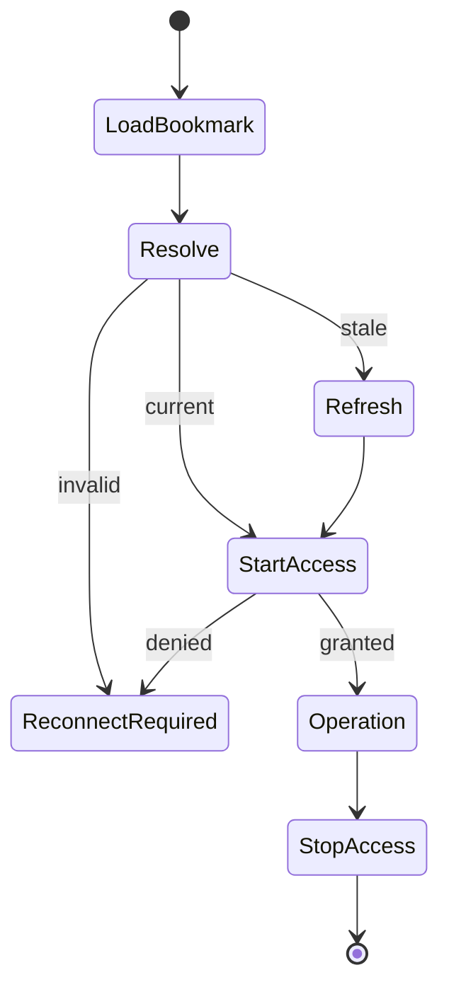
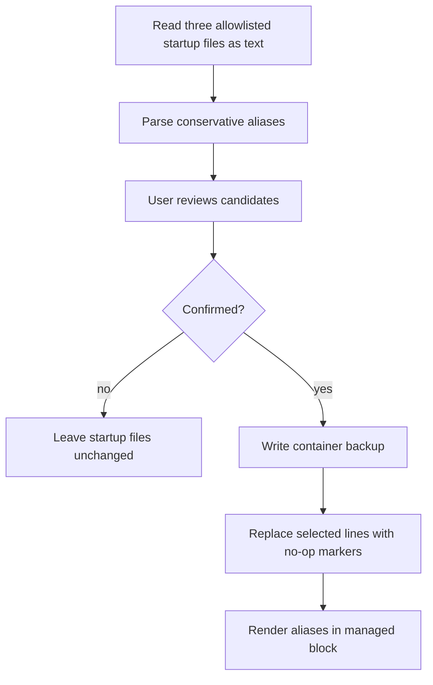
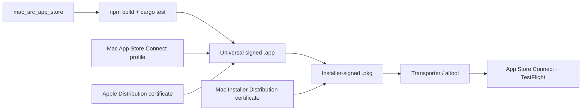

# Mac App Store Architecture

This document describes the sandboxed EasyAlias macOS edition in `mac_src_app_store/`.

## Design Goal

The Homebrew edition can access the user's home directory directly. The Mac App Store edition cannot. It must run inside App Sandbox and receive explicit user permission for external files it manages.

The Store edition therefore separates data into two ownership domains:

| Domain | Data |
| --- | --- |
| EasyAlias App Sandbox container | structured alias JSON, Trash, bookmark data, import marker, backups |
| user-selected Home folder | `.zshrc`, `.bash_profile`, and `.bashrc`, each containing the EasyAlias managed block |



## Components

| Layer | File | Responsibility |
| --- | --- | --- |
| Frontend | `src/main.ts` | forms, favorites, paged suggestions, setup, legacy import, portable backups, Trash, status |
| Styling | `src/styles.css` | responsive desktop UI |
| Backend | `src-tauri/src/main.rs` | container storage, bookmark lifecycle, parsing, backups, managed block |
| Base config | `src-tauri/tauri.conf.json` | identity, version, window, category |
| Sandbox config | `src-tauri/tauri.sandbox.conf.json` | local sandbox bundle |
| Store config | `src-tauri/tauri.appstore.conf.json` | final provisioning-profile bundle |
| Local entitlements | `src-tauri/Entitlements.local.plist` | ad-hoc sandbox permissions without Store identity fields |
| Store entitlements | `src-tauri/Entitlements.plist` | sandbox permissions plus Team ID and Application ID |
| Info plist | `src-tauri/Info.plist` | export-compliance declaration |

## Connection Flow

The frontend uses Tauri's dialog plugin, which opens a native `NSOpenPanel`. The user selects their Home folder, and the selected path is immediately sent to `connect_home`.



The temporary permission from the picker is converted into bookmark data before the panel access ends.

## Bookmark Lifecycle

Every later shell-file operation follows the same boundary:

1. Read `home.bookmark` from the app container.
2. Resolve it with `NSURLBookmarkResolutionWithSecurityScope`.
3. Refresh stale bookmark data if macOS requests it.
4. Call `startAccessingSecurityScopedResource()`.
5. Perform one bounded operation against the fixed `.zshrc`, `.bash_profile`, and `.bashrc` allowlist.
6. Call `stopAccessingSecurityScopedResource()`.



The resolved path is never treated as permanent authority by itself. The bookmark is the authority.

## Managed Blocks

Aliases are rendered into `.zshrc`, `.bash_profile`, and `.bashrc` directly inside the selected Home folder:

```zsh
# >>> EasyAlias managed aliases >>>
# Managed by EasyAlias. Edit these aliases in the app.
alias gs='git status --short --branch'
# <<< EasyAlias managed aliases <<<
```

Before writing, the backend:

- validates every alias name
- rejects empty commands
- escapes commands for a POSIX-style single-quoted alias
- validates that markers are paired
- rejects duplicate or ambiguous blocks
- removes only the previous managed block
- appends one newly rendered block

This avoids asking Terminal to read generated scripts from another app's sandbox container.

## Commands

The backend exposes commands for connection, active aliases, recovery, backups, and legacy migration:

```rust
load_aliases()
connect_home(path)
disconnect_home()
save_aliases(aliases)
list_trash()
move_alias_to_trash(id)
restore_trash_alias(id)
permanently_delete_trash_alias(id)
empty_trash()
export_alias_backup(selected_ids)
inspect_alias_backup(path)
import_alias_backup(path, selected_ids)
scan_shell_import()
dismiss_shell_import()
import_shell_aliases(selected_ids, timestamp)
```

### `load_aliases`

- creates the app container data and backup directories
- loads `config.json`
- resolves the bookmark if one exists
- reports connection and managed-block status
- offers a first import only after a valid connection

It does not choose or scan a Home folder without a valid user-created bookmark.

### `connect_home`

- accepts the directory path returned by the native picker
- validates that it is a readable and writable directory
- creates and stores the security-scoped bookmark
- accesses only the three allowlisted startup filenames inside that directory
- backs up existing startup files before adding the first blocks
- returns safe aliases from all supported files for optional import

### `save_aliases`

- validates and renders all aliases
- resolves and activates the bookmark
- replaces the managed block in all three startup files
- stops security-scoped access
- writes structured `config.json`

### `disconnect_home`

- resolves the current bookmark
- backs up the connected startup files
- removes the managed blocks from the old folder
- deletes the old bookmark
- keeps structured aliases in the container for the next connection

### `scan_shell_import`

- reads the three connected startup files as text
- ignores aliases inside the managed block
- ignores names already managed by EasyAlias
- rejects names defined in more than one startup file as ambiguous
- returns conservative one-line candidates with source filename and line number

### `import_shell_aliases`

- rescans the connected startup files
- verifies selected ids against current filenames and line numbers
- creates a container backup
- replaces confirmed source lines with shell no-op markers
- writes imported commands into all managed blocks
- stores the updated structured config

### Trash commands

- move deleted aliases out of the active config and all managed shell blocks
- retain deletion metadata in `trash.json` for up to 30 days
- restore selected entries and regenerate the managed block
- permanently delete one entry or empty the complete Trash on explicit request

### Portable backup commands

- export only the aliases selected in the review dialog
- inspect a versioned EasyAlias JSON file without applying it
- validate size, schema, names, and commands before import
- merge only selected entries; matching names replace their existing EasyAlias entry

## Container Data

```text
Application Support/
  config.json
  trash.json
  home.bookmark
  .shell-import-v2
  backups/
    zshrc-<timestamp>.backup
    bash_profile-<timestamp>.backup
    bashrc-<timestamp>.backup
```

No Apple certificate, private key, API key, or provisioning profile belongs in this directory or in Git.

## Entitlements

`Entitlements.plist` contains:

| Entitlement | Reason |
| --- | --- |
| `com.apple.security.app-sandbox` | required for Mac App Store distribution |
| `com.apple.security.network.client` | allows Tauri's sandboxed WebKit helper processes to load the bundled frontend |
| `com.apple.application-identifier` | binds the app to Team ID and Bundle ID |
| `com.apple.developer.team-identifier` | identifies the Apple Developer team |
| `com.apple.security.files.user-selected.read-write` | permits access to the Home folder selected through `NSOpenPanel` |
| `com.apple.security.files.bookmarks.app-scope` | persists selected-folder access between launches |

No broad home-directory entitlement, temporary exception, network server entitlement, shell execution plugin, or child process is used. Although the operating-system permission covers the selected folder, the Rust backend has an exact filename allowlist and does not enumerate or access other entries.

`com.apple.security.files.user-selected.executable` exists only in `Entitlements.local.plist` for local ad-hoc sandbox testing. It is deliberately absent from the final `Entitlements.plist` after App Review flagged it as invalid for this Store submission. The Store configuration references only the final entitlement file.

## Automations (Not Included)

The direct macOS and Windows editions have an Automations feature: user-defined, multi-step workflows where the app itself spawns a persistent shell (`/bin/zsh` or `cmd.exe`) and runs arbitrary commands the user typed in, so tools like `npm`, `docker`, or `git` can be chained in one working directory.

This Store edition deliberately does not include it. Running arbitrary child-process commands is a different capability than anything else in this app: every other feature here either edits the user's own `.zshrc` text or reads/writes inside the sandboxed container — nothing else spawns a process. Under App Sandbox, a child process inherits the parent's sandbox, so most commands (git, docker, network tools reaching outside the container, project directories never explicitly picked by the user) would fail unless every working directory were re-granted through the native folder picker with its own security-scoped bookmark, similar to the existing `.zshrc` bookmark in the Connection Flow above. Even with that limitation solved, a Store app whose primary new feature is "run whatever shell command the user types" is a meaningfully higher-risk App Review surface than the conservative, allowlisted file edits this edition already relies on (see Entitlements and Import Safety below).

If this changes in the future, the working directory would need to go through the same picker-plus-bookmark pattern as `.zshrc`, not a free-text path field like the direct macOS/Windows editions use.

## Import Safety

The parser skips:

- indented aliases that may belong to shell conditions or functions
- global aliases and other zsh alias options
- multiple definitions on one line
- repeated names
- malformed or multiline declarations
- the reserved `easya` application shortcut
- every alias inside the managed block

The startup files are parsed as text and never sourced or executed.

Portable backup files receive the same defensive treatment: they are parsed as bounded JSON data, validated before the selection screen appears, and never executed. Deleted aliases remain recoverable for 30 days unless the user explicitly removes them permanently.



## Packaging Flow



The final Store build merges `tauri.appstore.conf.json` into the base Tauri configuration and embeds `EasyAlias_AppStore.provisionprofile`.

## Tests

Rust unit tests cover:

- ignoring aliases inside the managed block
- replacing one managed block without changing unrelated lines
- rejecting malformed markers
- replacing only confirmed import lines
- portable backup validation and selective merging
- Trash retention, restoration, and permanent removal

The production checks are:

```zsh
npm run build
cargo test --manifest-path src-tauri/Cargo.toml
plutil -lint \
  src-tauri/Entitlements.local.plist \
  src-tauri/Entitlements.plist \
  src-tauri/Info.plist
```

A signed manual test is still required because bookmark persistence and App Sandbox enforcement depend on macOS code signing.
