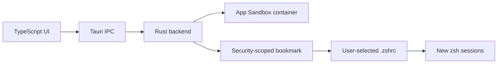
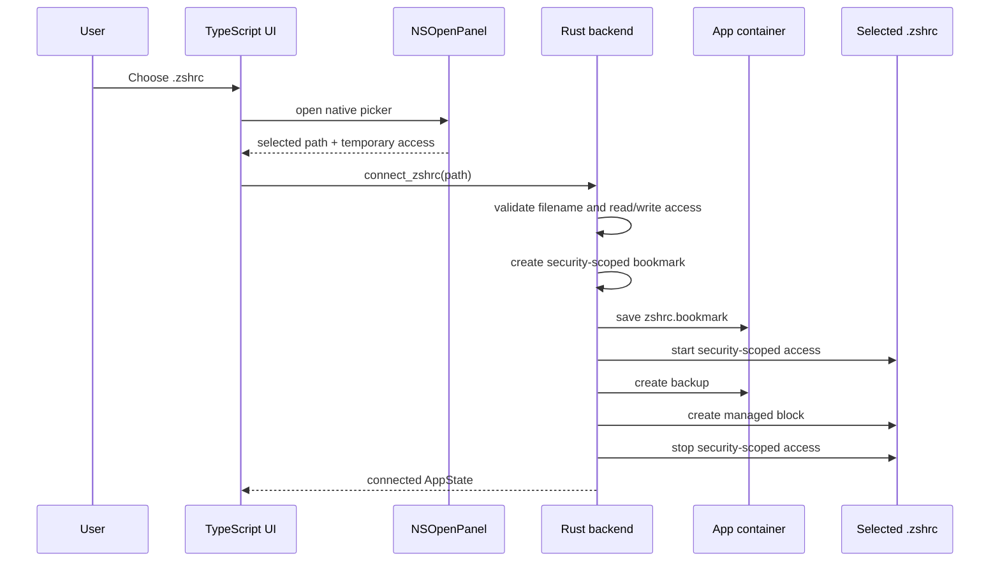
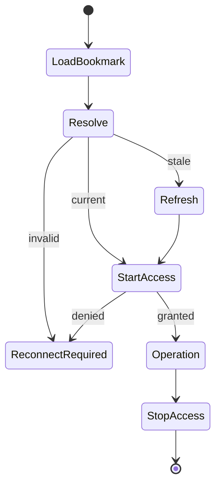
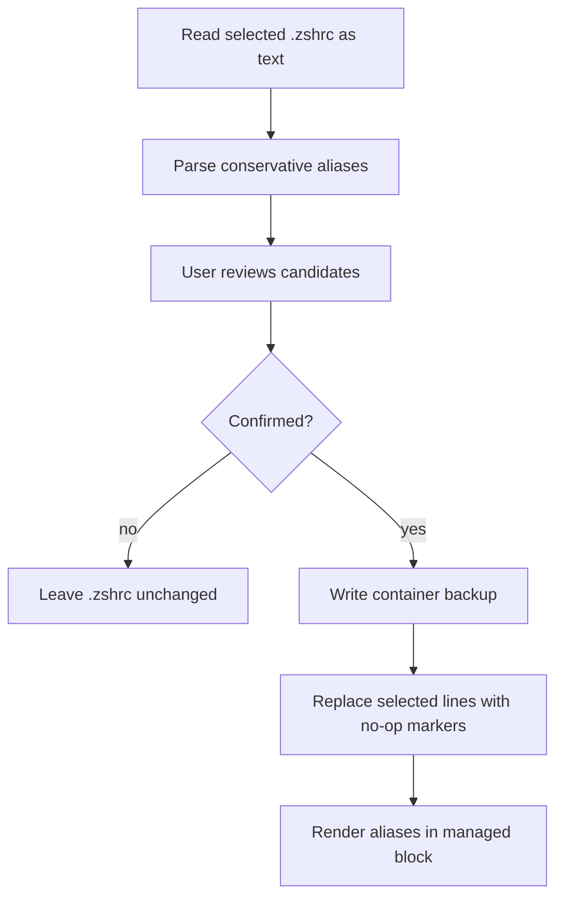
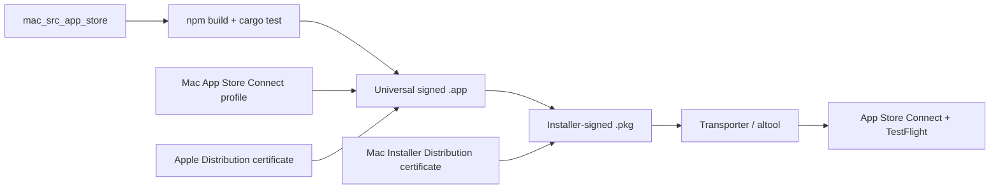

# Mac App Store Architecture

This document describes the sandboxed EasyAlias macOS edition in `mac_src_app_store/`.

## Design Goal

The Homebrew edition can access the user's home directory directly. The Mac App Store edition cannot. It must run inside App Sandbox and receive explicit permission for every external file it manages.

The Store edition therefore separates data into two ownership domains:

| Domain | Data |
| --- | --- |
| EasyAlias App Sandbox container | structured alias JSON, bookmark data, import marker, backups |
| user-selected file | one `.zshrc` containing the EasyAlias managed block |



## Components

| Layer | File | Responsibility |
| --- | --- | --- |
| Frontend | `src/main.ts` | forms, suggestions, setup flow, import review, status |
| Styling | `src/styles.css` | responsive desktop UI |
| Backend | `src-tauri/src/main.rs` | container storage, bookmark lifecycle, parsing, backups, managed block |
| Base config | `src-tauri/tauri.conf.json` | identity, version, window, category |
| Sandbox config | `src-tauri/tauri.sandbox.conf.json` | local sandbox bundle |
| Store config | `src-tauri/tauri.appstore.conf.json` | final provisioning-profile bundle |
| Local entitlements | `src-tauri/Entitlements.local.plist` | ad-hoc sandbox permissions without Store identity fields |
| Store entitlements | `src-tauri/Entitlements.plist` | sandbox permissions plus Team ID and Application ID |
| Info plist | `src-tauri/Info.plist` | export-compliance declaration |

## Connection Flow

The frontend uses Tauri's dialog plugin, which opens a native `NSOpenPanel`. The user selects `.zshrc`, and the selected path is immediately sent to `connect_zshrc`.



The temporary permission from the picker is converted into bookmark data before the panel access ends.

## Bookmark Lifecycle

Every later `.zshrc` operation follows the same boundary:

1. Read `zshrc.bookmark` from the app container.
2. Resolve it with `NSURLBookmarkResolutionWithSecurityScope`.
3. Refresh stale bookmark data if macOS requests it.
4. Call `startAccessingSecurityScopedResource()`.
5. Perform one bounded read/write operation.
6. Call `stopAccessingSecurityScopedResource()`.



The resolved path is never treated as permanent authority by itself. The bookmark is the authority.

## Managed Block

Aliases are rendered directly into the selected `.zshrc`:

```zsh
# >>> EasyAlias managed aliases >>>
# Managed by EasyAlias. Edit these aliases in the app.
alias gs='git status --short --branch'
# <<< EasyAlias managed aliases <<<
```

Before writing, the backend:

- validates every alias name
- rejects empty commands
- escapes commands for a single-quoted zsh alias
- validates that markers are paired
- rejects duplicate or ambiguous blocks
- removes only the previous managed block
- appends one newly rendered block

This avoids asking Terminal to read generated scripts from another app's sandbox container.

## Commands

The backend exposes seven Tauri commands:

```rust
load_aliases()
connect_zshrc(path)
disconnect_zshrc()
save_aliases(aliases)
scan_zshrc_import()
dismiss_zshrc_import()
import_zshrc_aliases(selected_ids, timestamp)
```

### `load_aliases`

- creates the app container data and backup directories
- loads `config.json`
- resolves the bookmark if one exists
- reports connection and managed-block status
- offers a first import only after a valid connection

It does not scan or modify the home directory.

### `connect_zshrc`

- accepts the path returned by the native picker
- requires the filename `.zshrc`
- validates read/write access
- creates and stores the security-scoped bookmark
- backs up the file before adding the first block
- returns existing safe aliases for optional import

### `save_aliases`

- validates and renders all aliases
- resolves and activates the bookmark
- replaces the managed block
- stops security-scoped access
- writes structured `config.json`

### `disconnect_zshrc`

- resolves the current bookmark
- backs up the connected `.zshrc`
- removes the managed block from the old file
- deletes the old bookmark
- keeps structured aliases in the container for the next connection

### `scan_zshrc_import`

- reads the connected file as text
- ignores aliases inside the managed block
- ignores names already managed by EasyAlias
- returns conservative one-line candidates

### `import_zshrc_aliases`

- rescans the connected file
- verifies selected ids against current line numbers
- creates a container backup
- replaces confirmed source lines with zsh no-op markers
- writes imported commands into the managed block
- stores the updated structured config

## Container Data

```text
Application Support/
  config.json
  zshrc.bookmark
  .zshrc-import-v1
  backups/
    zshrc-<timestamp>.backup
```

No Apple certificate, private key, API key, or provisioning profile belongs in this directory or in Git.

## Entitlements

`Entitlements.plist` contains:

| Entitlement | Reason |
| --- | --- |
| `com.apple.security.app-sandbox` | required for Mac App Store distribution |
| `com.apple.application-identifier` | binds the app to Team ID and Bundle ID |
| `com.apple.developer.team-identifier` | identifies the Apple Developer team |
| `com.apple.security.files.user-selected.read-write` | permits `.zshrc` selected through `NSOpenPanel` |
| `com.apple.security.files.user-selected.executable` | permits writing shell script content without command-line quarantine problems |
| `com.apple.security.files.bookmarks.app-scope` | persists selected-file access between launches |

No broad home-directory entitlement, temporary exception, network entitlement, shell execution plugin, or child process is used.

## Import Safety

The parser skips:

- indented aliases that may belong to shell conditions or functions
- global aliases and other zsh alias options
- multiple definitions on one line
- repeated names
- malformed or multiline declarations
- the reserved `easya` application shortcut
- every alias inside the managed block

The `.zshrc` is parsed as text and never sourced or executed.



## Packaging Flow



The final Store build merges `tauri.appstore.conf.json` into the base Tauri configuration and embeds `EasyAlias_AppStore.provisionprofile`.

## Tests

Rust unit tests cover:

- ignoring aliases inside the managed block
- replacing one managed block without changing unrelated lines
- rejecting malformed markers
- replacing only confirmed import lines

The production checks are:

```zsh
npm run build
cargo test --manifest-path src-tauri/Cargo.toml
plutil -lint \
  src-tauri/Entitlements.local.plist \
  src-tauri/Entitlements.plist \
  src-tauri/Info.plist
```

A signed manual test is still required because bookmark persistence and App Sandbox enforcement depend on macOS code signing.
