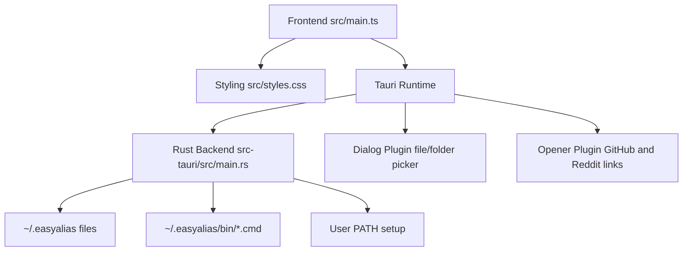
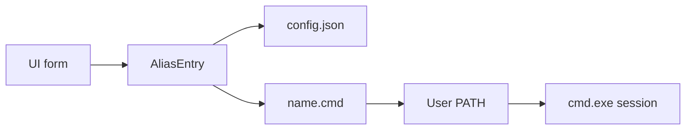
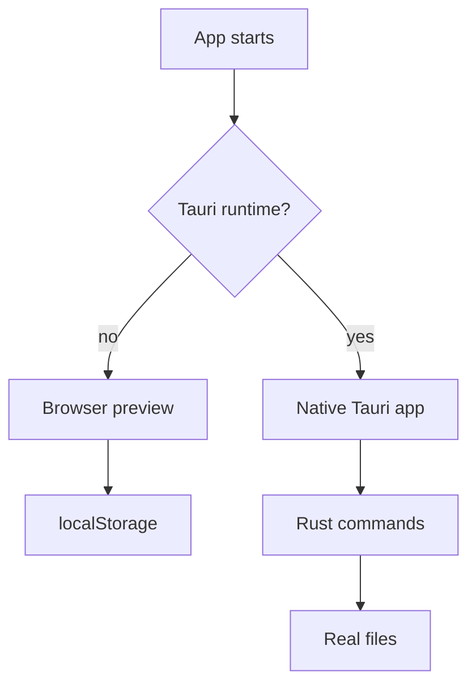
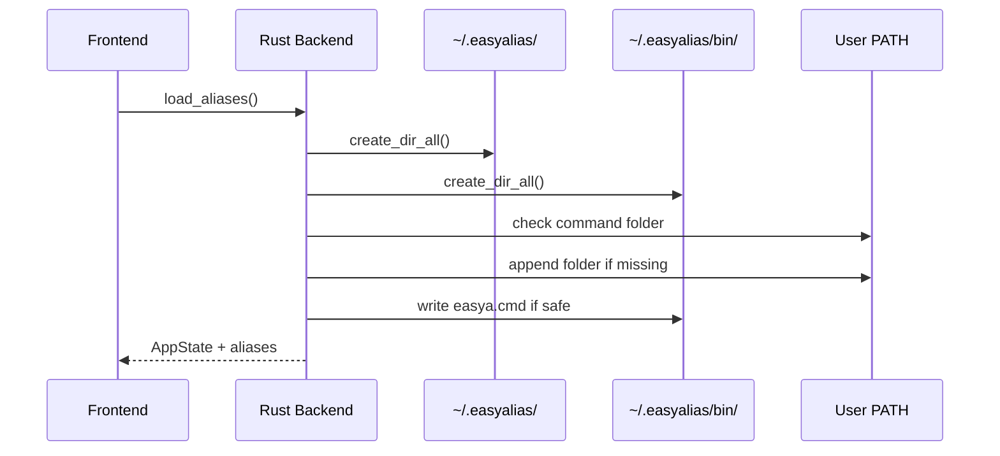
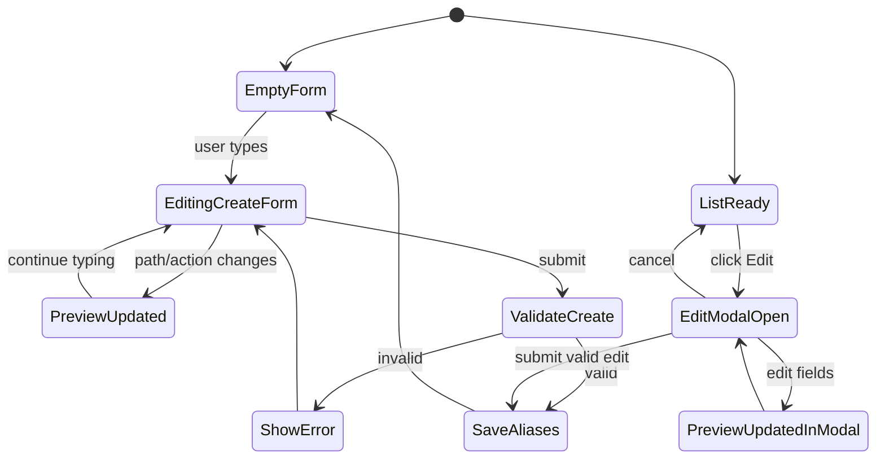
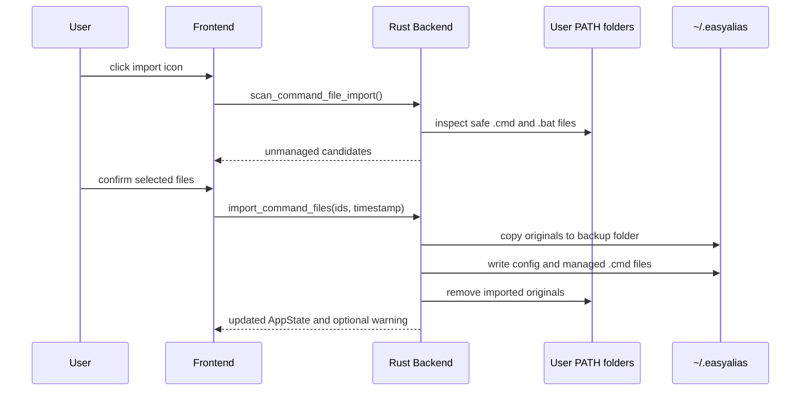
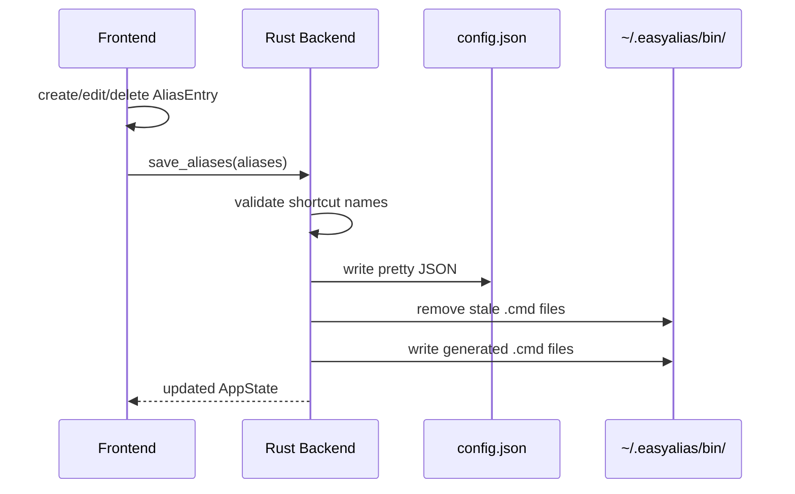
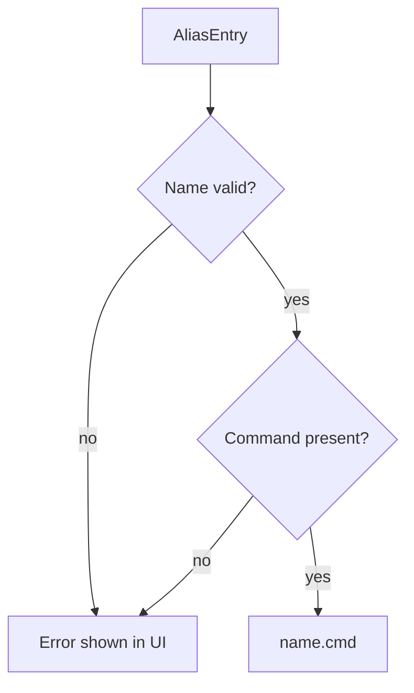

# Architecture

This document describes the technical structure of the Windows version of EasyAlias.

## Overview

EasyAlias consists of a small frontend and a Tauri/Rust backend:

| Layer | File | Responsibility |
| --- | --- | --- |
| Frontend | `src/main.ts` | UI, form state, suggestions, first-start/manual import dialog, command preview |
| Styling | `src/styles.css` | layout and visual design |
| Backend | `src-tauri/src/main.rs` | PATH setup, legacy command discovery, backup, and persistence |
| Tauri Config | `src-tauri/tauri.conf.json` | app window, build, Windows installer |
| Tauri Dialog Plugin | `@tauri-apps/plugin-dialog` | native file/folder picker |
| Tauri Opener Plugin | `@tauri-apps/plugin-opener` | open GitHub and Reddit in the system browser |

The core idea: EasyAlias creates one `.cmd` file per alias and places those command files in a dedicated folder that is added to the user's `PATH`.

This matches the classic Windows shortcut pattern: a command name is just an executable file name that Windows can discover through `PATH`.



## Data Flow

```text
UI form
  -> AliasEntry
  -> ~/.easyalias/config.json
  -> ~/.easyalias/bin/name.cmd
  -> user PATH contains ~/.easyalias/bin
  -> new cmd.exe sessions
```



In browser preview mode without Tauri, state is stored only in `localStorage`. This makes the UI easy to test without changing real shell files.

In Tauri mode, the backend writes real files on Windows.



## Local Files

| File | Content | Owner |
| --- | --- | --- |
| `~/.easyalias/config.json` | structured shortcut data for the UI | EasyAlias |
| `~/.easyalias/bin/*.cmd` | generated command files | EasyAlias |
| `~/.easyalias/.cmd-import-v1` | records that the automatic first-start import prompt was handled | EasyAlias |
| `~/.easyalias/import-backup-*` | copies of imported legacy command files | user backup |
| User `PATH` | contains `~/.easyalias/bin` | user + EasyAlias setup |

On first Tauri startup, the backend ensures:

1. `~/.easyalias/` exists.
2. `~/.easyalias/bin/` exists.
3. Simple legacy command files are detected in user-owned `PATH` folders.
4. The user `PATH` contains the command folder.
5. `easya.cmd` exists when it does not conflict with a user alias.



## Frontend

The frontend is intentionally lightweight:

- no UI framework
- TypeScript
- Vite
- direct DOM updates

Main responsibilities:

- manage form values
- validate shortcut names
- update the cmd command preview live
- persist optional Windows shortcut suggestions with one click
- open the import scanner from the header and review safe legacy `.cmd`/`.bat` candidates
- display, edit, and delete shortcuts
- call Tauri commands when the app runs natively

The most important types:

```ts
type AliasAction =
  | "navigate"
  | "open"
  | "execute"
  | "compile_gradle"
  | "compile_maven"
  | "custom";

type AliasEntry = {
  id: string;
  name: string;
  path: string;
  action: AliasAction;
  customCommand?: string;
  commandPreview: string;
  createdAt: string;
  updatedAt: string;
};
```



## Backend

The Tauri backend exposes five commands:

```rust
load_aliases()
save_aliases(aliases)
scan_command_file_import()
dismiss_command_file_import()
import_command_files(selected_ids, timestamp)
```

`load_aliases` handles startup setup:

- create the app directory
- create the command directory
- ensure the command directory is in the user `PATH`
- write `easya.cmd` when it does not conflict with an alias
- load `config.json` if it exists
- regenerate command files from saved aliases
- migrate older PowerShell-style command previews to cmd-style previews

`save_aliases` writes:

- `config.json` as the data source for the UI
- one `.cmd` file per alias
- removes stale `.cmd` files for deleted aliases
- returns fresh PATH status for the UI

`scan_command_file_import` ignores the first-start marker, rescans user-owned `PATH` folders, filters case-insensitive command names already managed by EasyAlias, and returns the remaining candidates. It never scans system directories or EasyAlias' own command folder.

`import_command_files` rescans selected ids, copies every source file into a timestamped backup directory, writes managed Custom Commands, and then removes the old files. Removal failures are returned as warnings without hiding a successful backup/import.





## Command Generation

An alias entry becomes a small `.cmd` file:

```cmd
@echo off
cd /d "%USERPROFILE%\Desktop\projects\beerv2_app"
```

The frontend and backend both know how to derive this command from structured fields. The backend is authoritative and rewrites `commandPreview` on load/save, so older configs from the first PowerShell-based Windows prototype are automatically normalized.

Before writing, the backend validates:

- shortcut name is not empty
- shortcut name starts with a letter or `_`
- shortcut name contains only letters, numbers, `_`, or `-`
- command preview is not empty



## Safety

EasyAlias changes the user `PATH` only by appending the command folder when it is missing:

```text
%USERPROFILE%\.easyalias\bin
```

Existing PATH entries are preserved.

The backend checks the persisted user PATH through `HKCU\Environment`. When it needs to add the command folder, it uses `setx` for normal-sized PATH values and falls back to `reg add` for long values to avoid `setx` truncation.

Important boundaries:

- Custom commands are real `cmd.exe` / batch commands.
- The generated `.cmd` files are app output and should not be edited manually.
- Standard paths are wrapped in double quotes.
- Import scanning is limited to directories below the user profile and never scans system PATH folders.
- Only one-command scripts are imported; labels, multiline logic, duplicate names, and location-dependent `%~dp0`/`%0` scripts are skipped.
- Selected originals are backed up before managed files are written or old files are removed.
- Folder-changing aliases persist in `cmd.exe`; from PowerShell they run as external commands and cannot change the parent PowerShell location.

## Runtime Notes

After EasyAlias updates User PATH, already-open terminals may still have the old environment. The expected user flow is:

1. Start EasyAlias once.
2. Let it add `~/.easyalias/bin` to User PATH.
3. Open a new `cmd.exe` window.
4. Run `where <alias>` to confirm resolution.

```cmd
where beerv2
```

The generated command files are intentionally human-readable:

```cmd
type "%USERPROFILE%\.easyalias\bin\beerv2.cmd"
```

## Roadmap

Short term:

- tests for command generation

Later:

- settings window
- optional export/backup mechanism
- signed Windows release automation
