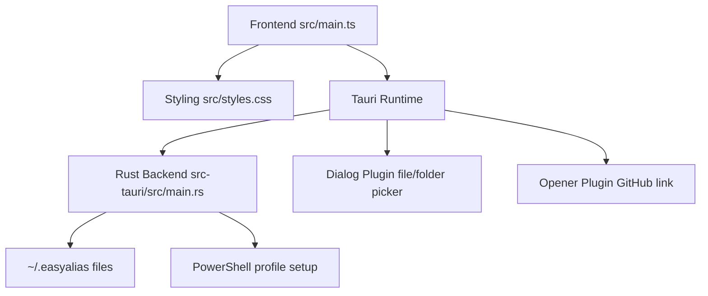
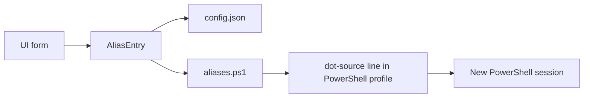
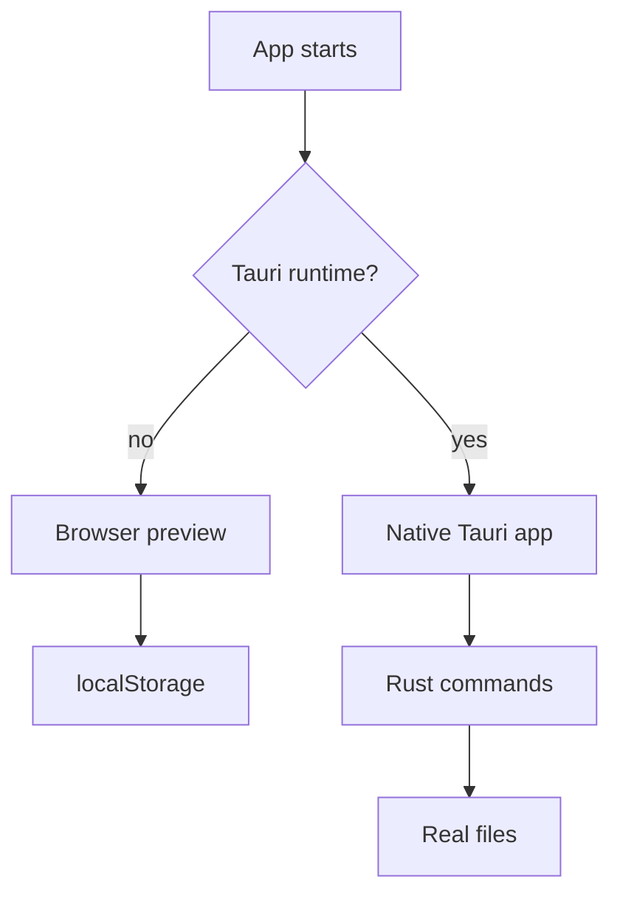
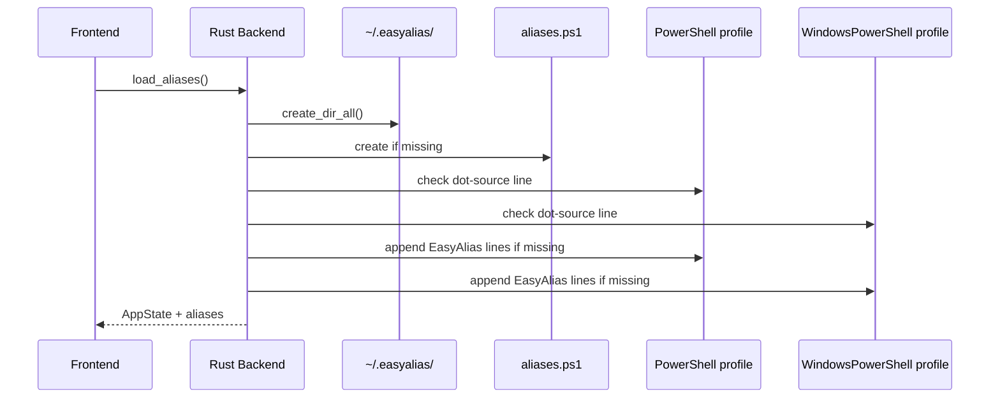
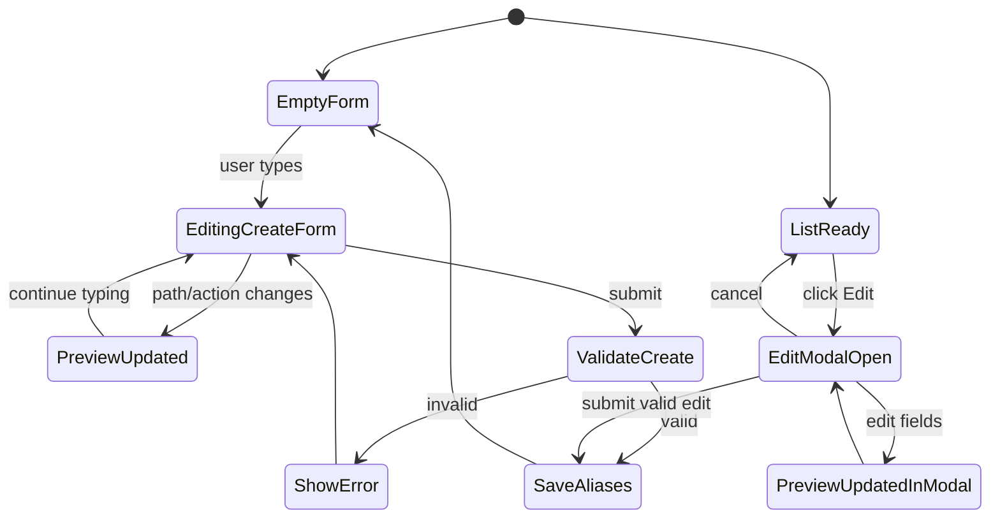
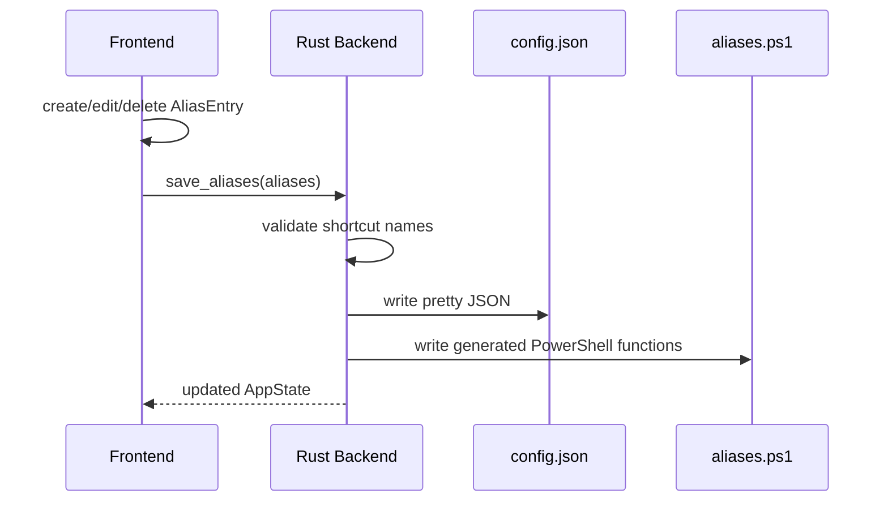
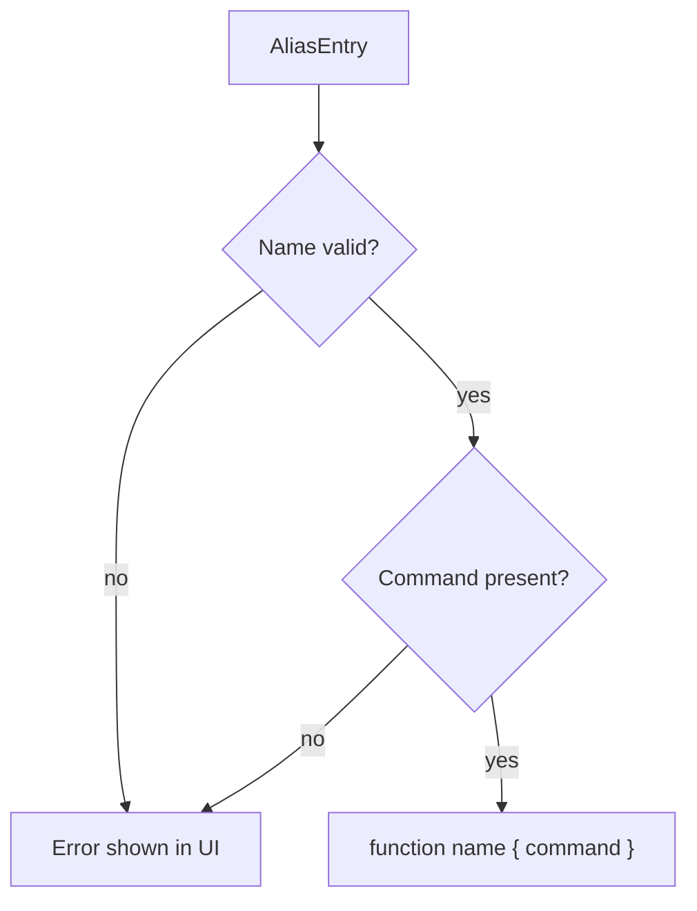

# Architecture

This document describes the technical structure of the Windows version of EasyAlias.

## Overview

EasyAlias consists of a small frontend and a Tauri/Rust backend:

| Layer | File | Responsibility |
| --- | --- | --- |
| Frontend | `src/main.ts` | UI, form state, command preview |
| Styling | `src/styles.css` | layout and visual design |
| Backend | `src-tauri/src/main.rs` | local file read/write logic |
| Tauri Config | `src-tauri/tauri.conf.json` | app window, build, Windows installer |
| Tauri Dialog Plugin | `@tauri-apps/plugin-dialog` | native file/folder picker |
| Tauri Opener Plugin | `@tauri-apps/plugin-opener` | open GitHub in the system browser |

The core idea: EasyAlias does not manage the entire PowerShell profile. It creates a dedicated `aliases.ps1` file and dot-sources it from the profile once.



## Data Flow

```text
UI form
  -> AliasEntry
  -> ~/.easyalias/config.json
  -> ~/.easyalias/aliases.ps1
  -> dot-source line in the PowerShell profile
  -> new PowerShell sessions
```



In browser preview mode without Tauri, state is stored only in `localStorage`. This makes the UI easy to test without changing real shell files.

In Tauri mode, the backend writes real files on Windows.



## Local Files

| File | Content | Owner |
| --- | --- | --- |
| `~/.easyalias/config.json` | structured shortcut data for the UI | EasyAlias |
| `~/.easyalias/aliases.ps1` | generated PowerShell functions | EasyAlias |
| `~/Documents/PowerShell/Microsoft.PowerShell_profile.ps1` | PowerShell 7+ profile | user + EasyAlias setup |
| `~/Documents/WindowsPowerShell/Microsoft.PowerShell_profile.ps1` | Windows PowerShell profile | user + EasyAlias setup |

On first Tauri startup, the backend ensures:

1. `~/.easyalias/` exists.
2. `~/.easyalias/aliases.ps1` exists.
3. Both common PowerShell profiles contain `. "$HOME\.easyalias\aliases.ps1"`.
4. Both profiles contain an `easya` function if `easya` does not already exist.



## Frontend

The frontend is intentionally lightweight:

- no UI framework
- TypeScript
- Vite
- direct DOM updates

Main responsibilities:

- manage form values
- validate shortcut names
- update the PowerShell command preview live
- display, edit, and delete shortcuts
- call Tauri commands when the app runs natively

The most important types:

```ts
type AliasAction =
  | "navigate"
  | "open"
  | "execute"
  | "compile_gradle"
  | "compile_maven"
  | "custom";

type AliasEntry = {
  id: string;
  name: string;
  path: string;
  action: AliasAction;
  customCommand?: string;
  commandPreview: string;
  createdAt: string;
  updatedAt: string;
};
```



## Backend

The Tauri backend currently exposes two commands:

```rust
load_aliases()
save_aliases(aliases)
```

`load_aliases` handles startup setup:

- create the app directory
- create an empty `aliases.ps1` if missing
- ensure the dot-source line in both common PowerShell profiles
- ensure the `easya` app shortcut in both profiles
- load `config.json` if it exists

`save_aliases` writes:

- `config.json` as the data source for the UI
- `aliases.ps1` as the generated PowerShell file



## Shell Generation

PowerShell aliases cannot directly represent complex commands like `Set-Location ...; mvn clean package`, so EasyAlias generates small functions instead.

An alias entry becomes a PowerShell function:

```powershell
# Generated by EasyAlias.
# Edit aliases in the app, not by hand.

function beerv2 { Set-Location "$HOME\Desktop\projekte\beerv2_app" }
```

Before writing, the backend validates:

- shortcut name is not empty
- shortcut name starts with a letter or `_`
- shortcut name contains only letters, numbers, `_`, or `-`
- command preview is not empty



## Safety

EasyAlias changes PowerShell profiles only minimally:

```powershell
# EasyAlias aliases
. "$HOME\.easyalias\aliases.ps1"

# EasyAlias app shortcut
function easya { Start-Process "$env:LOCALAPPDATA\Programs\EasyAlias\EasyAlias.exe" }
```

Existing content is preserved.

Important boundaries:

- Custom commands are real PowerShell commands.
- The generated `aliases.ps1` is app output and should not be edited manually.
- Standard paths are wrapped in double quotes.
- Existing functions from PowerShell profiles are not imported yet.

## Roadmap

Short term:

- import existing profile functions
- tests for command generation

Later:

- settings window
- polished app icon
- Windows installer
- optional export/backup mechanism
