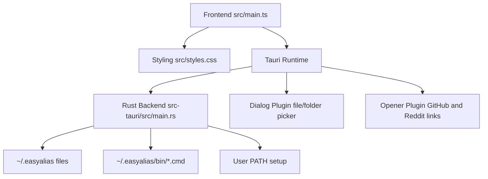
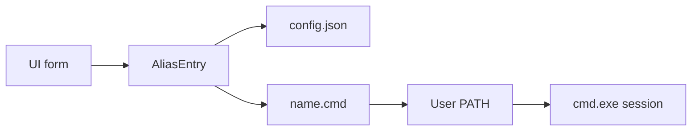
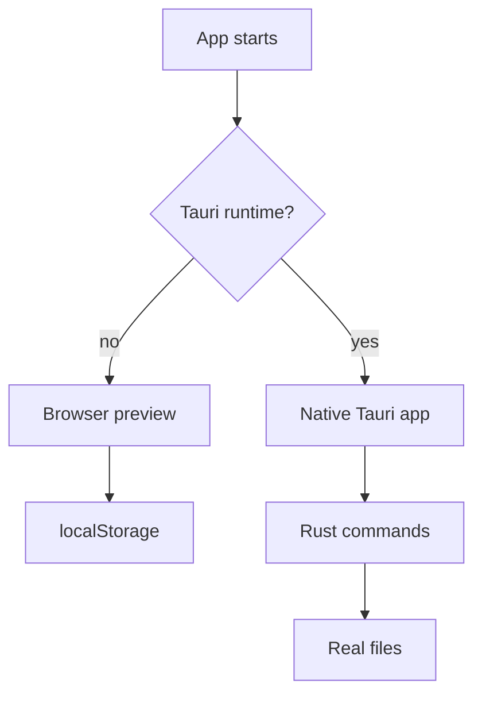
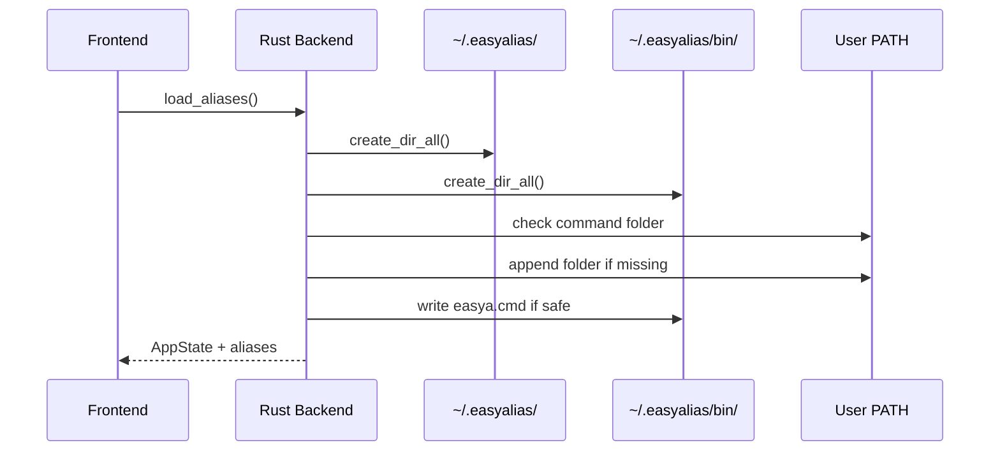
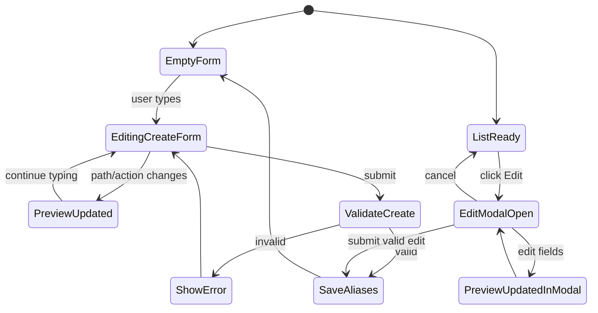
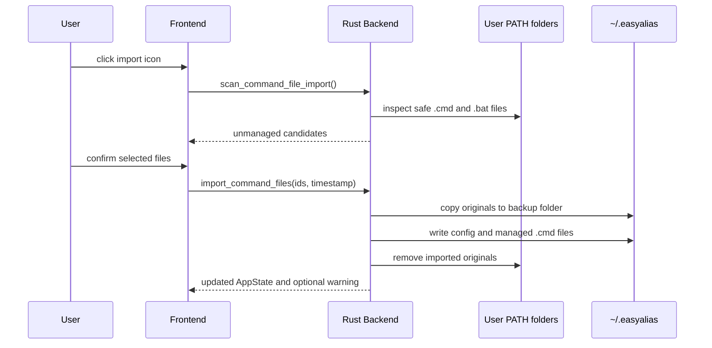
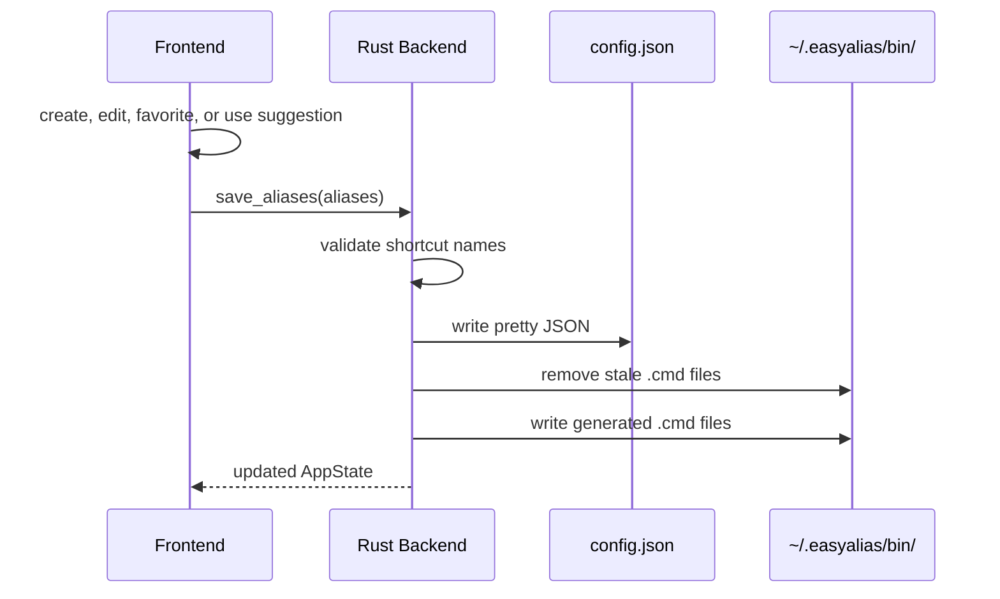
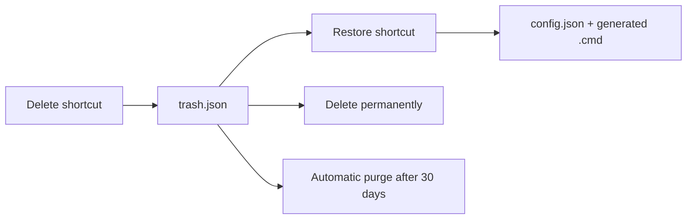
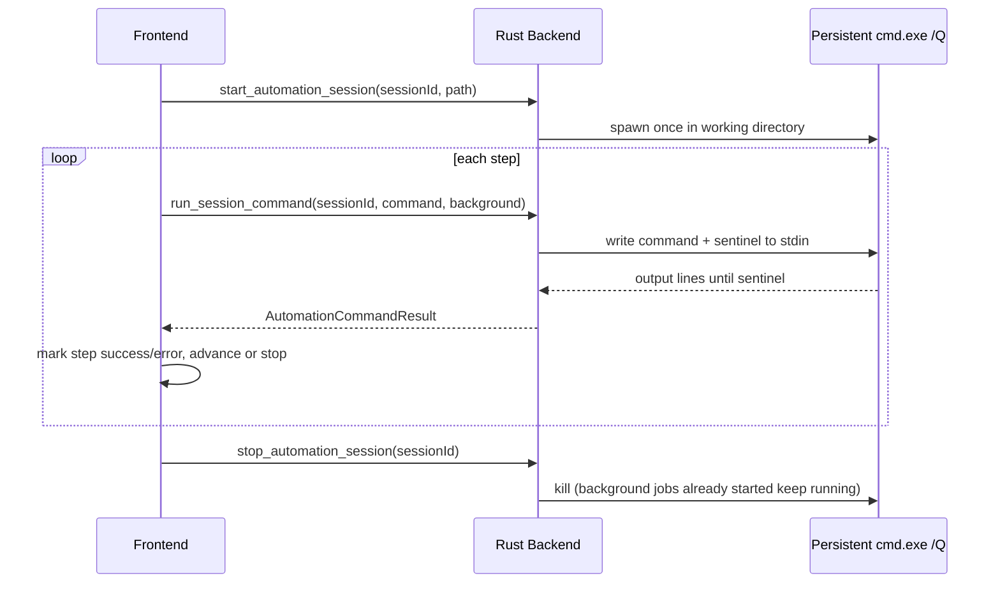
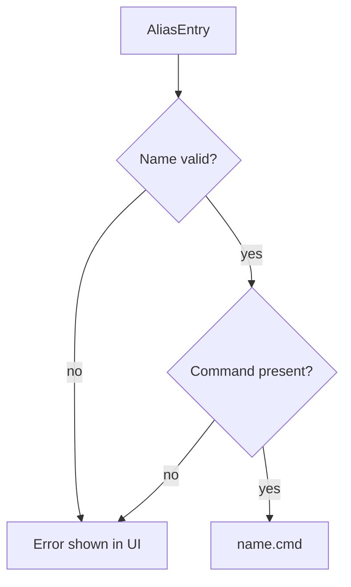

# Architecture

This document describes the technical structure of the Windows version of EasyAlias.

## Overview

EasyAlias consists of a small frontend and a Tauri/Rust backend:

| Layer | File | Responsibility |
| --- | --- | --- |
| Frontend | `src/main.ts` | UI, favorites, paged suggestions, legacy import, portable backups, Trash, command preview |
| Styling | `src/styles.css` | layout and visual design |
| Backend | `src-tauri/src/main.rs` | PATH setup, legacy command discovery, backup, and persistence |
| Tauri Config | `src-tauri/tauri.conf.json` | app window, build, Windows installer |
| Tauri Dialog Plugin | `@tauri-apps/plugin-dialog` | native file/folder picker |
| Tauri Opener Plugin | `@tauri-apps/plugin-opener` | open GitHub and Reddit in the system browser |

The core idea: EasyAlias creates one `.cmd` file per alias and places those command files in a dedicated folder that is added to the user's `PATH`.

This matches the classic Windows shortcut pattern: a command name is just an executable file name that Windows can discover through `PATH`.


```mermaid
flowchart TB
  UI["Frontend src/main.ts"]
  CSS["Styling src/styles.css"]
  Tauri["Tauri Runtime"]
  Rust["Rust Backend src-tauri/src/main.rs"]
  Dialog["Dialog Plugin file/folder picker"]
  Opener["Opener Plugin GitHub and Reddit links"]
  Files["~/.easyalias files"]
  Bin["~/.easyalias/bin/*.cmd"]
  Path["User PATH setup"]

  UI --> CSS
  UI --> Tauri
  Tauri --> Rust
  Tauri --> Dialog
  Tauri --> Opener
  Rust --> Files
  Rust --> Bin
  Rust --> Path
```

## Data Flow

```text
UI form
  -> AliasEntry
  -> ~/.easyalias/config.json
  -> ~/.easyalias/bin/name.cmd
  -> user PATH contains ~/.easyalias/bin
  -> new cmd.exe sessions
```


```mermaid
flowchart LR
  Form["UI form"]
  Entry["AliasEntry"]
  Config["config.json"]
  CmdFile["name.cmd"]
  Path["User PATH"]
  Terminal["cmd.exe session"]

  Form --> Entry
  Entry --> Config
  Entry --> CmdFile
  CmdFile --> Path
  Path --> Terminal
```

In browser preview mode without Tauri, state is stored only in `localStorage`. This makes the UI easy to test without changing real shell files.

In Tauri mode, the backend writes real files on Windows.


```mermaid
flowchart TD
  Start["App starts"]
  Runtime{"Tauri runtime?"}
  Browser["Browser preview"]
  Native["Native Tauri app"]
  LocalStorage["localStorage"]
  Backend["Rust commands"]
  RealFiles["Real files"]

  Start --> Runtime
  Runtime -- "no" --> Browser
  Browser --> LocalStorage
  Runtime -- "yes" --> Native
  Native --> Backend
  Backend --> RealFiles
```

## Local Files

| File | Content | Owner |
| --- | --- | --- |
| `~/.easyalias/config.json` | structured shortcut data for the UI | EasyAlias |
| `~/.easyalias/trash.json` | deleted shortcuts retained for up to 30 days | EasyAlias |
| `~/.easyalias/bin/*.cmd` | generated command files | EasyAlias |
| `~/.easyalias/.cmd-import-v1` | records that the automatic first-start import prompt was handled | EasyAlias |
| `~/.easyalias/import-backup-*` | copies of imported legacy command files | user backup |
| `~/.easyalias/automations.json` | saved multi-step automations | EasyAlias |
| User `PATH` | contains `~/.easyalias/bin` | user + EasyAlias setup |

On first Tauri startup, the backend ensures:

1. `~/.easyalias/` exists.
2. `~/.easyalias/bin/` exists.
3. Simple legacy command files are detected in user-owned `PATH` folders.
4. The user `PATH` contains the command folder.
5. `easya.cmd` exists when it does not conflict with a user alias.


```mermaid
sequenceDiagram
  participant UI as Frontend
  participant Rust as Rust Backend
  participant Dir as ~/.easyalias/
  participant Bin as ~/.easyalias/bin/
  participant Path as User PATH

  UI->>Rust: load_aliases()
  Rust->>Dir: create_dir_all()
  Rust->>Bin: create_dir_all()
  Rust->>Path: check command folder
  Rust->>Path: append folder if missing
  Rust->>Bin: write easya.cmd if safe
  Rust-->>UI: AppState + aliases
```

## Frontend

The frontend is intentionally lightweight:

- no UI framework
- TypeScript
- Vite
- direct DOM updates

Main responsibilities:

- manage form values
- validate shortcut names
- update the cmd command preview live
- persist optional Windows shortcut suggestions with one click
- paginate the 31 built-in Git, Docker, build, and utility suggestions
- open the import scanner from the header and review safe legacy `.cmd`/`.bat` candidates
- sort favorites before regular shortcuts
- selectively export and restore portable JSON backups
- restore or permanently remove shortcuts from the 30-day Trash
- display, edit, and move shortcuts to Trash
- build, save, and run multi-step Automations in a separate view
- call Tauri commands when the app runs natively

The most important types:

```ts
type AliasAction =
  | "navigate"
  | "open"
  | "execute"
  | "compile_gradle"
  | "compile_maven"
  | "custom";

type AliasEntry = {
  id: string;
  name: string;
  path: string;
  action: AliasAction;
  customCommand?: string;
  commandPreview: string;
  favorite: boolean;
  createdAt: string;
  updatedAt: string;
};

type AutomationStep = {
  id: string;
  kind: "command" | "wait";
  command: string;
  seconds: number;
  behavior: "wait" | "background";
};

type Automation = {
  id: string;
  name: string;
  path: string;
  steps: AutomationStep[];
  // Free-text label used to organize automations; empty means ungrouped.
  group: string;
  createdAt: string;
  updatedAt: string;
};
```


```mermaid
stateDiagram-v2
  [*] --> EmptyForm
  EmptyForm --> EditingCreateForm: user types
  EditingCreateForm --> PreviewUpdated: path/action changes
  PreviewUpdated --> EditingCreateForm: continue typing
  EditingCreateForm --> ValidateCreate: submit
  ValidateCreate --> SaveAliases: valid
  ValidateCreate --> ShowError: invalid
  ShowError --> EditingCreateForm
  SaveAliases --> EmptyForm

  [*] --> ListReady
  ListReady --> EditModalOpen: click Edit
  EditModalOpen --> PreviewUpdatedInModal: edit fields
  PreviewUpdatedInModal --> EditModalOpen
  EditModalOpen --> SaveAliases: submit valid edit
  EditModalOpen --> ListReady: cancel
```

## Backend

The Tauri backend exposes commands in four groups:

```rust
// Core persistence
load_aliases()
save_aliases(aliases)

// Recoverable deletion
list_trash()
move_alias_to_trash(id)
restore_trash_alias(id)
permanently_delete_trash_alias(id)
empty_trash()

// Portable JSON backups
export_alias_backup(selected_ids)
inspect_alias_backup(path)
import_alias_backup(path, selected_ids)

// Legacy command-file migration
scan_command_file_import()
dismiss_command_file_import()
import_command_files(selected_ids, timestamp)

// Automations
load_automations()
save_automations(automations)
start_automation_session(session_id, path)
run_session_command(session_id, command, background)
stop_automation_session(session_id)
```

`load_aliases` handles startup setup:

- create the app directory
- create the command directory
- ensure the command directory is in the user `PATH`
- write `easya.cmd` when it does not conflict with an alias
- load `config.json` if it exists
- regenerate command files from saved aliases
- migrate older PowerShell-style command previews to cmd-style previews

`save_aliases` writes:

- `config.json` as the data source for the UI
- one `.cmd` file per alias
- removes stale `.cmd` files for deleted aliases
- returns fresh PATH status for the UI

Deletion uses `move_alias_to_trash`, which removes the active `.cmd` file and records the entry in `trash.json`. Restoring recreates the managed command file. Entries older than 30 days are purged when Trash is loaded; permanent deletion and `empty_trash` are explicit irreversible actions.

Portable backup commands export selected entries to a versioned EasyAlias JSON file. Import validates and previews the file before merging only the selected entries; matching shortcut names are replaced only when selected.

`scan_command_file_import` ignores the first-start marker, rescans user-owned `PATH` folders, filters case-insensitive command names already managed by EasyAlias, and returns the remaining candidates. It never scans system directories or EasyAlias' own command folder.

`import_command_files` rescans selected ids, copies every source file into a timestamped backup directory, writes managed Custom Commands, and then removes the old files. Removal failures are returned as warnings without hiding a successful backup/import.


```mermaid
sequenceDiagram
  participant User
  participant UI as Frontend
  participant Rust as Rust Backend
  participant Legacy as User PATH folders
  participant Managed as ~/.easyalias

  User->>UI: click import icon
  UI->>Rust: scan_command_file_import()
  Rust->>Legacy: inspect safe .cmd and .bat files
  Rust-->>UI: unmanaged candidates
  User->>UI: confirm selected files
  UI->>Rust: import_command_files(ids, timestamp)
  Rust->>Managed: copy originals to backup folder
  Rust->>Managed: write config and managed .cmd files
  Rust->>Legacy: remove imported originals
  Rust-->>UI: updated AppState and optional warning
```


```mermaid
sequenceDiagram
  participant UI as Frontend
  participant Rust as Rust Backend
  participant Config as config.json
  participant Bin as ~/.easyalias/bin/

  UI->>UI: create, edit, favorite, or use suggestion
  UI->>Rust: save_aliases(aliases)
  Rust->>Rust: validate shortcut names
  Rust->>Config: write pretty JSON
  Rust->>Bin: remove stale .cmd files
  Rust->>Bin: write generated .cmd files
  Rust-->>UI: updated AppState
```


```mermaid
flowchart LR
  Delete["Delete shortcut"] --> Trash["trash.json"]
  Trash --> Restore["Restore shortcut"]
  Trash --> Permanent["Delete permanently"]
  Trash --> Expire["Automatic purge after 30 days"]
  Restore --> Files["config.json + generated .cmd"]
```

Automations are stored independently of shortcuts in `~/.easyalias/automations.json` and validated on every load and save: up to `MAX_AUTOMATIONS` (200) automations, each with 1-`MAX_AUTOMATION_STEPS` (100) steps, unique automation and step ids, command steps under `MAX_AUTOMATION_COMMAND_BYTES` (16 KB), and wait steps between 1 second and `MAX_WAIT_SECONDS` (24 hours).

Each run gets one persistent `cmd.exe /Q` process (an `AutomationSessionHandle`, keyed by a frontend-generated `session_id` in the `AutomationSessions` Tauri-managed state) instead of a fresh process per step. This is what lets `cd` and `set` environment variables from one step carry over to the next, the same way they would in a real Command Prompt window. `/Q` suppresses cmd.exe echoing each line it reads back from stdin.

- `start_automation_session` resolves the working directory (expanding a leading `~`, matching the tilde convention already used for alias paths) and spawns the shell with piped stdin/stdout. It deliberately skips `canonicalize()`: on Windows that can return an extended-length `\\?\` path, and cmd.exe's handling of that prefix for a process's working directory is unreliable across Windows versions. A background thread streams output lines into an `mpsc` channel.
- `run_session_command` writes the step's command to the session's stdin followed by a unique echoed sentinel, then reads from the channel until that sentinel appears. Foreground commands are wrapped as `(command) 2>&1` so stderr merges into the captured output and the whole command line (including any internal `&&`/`|`) is redirected, with the sentinel carrying `%ERRORLEVEL%`; background commands run as `start "" /B cmd /C "command"` and the sentinel fires as soon as the job has started rather than waiting for it to finish. `start /B` has no simple single-line way to report a PID, so background steps always report `process_id: None`. Captured output is truncated to `MAX_AUTOMATION_OUTPUT_CHARS` (20,000 characters).
- `stop_automation_session` kills the session's cmd.exe process specifically, so it can interrupt a stuck foreground command without touching background jobs that process already started with `start /B` — those keep running detached. It is called both when the user clicks Stop and automatically once a run finishes.


```mermaid
sequenceDiagram
  participant UI as Frontend
  participant Rust as Rust Backend
  participant Shell as Persistent cmd.exe /Q

  UI->>Rust: start_automation_session(sessionId, path)
  Rust->>Shell: spawn once in working directory
  loop each step
    UI->>Rust: run_session_command(sessionId, command, background)
    Rust->>Shell: write command + sentinel to stdin
    Shell-->>Rust: output lines until sentinel
    Rust-->>UI: AutomationCommandResult
    UI->>UI: mark step success/error, advance or stop
  end
  UI->>Rust: stop_automation_session(sessionId)
  Rust->>Shell: kill (background jobs already started keep running)
```

## Command Generation

An alias entry becomes a small `.cmd` file:

```cmd
@echo off
cd /d "%USERPROFILE%\Desktop\projects\beerv2_app"
```

The frontend and backend both know how to derive this command from structured fields. The backend is authoritative and rewrites `commandPreview` on load/save, so older configs from the first PowerShell-based Windows prototype are automatically normalized.

Before writing, the backend validates:

- shortcut name is not empty
- shortcut name starts with a letter or `_`
- shortcut name contains only letters, numbers, `_`, or `-`
- command preview is not empty


```mermaid
flowchart TD
  AliasEntry["AliasEntry"]
  ValidateName{"Name valid?"}
  ValidateCommand{"Command present?"}
  CmdFile["name.cmd"]
  Error["Error shown in UI"]

  AliasEntry --> ValidateName
  ValidateName -- "no" --> Error
  ValidateName -- "yes" --> ValidateCommand
  ValidateCommand -- "no" --> Error
  ValidateCommand -- "yes" --> CmdFile
```

## Safety

EasyAlias changes the user `PATH` only by appending the command folder when it is missing:

```text
%USERPROFILE%\.easyalias\bin
```

Existing PATH entries are preserved.

The backend checks the persisted user PATH through `HKCU\Environment`. When it needs to add the command folder, it uses `setx` for normal-sized PATH values and falls back to `reg add` for long values to avoid `setx` truncation.

Important boundaries:

- Custom commands are real `cmd.exe` / batch commands.
- The generated `.cmd` files are app output and should not be edited manually.
- Standard paths are wrapped in double quotes.
- Import scanning is limited to directories below the user profile and never scans system PATH folders.
- Only one-command scripts are imported; labels, multiline logic, duplicate names, and location-dependent `%~dp0`/`%0` scripts are skipped.
- Selected originals are backed up before managed files are written or old files are removed.
- Portable backup files are parsed as data and never executed.
- Trash provides a 30-day recovery window unless the user explicitly removes an entry permanently or empties it.
- Folder-changing aliases persist in `cmd.exe`; from PowerShell they run as external commands and cannot change the parent PowerShell location.
- Automation commands run only when the user explicitly clicks Run, execute in the automation's own cmd.exe session, and are rejected outright in browser preview mode (no `start_automation_session`/`run_session_command` backend to call).

## Runtime Notes

After EasyAlias updates User PATH, already-open terminals may still have the old environment. The expected user flow is:

1. Start EasyAlias once.
2. Let it add `~/.easyalias/bin` to User PATH.
3. Open a new `cmd.exe` window.
4. Run `where <alias>` to confirm resolution.

```cmd
where beerv2
```

The generated command files are intentionally human-readable:

```cmd
type "%USERPROFILE%\.easyalias\bin\beerv2.cmd"
```

## Roadmap

Short term:

- tests for command generation
- verify the automation session (persistent `cmd.exe`, `cd`/`set` carrying across steps, `start /B` background steps) on an actual Windows machine — it was built and code-reviewed on macOS, where `cmd.exe` cannot be spawned, so the two session-behavior tests in `main.rs` are gated to `#[cfg(target_os = "windows")]` and have not been run yet

Later:

- settings window
- signed Windows release automation
